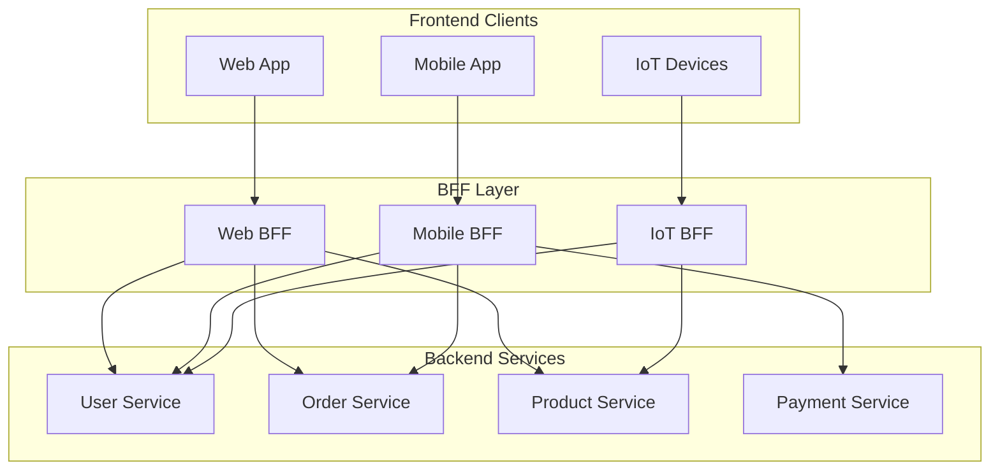
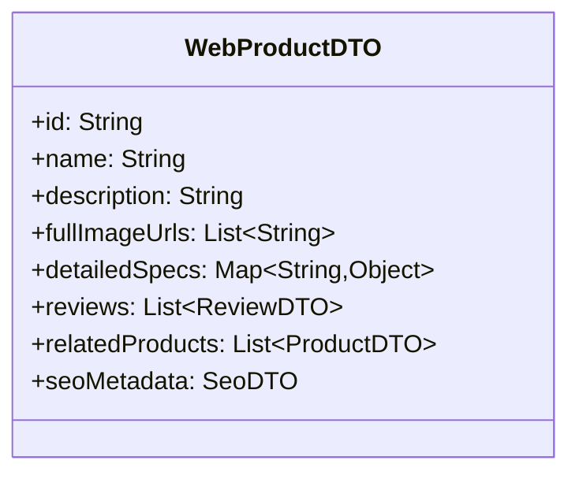
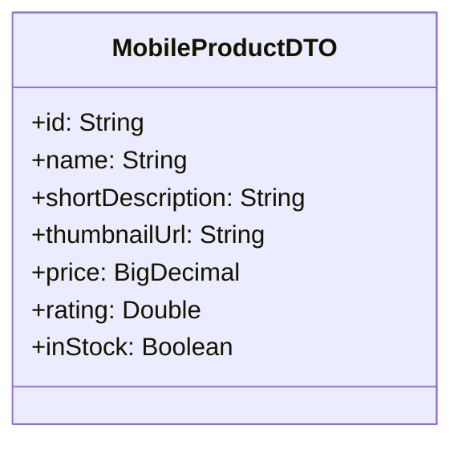
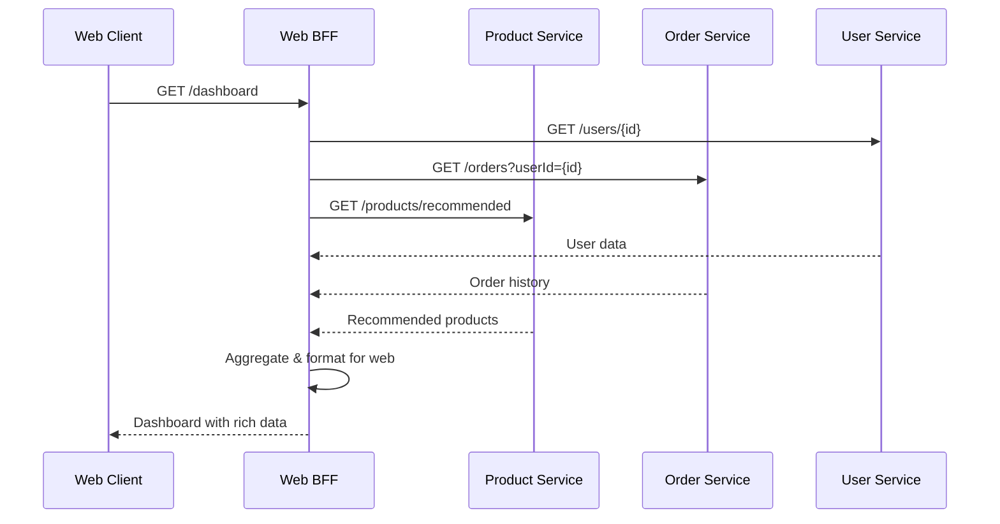
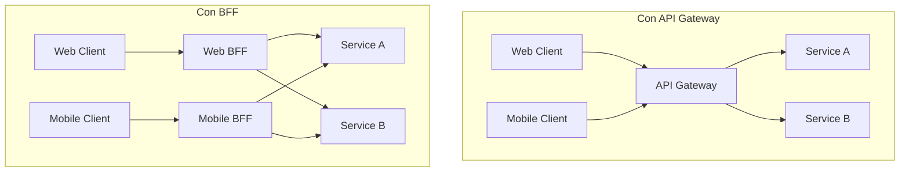
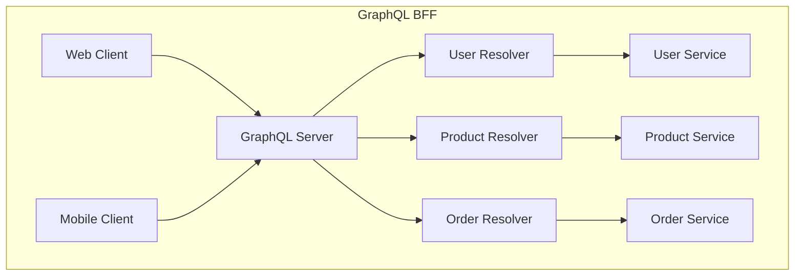
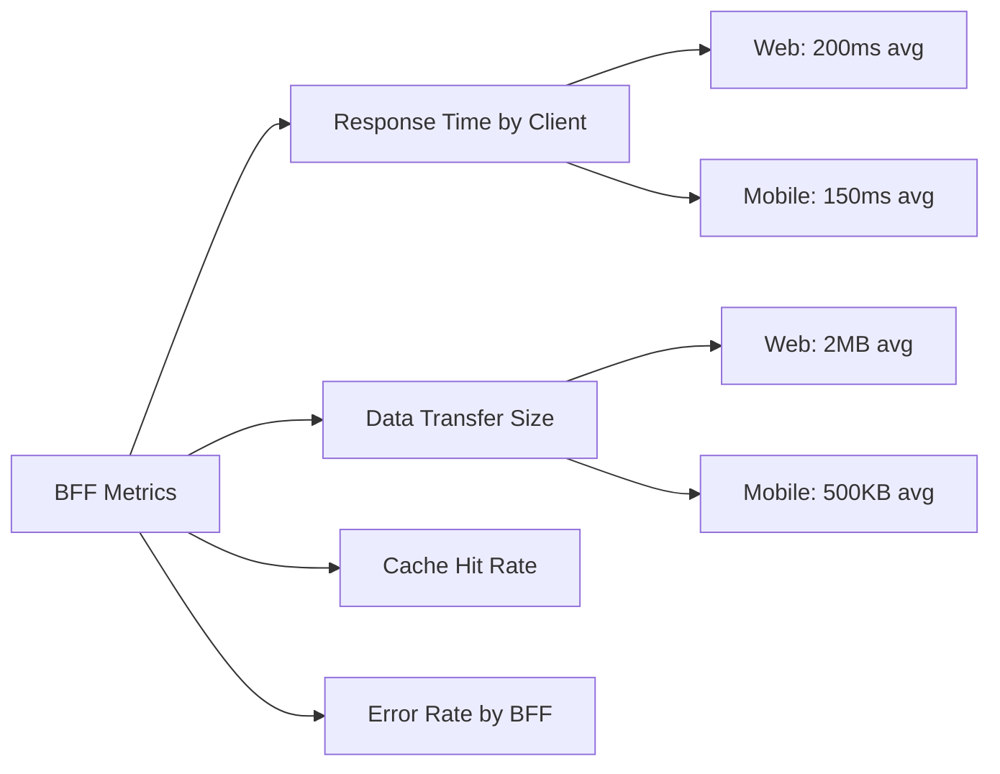

## ❓ Qué problema resuelve
- **APIs genéricas**: Una API única que no se adapta bien a diferentes clientes (web, móvil, IoT)
- **Over-fetching**: Clientes reciben más datos de los necesarios
- **Under-fetching**: Múltiples llamadas para obtener datos relacionados
- **Acoplamiento**: Cambios en la API afectan a todos los clientes

## 🔧 Cómo funciona
Crea una capa de backend específica para cada tipo de frontend, optimizando la comunicación y adaptando los datos según las necesidades del cliente.

## 📊 Diagrama de Arquitectura



## 🏗️ Estructura de Implementación

### Web BFF
```
web-bff/
├── controllers/
│   ├── DashboardController.java
│   ├── ProductCatalogController.java
│   └── OrderManagementController.java
├── services/
│   ├── WebDashboardService.java
│   └── WebProductService.java
├── dto/
│   ├── WebProductDTO.java
│   ├── WebOrderDTO.java
│   └── DashboardSummaryDTO.java
└── aggregators/
    ├── DashboardAggregator.java
    └── ProductCatalogAggregator.java
```

### Mobile BFF
```
mobile-bff/
├── controllers/
│   ├── MobileAuthController.java
│   ├── MobileProductController.java
│   └── MobileOrderController.java
├── services/
│   ├── MobileProductService.java
│   └── MobileOrderService.java
├── dto/
│   ├── MobileProductDTO.java
│   ├── MobileOrderDTO.java
│   └── MobileUserDTO.java
└── aggregators/
    ├── MobileProductAggregator.java
    └── MobileOrderAggregator.java
```

## 📋 Comparación de Respuestas

### Producto para Web


### Producto para Mobile


## 🔄 Flujo de Datos



## 🎯 Patrones Complementarios

### API Gateway vs BFF


### GraphQL como BFF


## ✅ Ventajas

- **Optimización específica**: Cada BFF optimizado para su cliente
- **Desarrollo independiente**: Teams pueden trabajar en paralelo
- **Reducción de tráfico**: Solo datos necesarios
- **Mejor UX**: Respuestas rápidas y específicas

## ❌ Desventajas

- **Duplicación de código**: Lógica similar en múltiples BFFs
- **Complejidad operacional**: Más servicios que mantener
- **Sincronización**: Cambios en backend requieren actualizar múltiples BFFs

## 🛠️ Implementación con Spring Boot

### Web BFF Controller
```java
@RestController
@RequestMapping("/api/web")
public class WebDashboardController {
    
    @Autowired
    private DashboardAggregator dashboardAggregator;
    
    @GetMapping("/dashboard/{userId}")
    public ResponseEntity<WebDashboardDTO> getDashboard(@PathVariable String userId) {
        WebDashboardDTO dashboard = dashboardAggregator.buildDashboard(userId);
        return ResponseEntity.ok(dashboard);
    }
}
```

### Mobile BFF Controller
```java
@RestController
@RequestMapping("/api/mobile")
public class MobileProductController {
    
    @Autowired
    private MobileProductService productService;
    
    @GetMapping("/products")
    public ResponseEntity<List<MobileProductDTO>> getProducts(
            @RequestParam(defaultValue = "0") int page,
            @RequestParam(defaultValue = "20") int size) {
        
        List<MobileProductDTO> products = productService.getProductsForMobile(page, size);
        return ResponseEntity.ok(products);
    }
}
```

## 🎨 Casos de Uso Comunes

### E-commerce
- **Web BFF**: Catálogo completo, comparaciones, reviews detalladas
- **Mobile BFF**: Lista optimizada, imágenes pequeñas, checkout rápido
- **Admin BFF**: Métricas, reportes, gestión de inventario

### Banking
- **Web BFF**: Dashboard completo, gráficos, transacciones detalladas
- **Mobile BFF**: Balance, transferencias rápidas, notificaciones
- **ATM BFF**: Operaciones básicas, interfaz simplificada

## 📊 Métricas y Monitoreo



---

*Patrón esencial para arquitecturas multi-cliente* 📱💻