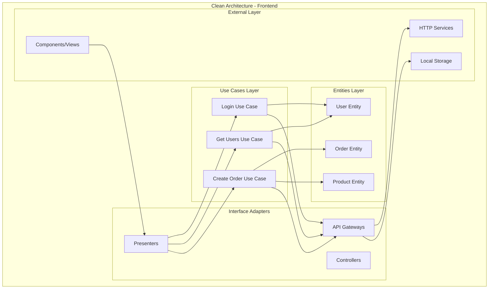
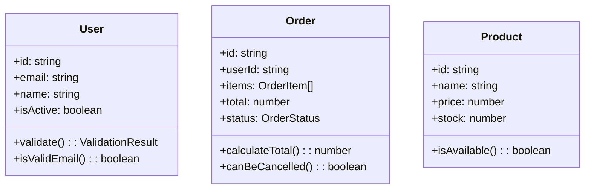
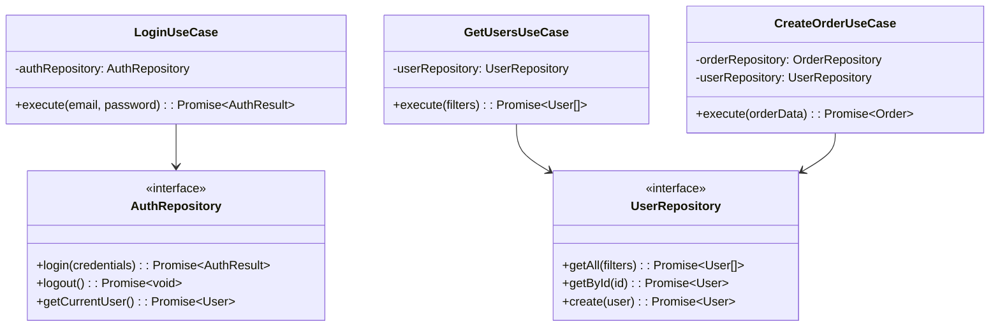
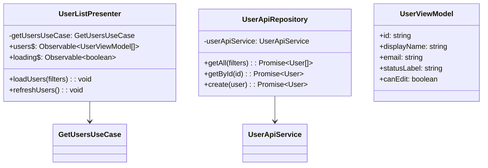
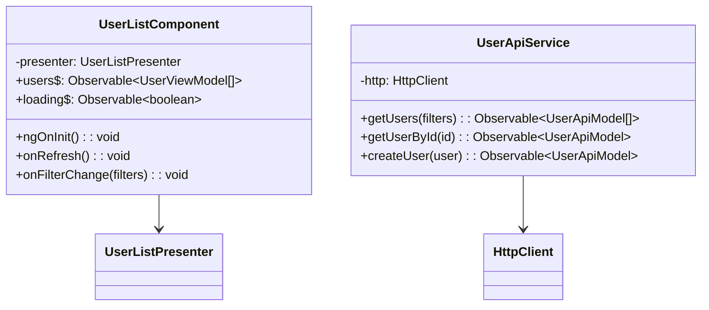
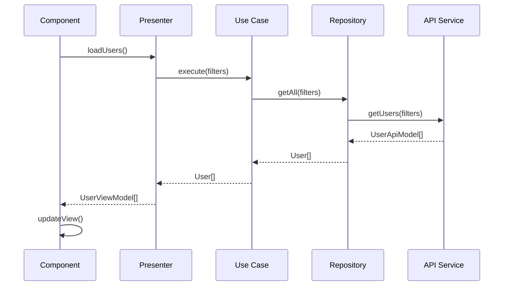
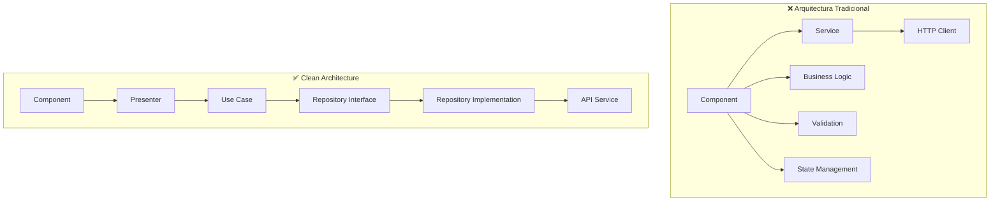
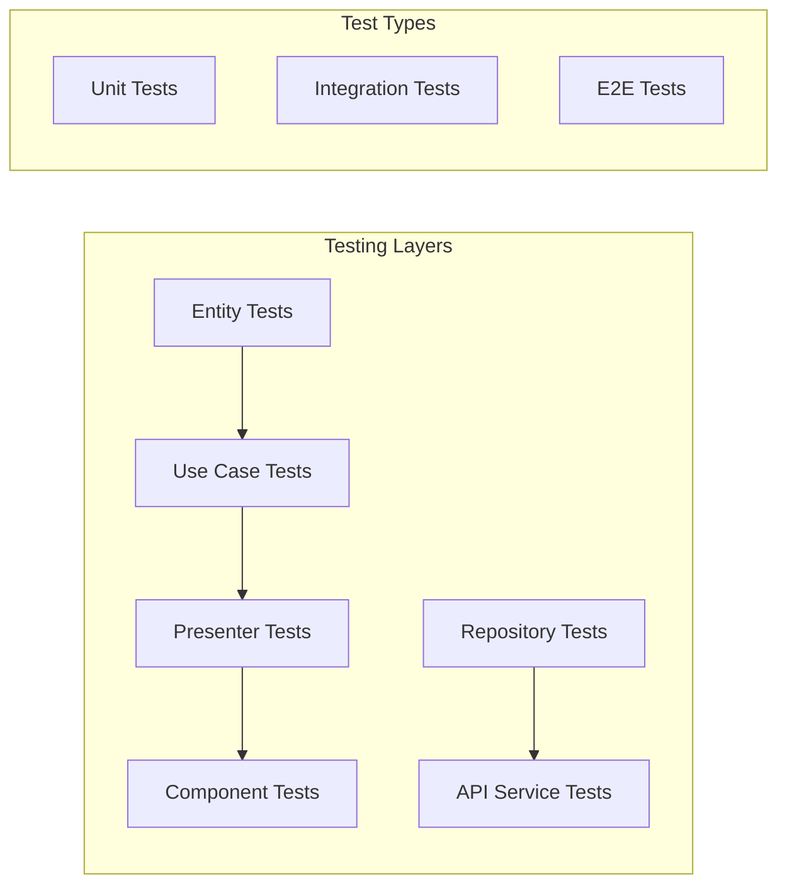
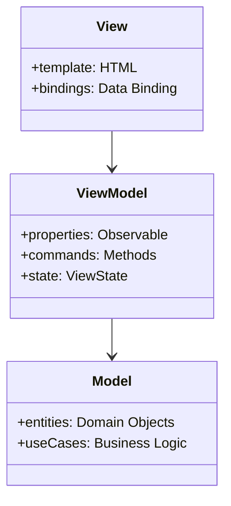
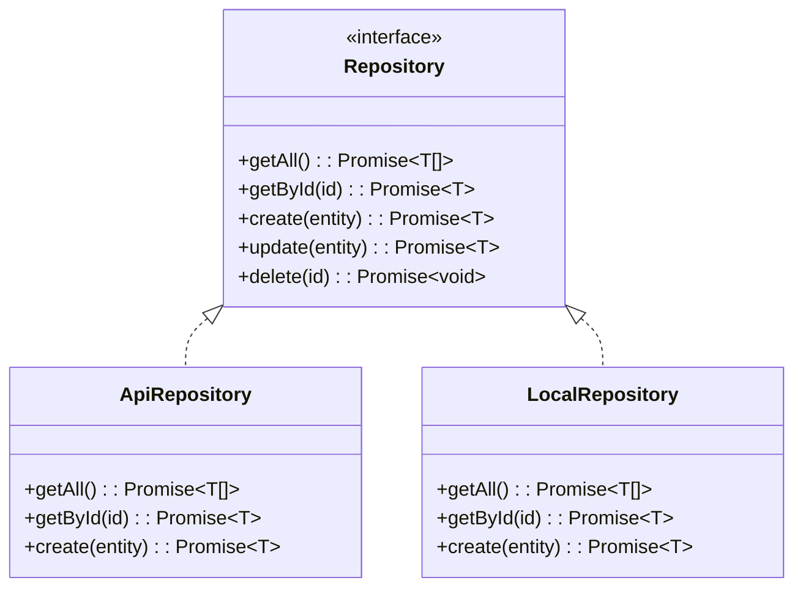

## ❓ Qué problema resuelve
- **Acoplamiento con frameworks**: Lógica de negocio mezclada con UI
- **Difícil testing**: Componentes complejos difíciles de probar
- **Mantenibilidad**: Cambios en UI afectan lógica de negocio
- **Reutilización**: Lógica no reutilizable entre diferentes interfaces

## 🔧 Cómo funciona
Separa la aplicación en capas concéntricas donde las dependencias apuntan hacia adentro, manteniendo la lógica de negocio independiente de frameworks y UI.

## 📊 Diagrama de Arquitectura



## 🏗️ Estructura de Carpetas Angular

```
src/app/
├── core/                           # Entities & Use Cases
│   ├── entities/
│   │   ├── user.entity.ts
│   │   ├── order.entity.ts
│   │   └── product.entity.ts
│   ├── use-cases/
│   │   ├── auth/
│   │   │   ├── login.use-case.ts
│   │   │   └── logout.use-case.ts
│   │   ├── user/
│   │   │   ├── get-users.use-case.ts
│   │   │   └── create-user.use-case.ts
│   │   └── order/
│   │       ├── create-order.use-case.ts
│   │       └── get-orders.use-case.ts
│   └── repositories/               # Abstract repositories
│       ├── user.repository.ts
│       ├── order.repository.ts
│       └── auth.repository.ts
├── data/                          # Interface Adapters - Data
│   ├── repositories/              # Repository implementations
│   │   ├── user-api.repository.ts
│   │   ├── order-api.repository.ts
│   │   └── auth-local.repository.ts
│   ├── services/                  # HTTP Services
│   │   ├── user-api.service.ts
│   │   ├── order-api.service.ts
│   │   └── auth-api.service.ts
│   └── models/                    # DTOs/API Models
│       ├── user-api.model.ts
│       ├── order-api.model.ts
│       └── auth-api.model.ts
├── presentation/                  # Interface Adapters - UI
│   ├── pages/
│   │   ├── login/
│   │   │   ├── login.component.ts
│   │   │   ├── login.presenter.ts
│   │   │   └── login.component.html
│   │   ├── users/
│   │   │   ├── user-list.component.ts
│   │   │   ├── user-list.presenter.ts
│   │   │   ├── user-create.component.ts
│   │   │   └── user-create.presenter.ts
│   │   └── orders/
│   │       ├── order-list.component.ts
│   │       ├── order-list.presenter.ts
│   │       └── order-create.component.ts
│   ├── shared/
│   │   ├── components/
│   │   ├── pipes/
│   │   └── directives/
│   └── view-models/               # View Models
│       ├── user.view-model.ts
│       ├── order.view-model.ts
│       └── auth.view-model.ts
└── shared/                        # Cross-cutting concerns
    ├── utils/
    ├── constants/
    └── types/
```

## 📋 Implementación por Capas

### 🔵 Entities Layer


### 🟢 Use Cases Layer


### 🟡 Interface Adapters Layer


### 🔴 External Layer (Components)


## 🔄 Flujo de Datos



## 🎯 Beneficios de Clean Architecture

### ✅ Ventajas
- **Testabilidad**: Cada capa se puede probar independientemente
- **Independencia de Framework**: Lógica no depende de Angular
- **Flexibilidad**: Fácil cambiar implementaciones
- **Mantenibilidad**: Separación clara de responsabilidades
- **Reutilización**: Use cases reutilizables

### 📊 Comparación con Arquitectura Tradicional



## 🧪 Testing Strategy

### Unit Tests por Capa


## 🔧 Implementación Práctica

### Dependency Injection Setup
```typescript
// app.module.ts
providers: [
  // Use Cases
  { provide: LoginUseCase, useClass: LoginUseCase },
  { provide: GetUsersUseCase, useClass: GetUsersUseCase },
  
  // Repositories
  { provide: 'AuthRepository', useClass: AuthApiRepository },
  { provide: 'UserRepository', useClass: UserApiRepository },
  
  // Presenters
  UserListPresenter,
  LoginPresenter
]
```

### Feature Module Structure
```typescript
// user.module.ts
@NgModule({
  declarations: [
    UserListComponent,
    UserCreateComponent
  ],
  providers: [
    GetUsersUseCase,
    CreateUserUseCase,
    UserListPresenter,
    UserCreatePresenter,
    { provide: 'UserRepository', useClass: UserApiRepository }
  ]
})
export class UserModule { }
```

## 🎨 Patrones Complementarios

### MVVM (Model-View-ViewModel)


### Repository Pattern


## 📱 Adaptación para Otros Frameworks

### React
```
src/
├── core/              # Same as Angular
├── data/              # Same as Angular
├── presentation/
│   ├── hooks/         # Custom hooks (Presenters)
│   ├── components/    # React Components
│   └── pages/         # Page Components
└── shared/
```

### Vue.js
```
src/
├── core/              # Same as Angular
├── data/              # Same as Angular
├── presentation/
│   ├── composables/   # Vue Composables (Presenters)
│   ├── components/    # Vue Components
│   └── views/         # Page Views
└── shared/
```