## ❓ Qué problema resuelve
- **Modelos complejos**: Cuando el modelo de lectura y escritura tienen diferentes necesidades
- **Performance**: Optimización independiente de consultas y comandos
- **Escalabilidad**: Escalar lecturas y escrituras por separado
- **Complejidad de consultas**: Queries complejas que no encajan en el modelo de dominio

## 🔧 Cómo funciona
CQRS separa las operaciones de lectura (Queries) de las operaciones de escritura (Commands), permitiendo optimizar cada lado independientemente.

### Conceptos Clave:
- **Commands**: Operaciones que modifican el estado
- **Queries**: Operaciones que leen datos
- **Command Handlers**: Procesan comandos
- **Query Handlers**: Procesan consultas
- **Read Models**: Modelos optimizados para lectura
- **Write Models**: Modelos optimizados para escritura

## 📊 Diagrama de Arquitectura

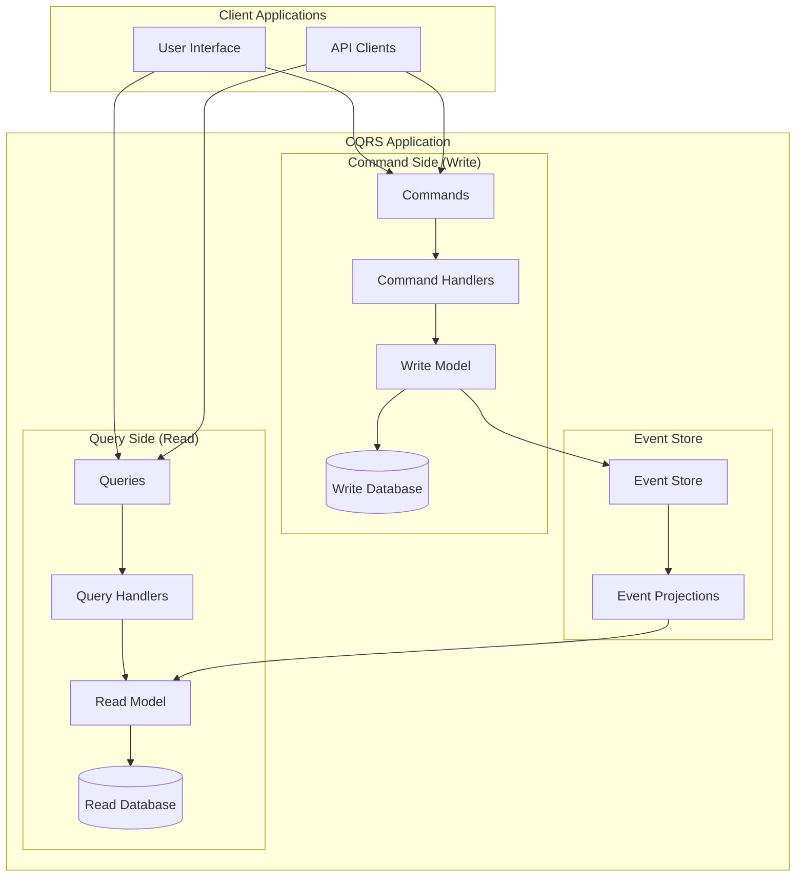

## 🏗️ Estructura de Paquetes CQRS

```
src/main/java/com/company/ecommerce/
├── command/                         # Command Side (Write)
│   ├── handler/
│   │   ├── CreateProductCommandHandler.java
│   │   ├── UpdateProductCommandHandler.java
│   │   ├── DeleteProductCommandHandler.java
│   │   └── CommandHandler.java
│   ├── model/                       # Write Models
│   │   ├── Product.java
│   │   ├── ProductRepository.java
│   │   └── ProductAggregate.java
│   ├── dto/
│   │   ├── CreateProductCommand.java
│   │   ├── UpdateProductCommand.java
│   │   └── DeleteProductCommand.java
│   └── validation/
│       ├── ProductCommandValidator.java
│       └── CommandValidator.java
├── query/                           # Query Side (Read)
│   ├── handler/
│   │   ├── GetProductQueryHandler.java
│   │   ├── GetProductsQueryHandler.java
│   │   ├── SearchProductsQueryHandler.java
│   │   └── QueryHandler.java
│   ├── model/                       # Read Models
│   │   ├── ProductView.java
│   │   ├── ProductListView.java
│   │   ├── ProductSearchView.java
│   │   └── ProductReadRepository.java
│   ├── dto/
│   │   ├── GetProductQuery.java
│   │   ├── GetProductsQuery.java
│   │   └── SearchProductsQuery.java
│   └── projection/                  # Event Projections
│       ├── ProductProjection.java
│       ├── ProductListProjection.java
│       └── ProjectionHandler.java
├── event/                           # Events & Event Store
│   ├── store/
│   │   ├── EventStore.java
│   │   ├── EventStoreRepository.java
│   │   └── StoredEvent.java
│   ├── publisher/
│   │   ├── EventPublisher.java
│   │   └── DomainEventPublisher.java
│   └── domain/
│       ├── ProductCreatedEvent.java
│       ├── ProductUpdatedEvent.java
│       ├── ProductDeletedEvent.java
│       └── DomainEvent.java
├── infrastructure/                  # Infrastructure
│   ├── persistence/
│   │   ├── command/                # Write Database
│   │   │   ├── ProductWriteRepository.java
│   │   │   └── JpaProductRepository.java
│   │   └── query/                  # Read Database
│   │       ├── ProductReadRepository.java
│   │       └── ProductViewRepository.java
│   ├── messaging/
│   │   ├── EventBus.java
│   │   ├── RabbitMQEventBus.java
│   │   └── EventHandler.java
│   └── config/
│       ├── CommandConfig.java
│       ├── QueryConfig.java
│       └── EventConfig.java
└── api/                            # API Layer
    ├── command/
    │   ├── ProductCommandController.java
    │   └── CommandController.java
    ├── query/
    │   ├── ProductQueryController.java
    │   └── QueryController.java
    └── dispatcher/
        ├── CQRSDispatcher.java
        └── MessageDispatcher.java
```

## 📋 Diagrama de Clases - Command Side

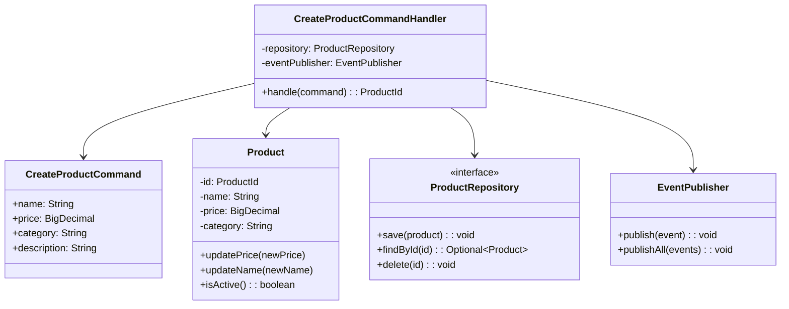

## 📋 Diagrama de Clases - Query Side

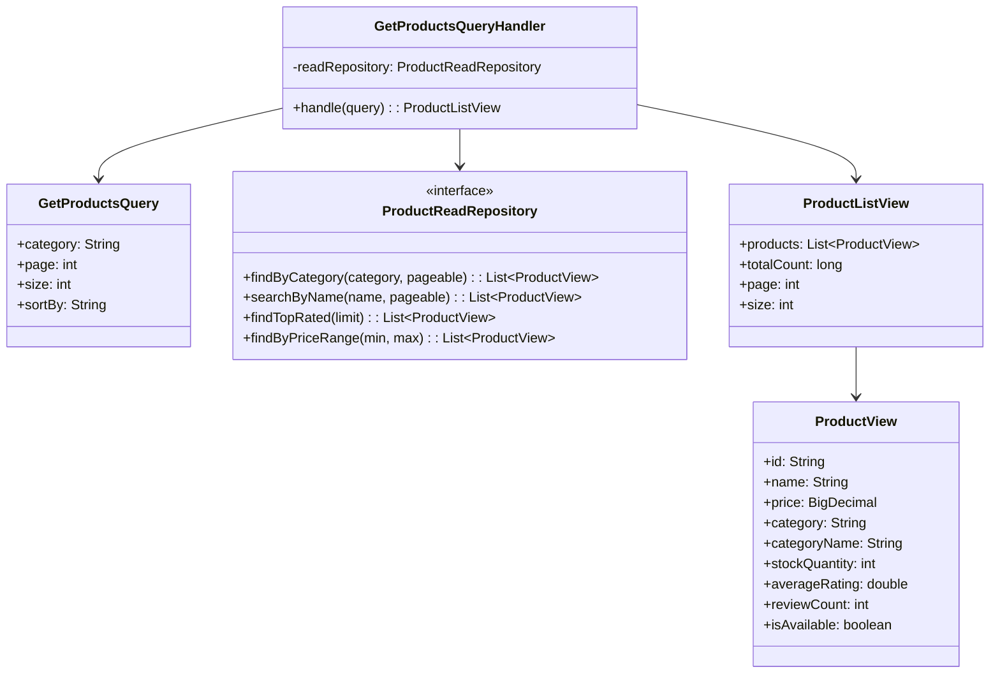

## 🔄 Event Flow Diagram

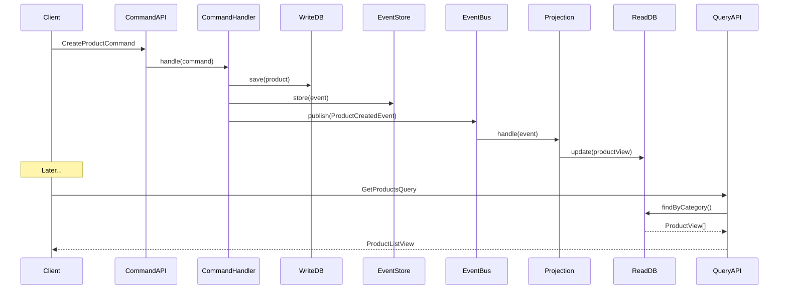

## 🎯 Patrones de Implementación

### Command Pattern Integration
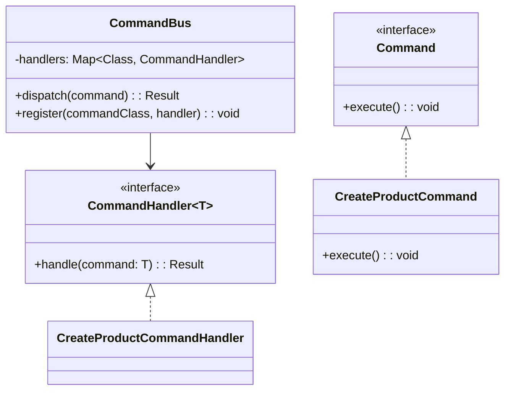

### Query Pattern Integration
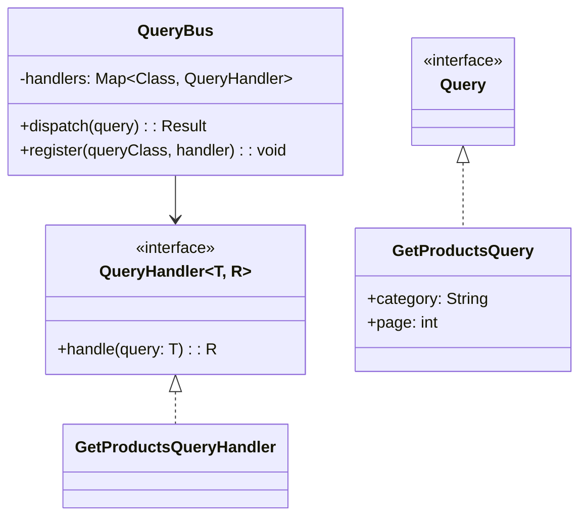

## 📊 Read Model Optimization Strategies

### Denormalized Views
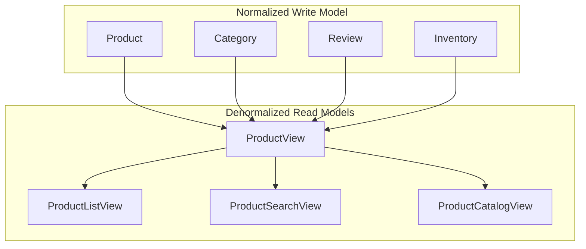

### Materialized Views
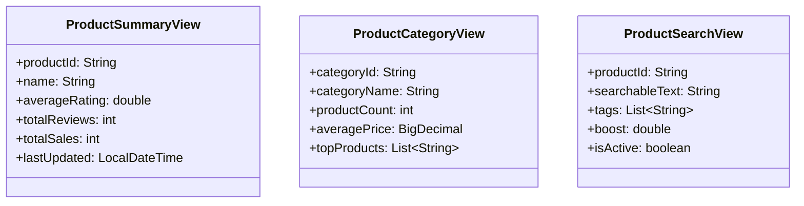

## 🔧 Event Sourcing Integration

### Event Store Pattern
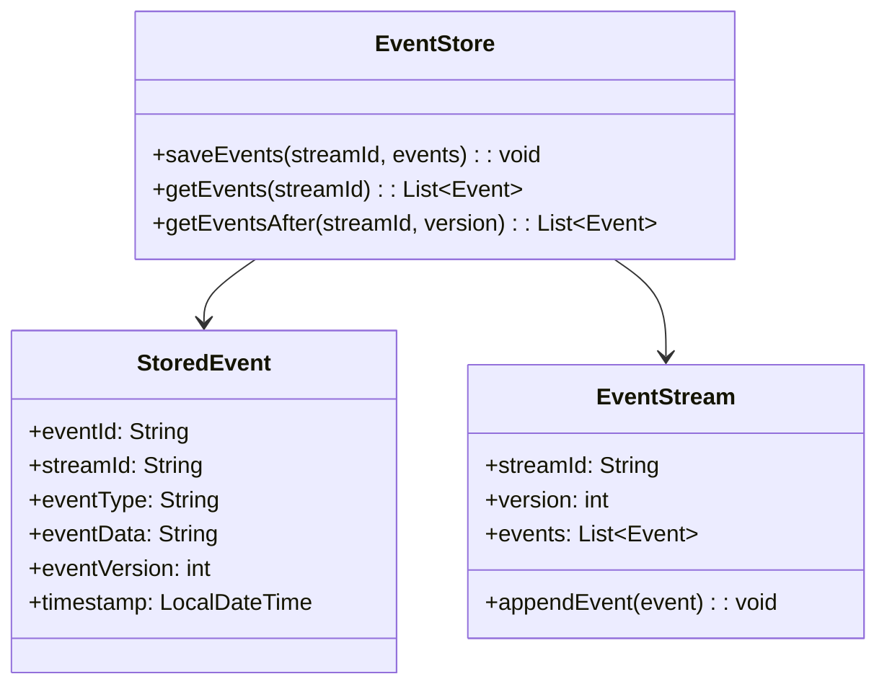

### Projection Rebuilding
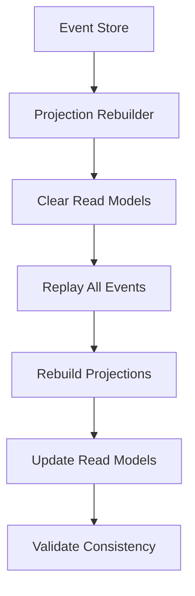

## 🎨 Advanced CQRS Patterns

### Saga Pattern Integration
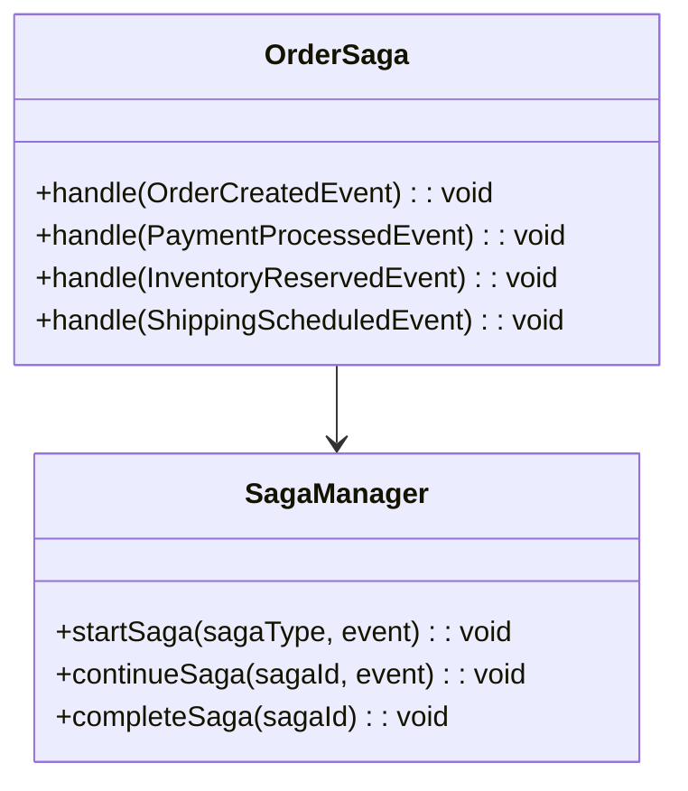

### Snapshot Pattern
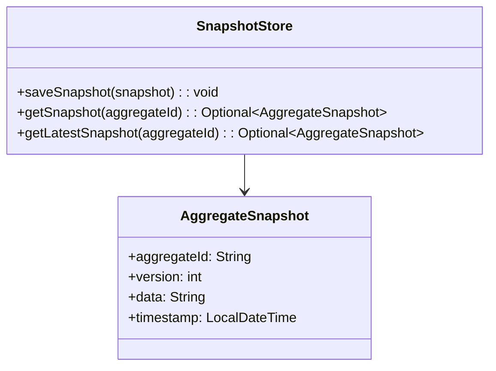