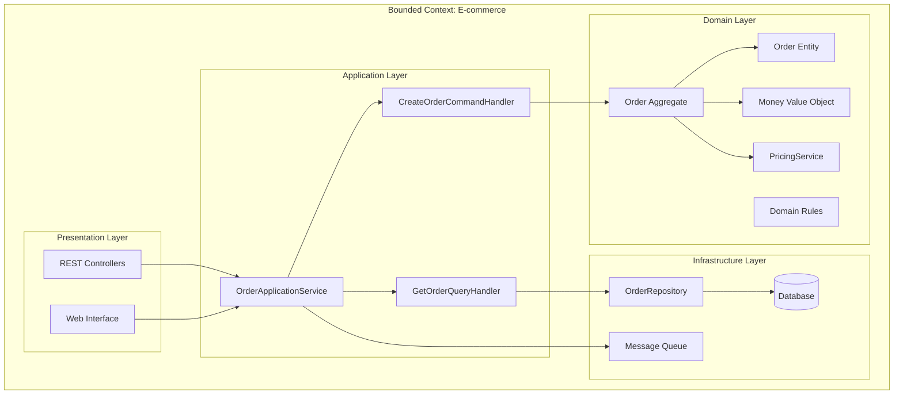
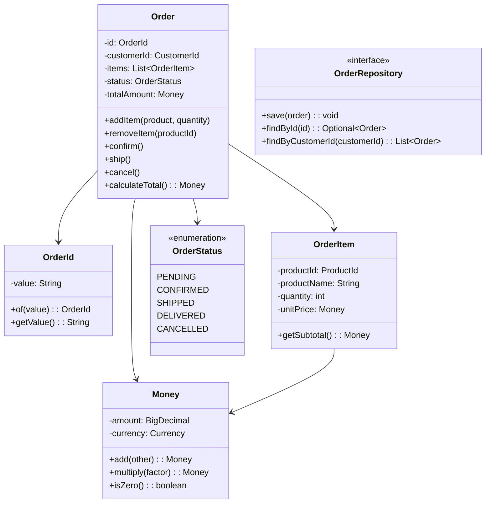
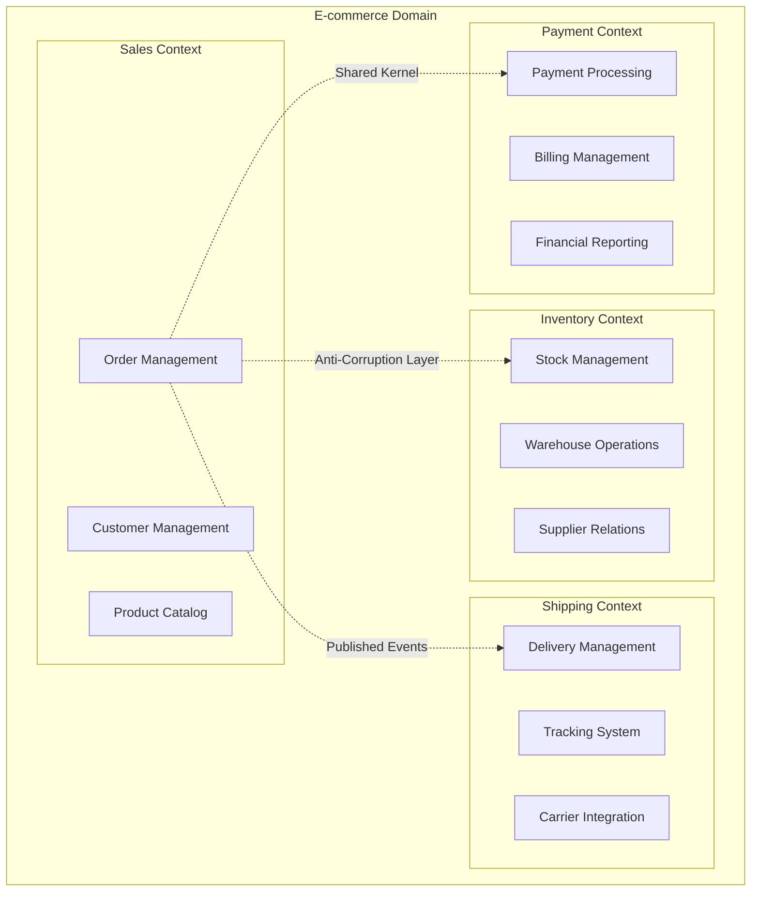
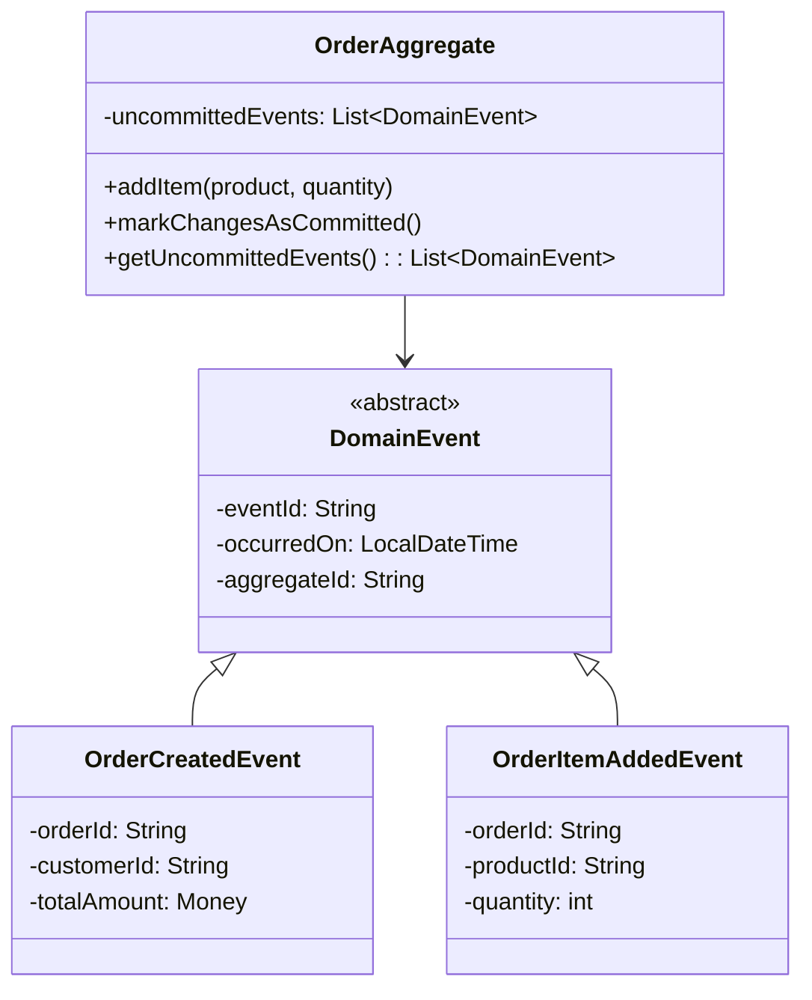
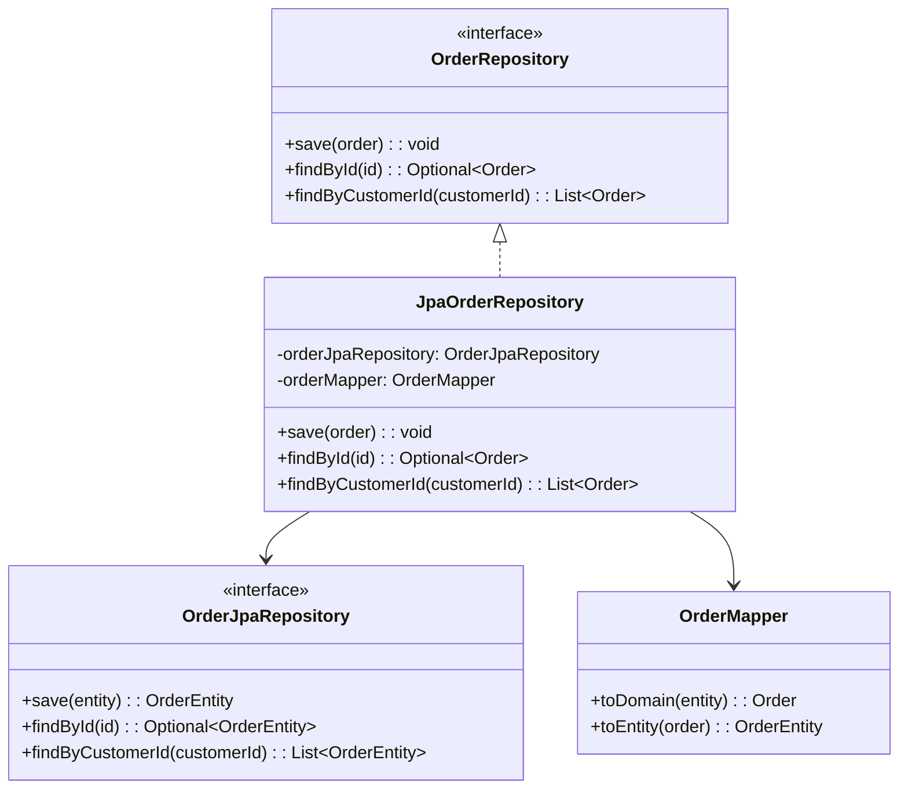
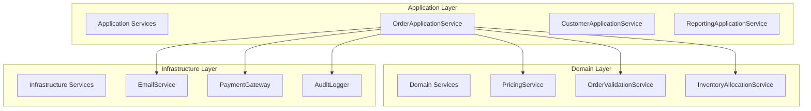
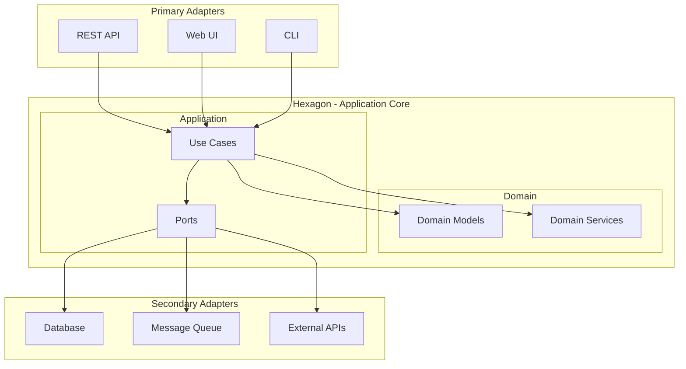
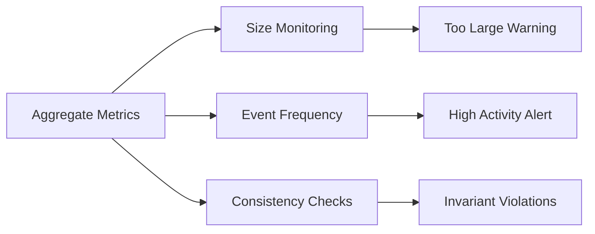
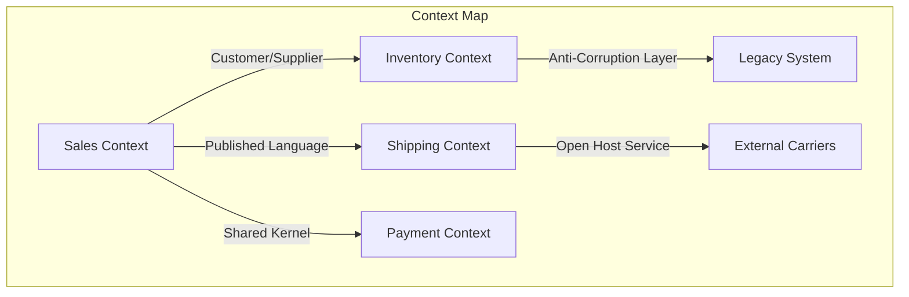

## ❓ Qué problema resuelve
- **Complejidad del dominio**: Cuando el negocio es complejo y las reglas cambian frecuentemente
- **Comunicación**: Desalineación entre desarrolladores y expertos del dominio
- **Mantenibilidad**: Código que no refleja la realidad del negocio

## 🔧 Cómo funciona
DDD se enfoca en modelar el software basándose en el dominio del negocio, creando un lenguaje ubicuo entre desarrolladores y expertos del dominio.

### Conceptos Clave:
- **Entities**: Objetos con identidad única
- **Value Objects**: Objetos inmutables sin identidad
- **Aggregates**: Grupos de entidades relacionadas
- **Repositories**: Abstracción para persistencia
- **Domain Services**: Lógica que no pertenece a una entidad específica

## 📊 Diagrama de Arquitectura



## 🏗️ Estructura de Paquetes DDD

```
src/main/java/com/company/ecommerce/
├── domain/                          # Domain Layer
│   ├── model/
│   │   ├── order/                   # Order Aggregate
│   │   │   ├── Order.java          # Entity
│   │   │   ├── OrderId.java        # Value Object
│   │   │   ├── OrderItem.java      # Entity
│   │   │   ├── OrderStatus.java    # Enum
│   │   │   └── OrderRepository.java # Repository Interface
│   │   ├── customer/               # Customer Aggregate
│   │   │   ├── Customer.java
│   │   │   ├── CustomerId.java
│   │   │   └── CustomerRepository.java
│   │   └── shared/                 # Shared Value Objects
│   │       ├── Money.java
│   │       ├── Address.java
│   │       └── Email.java
│   ├── service/                    # Domain Services
│   │   ├── PricingService.java
│   │   ├── InventoryService.java
│   │   └── OrderValidationService.java
│   └── event/                      # Domain Events
│       ├── OrderCreatedEvent.java
│       ├── OrderShippedEvent.java
│       └── DomainEvent.java
├── application/                     # Application Layer
│   ├── service/
│   │   ├── OrderApplicationService.java
│   │   └── CustomerApplicationService.java
│   ├── command/                    # Commands (CQRS)
│   │   ├── CreateOrderCommand.java
│   │   ├── UpdateOrderCommand.java
│   │   └── CommandHandler.java
│   ├── query/                      # Queries (CQRS)
│   │   ├── GetOrderQuery.java
│   │   ├── OrderQueryHandler.java
│   │   └── OrderProjection.java
│   └── dto/                        # Data Transfer Objects
│       ├── CreateOrderRequest.java
│       ├── OrderResponse.java
│       └── CustomerResponse.java
├── infrastructure/                  # Infrastructure Layer
│   ├── persistence/
│   │   ├── jpa/
│   │   │   ├── OrderJpaRepository.java
│   │   │   ├── CustomerJpaRepository.java
│   │   │   └── JpaOrderRepository.java
│   │   └── entity/                 # JPA Entities
│   │       ├── OrderEntity.java
│   │       ├── CustomerEntity.java
│   │       └── OrderItemEntity.java
│   ├── messaging/
│   │   ├── EventPublisher.java
│   │   ├── OrderEventHandler.java
│   │   └── RabbitMQConfig.java
│   └── external/                   # External Services
│       ├── PaymentGateway.java
│       ├── EmailService.java
│       └── InventoryService.java
└── presentation/                    # Presentation Layer
    ├── rest/
    │   ├── OrderController.java
    │   ├── CustomerController.java
    │   └── GlobalExceptionHandler.java
    └── web/
        ├── OrderWebController.java
        └── CustomerWebController.java
```

## 📋 Diagrama de Clases - Order Aggregate



## 🎯 Bounded Contexts



## 🔄 Aggregate Design Patterns

### Event Sourcing Integration


### Repository Pattern


## 🎨 Domain Services vs Application Services



## 🏛️ Hexagonal Architecture Integration



## 📊 Métricas y Monitoreo DDD

### Aggregate Health


### Bounded Context Mapping
