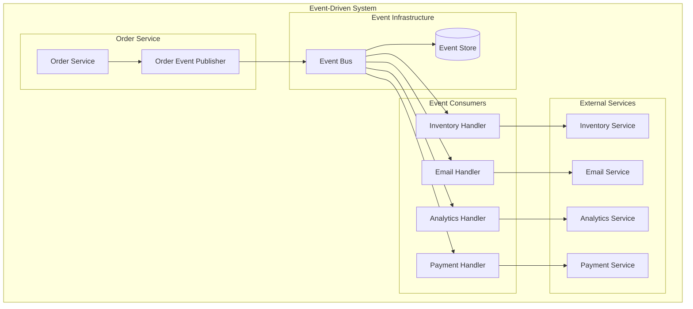

## ❓ Qué problema resuelve
- **Acoplamiento**: Reduce dependencias directas entre componentes
- **Escalabilidad**: Permite procesamiento asíncrono y distribución de carga
- **Extensibilidad**: Fácil agregar nuevas funcionalidades sin modificar código existente
- **Auditoria**: Historial completo de cambios en el sistema

## 🔧 Cómo funciona
Los componentes se comunican a través de eventos, donde los productores publican eventos y los consumidores se suscriben a los eventos que les interesan.

### Conceptos Clave:
- **Events**: Representan algo que ocurrió en el pasado
- **Event Publishers**: Publican eventos
- **Event Handlers**: Procesan eventos
- **Event Store**: Almacena eventos
- **Event Bus**: Mecanismo de distribución de eventos

## 📊 Diagrama



## ☕ Ejemplo en Java

### Event Base
```java
public abstract class DomainEvent {
    private final String eventId;
    private final LocalDateTime occurredOn;
    private final String aggregateId;
    
    protected DomainEvent(String aggregateId) {
        this.eventId = UUID.randomUUID().toString();
        this.occurredOn = LocalDateTime.now();
        this.aggregateId = aggregateId;
    }
    
    // getters...
}
```

### Eventos Específicos
```java
public class OrderCreatedEvent extends DomainEvent {
    private final String customerId;
    private final BigDecimal totalAmount;
    private final List<OrderItem> items;
    
    public OrderCreatedEvent(String orderId, String customerId, 
                           BigDecimal totalAmount, List<OrderItem> items) {
        super(orderId);
        this.customerId = customerId;
        this.totalAmount = totalAmount;
        this.items = new ArrayList<>(items);
    }
    
    // getters...
}

public class PaymentProcessedEvent extends DomainEvent {
    private final String orderId;
    private final BigDecimal amount;
    private final PaymentStatus status;
    
    public PaymentProcessedEvent(String paymentId, String orderId, 
                               BigDecimal amount, PaymentStatus status) {
        super(paymentId);
        this.orderId = orderId;
        this.amount = amount;
        this.status = status;
    }
    
    // getters...
}
```

### Event Publisher
```java
@Component
public class EventPublisher {
    private final ApplicationEventPublisher applicationEventPublisher;
    private final EventStore eventStore;
    
    public EventPublisher(ApplicationEventPublisher applicationEventPublisher,
                         EventStore eventStore) {
        this.applicationEventPublisher = applicationEventPublisher;
        this.eventStore = eventStore;
    }
    
    public void publish(DomainEvent event) {
        // Guardar en event store
        eventStore.save(event);
        
        // Publicar para procesamiento inmediato
        applicationEventPublisher.publishEvent(event);
        
        // Opcional: Publicar a message broker externo
        // messageBroker.publish(event);
    }
    
    public void publishAll(List<DomainEvent> events) {
        events.forEach(this::publish);
    }
}
```

### Event Handlers
```java
@Component
public class InventoryEventHandler {
    private final InventoryService inventoryService;
    
    public InventoryEventHandler(InventoryService inventoryService) {
        this.inventoryService = inventoryService;
    }
    
    @EventListener
    @Async
    public void handle(OrderCreatedEvent event) {
        try {
            inventoryService.reserveItems(event.getItems());
            log.info("Inventory reserved for order: {}", event.getAggregateId());
        } catch (Exception e) {
            log.error("Failed to reserve inventory for order: {}", 
                     event.getAggregateId(), e);
            // Publicar evento de compensación
        }
    }
}

@Component
public class EmailNotificationHandler {
    private final EmailService emailService;
    private final CustomerService customerService;
    
    public EmailNotificationHandler(EmailService emailService,
                                  CustomerService customerService) {
        this.emailService = emailService;
        this.customerService = customerService;
    }
    
    @EventListener
    @Async
    public void handle(OrderCreatedEvent event) {
        Customer customer = customerService.findById(event.getCustomerId());
        
        EmailTemplate template = EmailTemplate.builder()
            .to(customer.getEmail())
            .subject("Order Confirmation")
            .template("order-confirmation")
            .variable("orderId", event.getAggregateId())
            .variable("totalAmount", event.getTotalAmount())
            .build();
            
        emailService.send(template);
    }
    
    @EventListener
    @Async
    public void handle(PaymentProcessedEvent event) {
        if (event.getStatus() == PaymentStatus.COMPLETED) {
            // Enviar email de pago confirmado
        } else {
            // Enviar email de pago fallido
        }
    }
}
```

### Event Store
```java
@Entity
@Table(name = "event_store")
public class StoredEvent {
    @Id
    private String eventId;
    private String aggregateId;
    private String eventType;
    private String eventData;
    private LocalDateTime occurredOn;
    private String version;
    
    // Constructor, getters y setters...
}

@Repository
public interface EventStore extends JpaRepository<StoredEvent, String> {
    
    void save(DomainEvent event);
    
    List<StoredEvent> findByAggregateIdOrderByOccurredOn(String aggregateId);
    
    List<StoredEvent> findByEventTypeAndOccurredOnAfter(String eventType, 
                                                       LocalDateTime after);
}

@Component
public class JpaEventStore implements EventStore {
    private final StoredEventRepository repository;
    private final ObjectMapper objectMapper;
    
    public JpaEventStore(StoredEventRepository repository, ObjectMapper objectMapper) {
        this.repository = repository;
        this.objectMapper = objectMapper;
    }
    
    @Override
    public void save(DomainEvent event) {
        try {
            StoredEvent storedEvent = new StoredEvent(
                event.getEventId(),
                event.getAggregateId(),
                event.getClass().getSimpleName(),
                objectMapper.writeValueAsString(event),
                event.getOccurredOn(),
                "1.0"
            );
            
            repository.save(storedEvent);
        } catch (Exception e) {
            throw new RuntimeException("Failed to store event", e);
        }
    }
}
```

### Aggregate con Eventos
```java
public class Order {
    private OrderId id;
    private CustomerId customerId;
    private List<OrderItem> items;
    private OrderStatus status;
    private List<DomainEvent> domainEvents;
    
    public Order(OrderId id, CustomerId customerId) {
        this.id = id;
        this.customerId = customerId;
        this.items = new ArrayList<>();
        this.status = OrderStatus.PENDING;
        this.domainEvents = new ArrayList<>();
    }
    
    public void addItem(Product product, int quantity) {
        OrderItem item = new OrderItem(product, quantity);
        items.add(item);
        
        // Registrar evento
        addDomainEvent(new OrderItemAddedEvent(
            id.getValue(),
            product.getId().getValue(),
            quantity
        ));
    }
    
    public void confirm() {
        if (items.isEmpty()) {
            throw new IllegalStateException("Cannot confirm empty order");
        }
        
        this.status = OrderStatus.CONFIRMED;
        
        // Registrar evento
        addDomainEvent(new OrderCreatedEvent(
            id.getValue(),
            customerId.getValue(),
            calculateTotal(),
            new ArrayList<>(items)
        ));
    }
    
    private void addDomainEvent(DomainEvent event) {
        this.domainEvents.add(event);
    }
    
    public List<DomainEvent> getDomainEvents() {
        return new ArrayList<>(domainEvents);
    }
    
    public void clearDomainEvents() {
        this.domainEvents.clear();
    }
}
```