## ❓ Qué problema resuelve
- **Estado compartido**: Múltiples componentes necesitan acceder al mismo estado
- **Flujo de datos complejo**: Datos fluyendo en múltiples direcciones
- **Debugging difícil**: Difícil rastrear cambios de estado
- **Efectos secundarios**: Mutaciones impredecibles del estado

## 🔧 Cómo funciona
Implementa un flujo unidireccional de datos donde las acciones desencadenan cambios de estado a través de reducers, y los componentes se suscriben a estos cambios.

## 📊 Diagrama de Arquitectura Flux

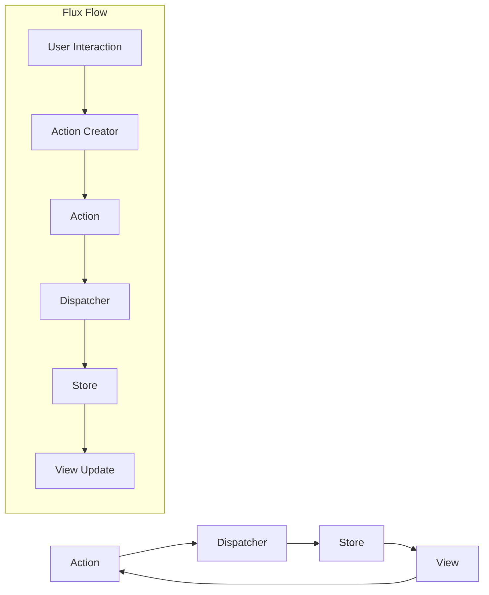

## 📊 Diagrama de Arquitectura Redux

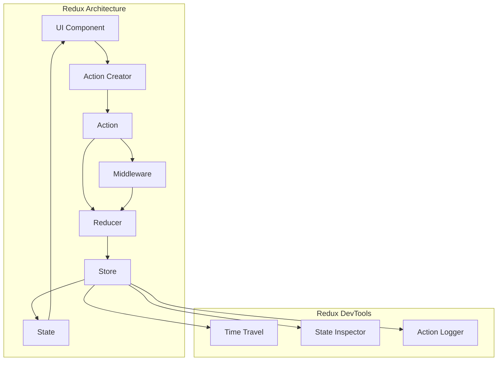

## 🎯 Flux Pattern

### 📊 Diagrama de Clases

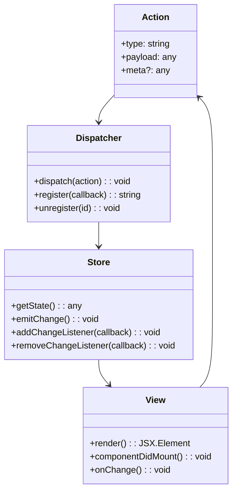

### 🏗️ Estructura de Carpetas Flux

```
src/
├── actions/
│   ├── UserActions.js
│   ├── ProductActions.js
│   └── ActionTypes.js
├── dispatcher/
│   └── AppDispatcher.js
├── stores/
│   ├── UserStore.js
│   ├── ProductStore.js
│   └── BaseStore.js
├── components/
│   ├── UserList.jsx
│   ├── ProductList.jsx
│   └── App.jsx
└── utils/
    └── WebAPIUtils.js
```

---

## 🎯 Redux Pattern

### 📊 Diagrama de Clases

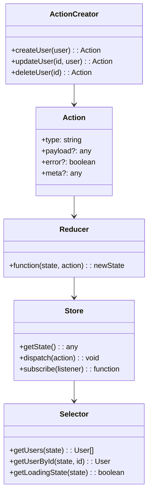

### 🏗️ Estructura de Carpetas Redux

```
src/
├── store/
│   ├── index.js                   # Store configuration
│   └── rootReducer.js
├── features/
│   ├── users/
│   │   ├── userSlice.js          # Redux Toolkit slice
│   │   ├── userActions.js        # Async actions
│   │   ├── userSelectors.js      # Selectors
│   │   ├── userSagas.js          # Side effects
│   │   └── components/
│   │       ├── UserList.jsx
│   │       └── UserForm.jsx
│   └── products/
│       ├── productSlice.js
│       ├── productActions.js
│       └── components/
├── shared/
│   ├── middleware/
│   │   ├── apiMiddleware.js
│   │   └── loggerMiddleware.js
│   └── utils/
│       └── apiClient.js
└── hooks/
    ├── useAppDispatch.js
    ├── useAppSelector.js
    └── useAsyncAction.js
```

---

## 🔄 Flujo de Datos Detallado

### Redux Flow
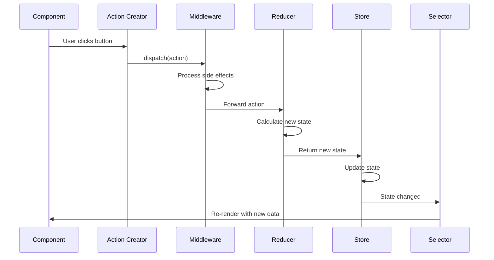

### Async Actions Flow
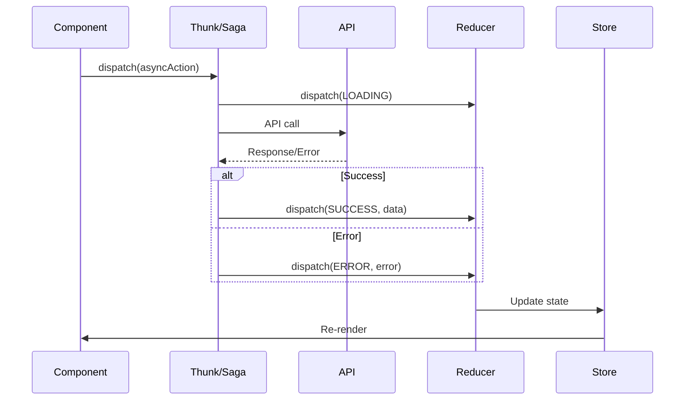

---

## 🎨 Implementación por Framework

### React + Redux

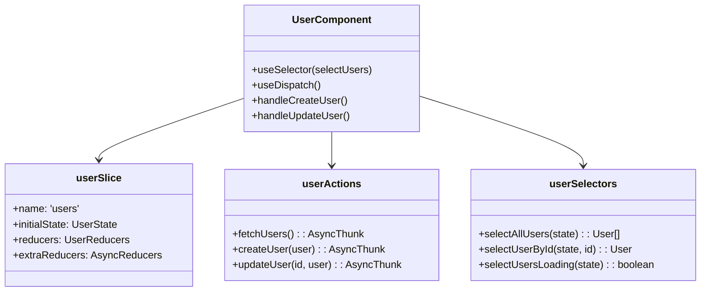

### Angular + NgRx

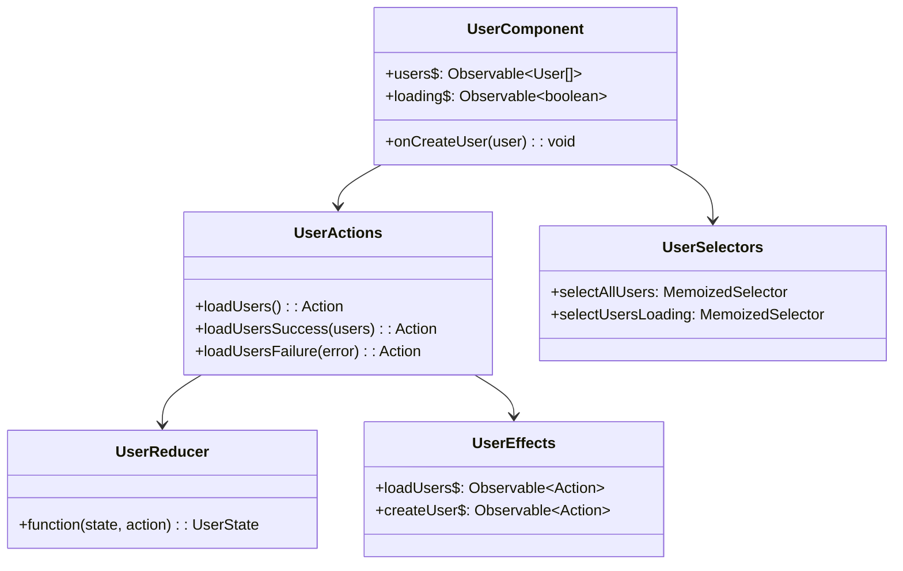

### Vue + Vuex

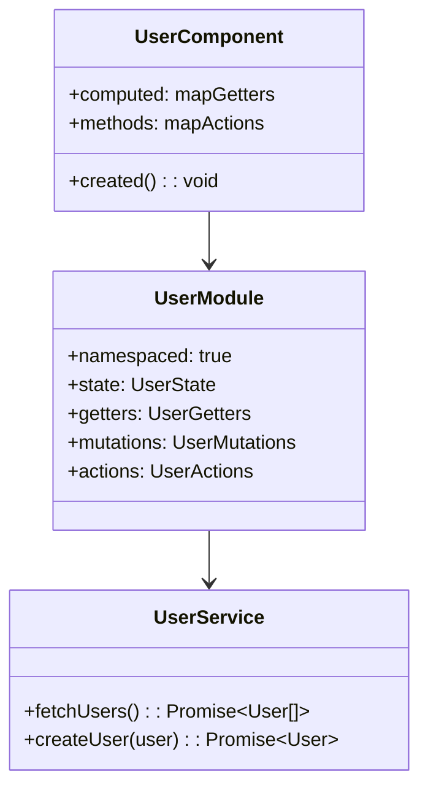

---

## 🧪 Testing Strategies

### Redux Testing
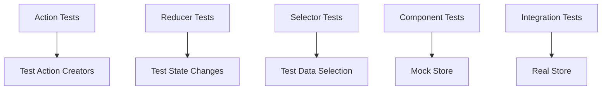

### Testing Pyramid
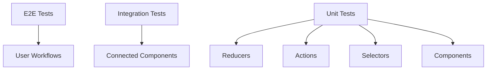

---

## 🔧 Middleware y Side Effects

### Middleware Chain
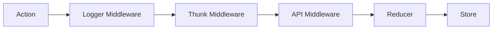

### Side Effects Patterns
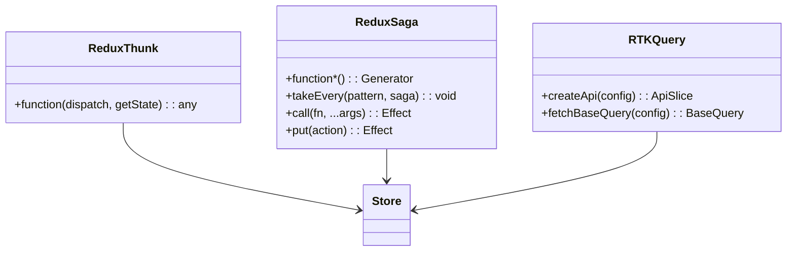

---

## 🎯 Patrones Avanzados

### Normalized State
```mermaid
graph TB
    subgraph "Normalized State Structure"
        A[entities] --> B[users]
        A --> C[posts]
        A --> D[comments]
        
        B --> E[byId: {1: user1, 2: user2}]
        B --> F[allIds: [1, 2]]
        
        C --> G[byId: {1: post1, 2: post2}]
        C --> H[allIds: [1, 2]]
    end
```

### Feature-Based Architecture
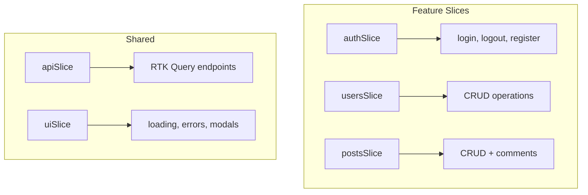

---

## 🎨 Mejores Prácticas

### Estado Inmutable
```mermaid
graph TB
    A[Current State] --> B[Action]
    B --> C[Reducer]
    C --> D[New State]
    
    E[❌ Mutation] --> F[state.users.push(newUser)]
    G[✅ Immutable] --> H[...state, users: [...state.users, newUser]]
```

### Action Design
```mermaid
classDiagram
    class GoodAction {
        +type: "users/userAdded"
        +payload: User
        +meta: {timestamp: Date}
    }
    
    class BadAction {
        +type: "ADD_USER"
        +user: User
        +otherData: any
        +randomProperty: any
    }
    
    note for GoodAction "FSA compliant\nPredictable structure\nNamespaced type"
    note for BadAction "Non-standard structure\nUnpredictable properties\nGeneric type"
```

---

## 🔄 Migración y Evolución

### From Flux to Redux
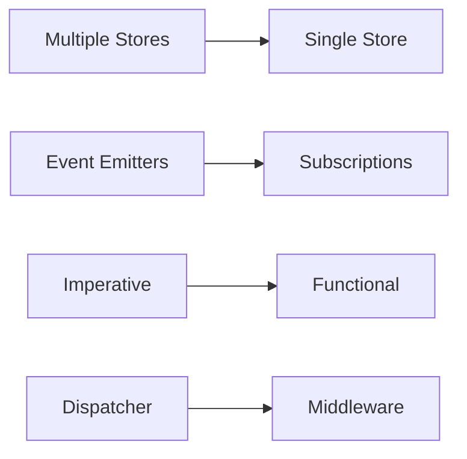

### Modern Redux (RTK)
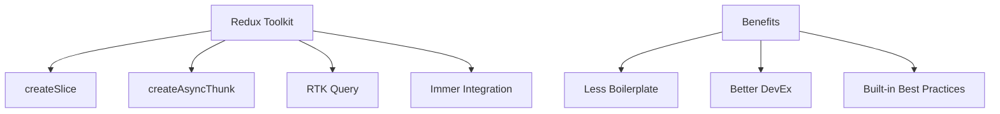

---

## 🎯 Cuándo Usar Redux/Flux

### ✅ Usar cuando:
- **Estado compartido** entre muchos componentes
- **Lógica de estado compleja**
- **Debugging** y **time-travel** necesarios
- **Aplicaciones grandes** con múltiples desarrolladores
- **Efectos secundarios** complejos

### ❌ No usar cuando:
- **Aplicaciones pequeñas** con estado local
- **Prototipado rápido**
- **Estado principalmente en servidor**
- **Componentes independientes**
- **Overhead** no justificado

---

## 📊 Comparación con Otras Soluciones

| Aspecto | Redux | Context API | Zustand | Recoil |
|---------|-------|-------------|---------|--------|
| **Curva de aprendizaje** | Alta | Baja | Baja | Media |
| **Boilerplate** | Alto | Bajo | Muy bajo | Bajo |
| **DevTools** | Excelente | Básico | Bueno | Bueno |
| **Performance** | Buena | Variable | Buena | Excelente |
| **Ecosistema** | Muy grande | Nativo | Pequeño | Creciendo |