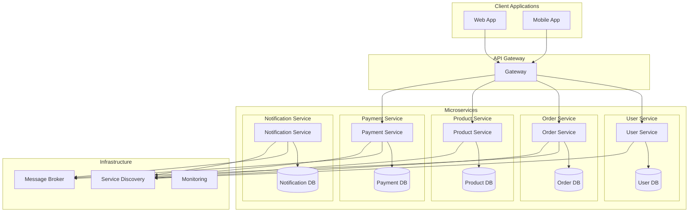
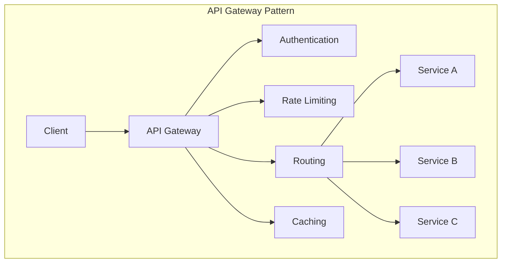
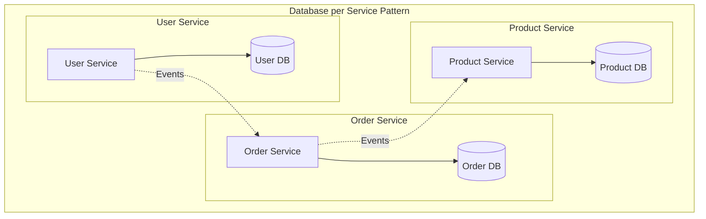
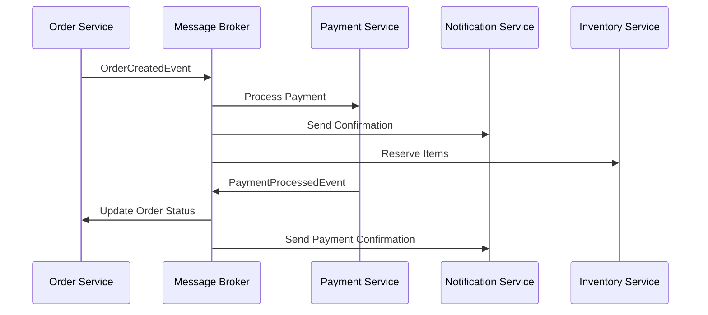

## ❓ Qué problema resuelve
- **Monolitos complejos**: Aplicaciones grandes difíciles de mantener y desplegar
- **Escalabilidad**: Escalar componentes específicos según demanda
- **Tecnología**: Usar diferentes tecnologías para diferentes servicios
- **Equipos**: Permitir que equipos trabajen independientemente
- **Despliegue**: Despliegues independientes y más frecuentes

## 🔧 Cómo funciona
Descompone una aplicación en servicios pequeños e independientes que se comunican a través de APIs bien definidas.

### Conceptos Clave:
- **Servicios independientes**: Cada servicio tiene su propia base de datos
- **Comunicación por API**: REST, gRPC, mensajería
- **Descentralización**: Cada servicio maneja su propia lógica
- **Tolerancia a fallos**: Circuit breakers, timeouts, retries
- **Service Discovery**: Registro y descubrimiento de servicios

## 📊 Diagrama



## ☕ Ejemplo en Java

### User Service
```java
@RestController
@RequestMapping("/api/users")
public class UserController {
    private final UserService userService;
    
    public UserController(UserService userService) {
        this.userService = userService;
    }
    
    @GetMapping("/{userId}")
    public ResponseEntity<UserDto> getUser(@PathVariable String userId) {
        User user = userService.findById(userId);
        return ResponseEntity.ok(UserDto.from(user));
    }
    
    @PostMapping
    public ResponseEntity<String> createUser(@RequestBody CreateUserRequest request) {
        String userId = userService.createUser(request);
        return ResponseEntity.ok(userId);
    }
}

@Service
public class UserService {
    private final UserRepository userRepository;
    private final EventPublisher eventPublisher;
    
    public UserService(UserRepository userRepository, EventPublisher eventPublisher) {
        this.userRepository = userRepository;
        this.eventPublisher = eventPublisher;
    }
    
    public String createUser(CreateUserRequest request) {
        User user = new User(
            UUID.randomUUID().toString(),
            request.getEmail(),
            request.getName()
        );
        
        userRepository.save(user);
        
        eventPublisher.publish(new UserCreatedEvent(
            user.getId(),
            user.getEmail(),
            user.getName()
        ));
        
        return user.getId();
    }
    
    public User findById(String userId) {
        return userRepository.findById(userId)
            .orElseThrow(() -> new UserNotFoundException(userId));
    }
}
```

### Order Service con comunicación entre servicios
```java
@RestController
@RequestMapping("/api/orders")
public class OrderController {
    private final OrderService orderService;
    
    public OrderController(OrderService orderService) {
        this.orderService = orderService;
    }
    
    @PostMapping
    public ResponseEntity<String> createOrder(@RequestBody CreateOrderRequest request) {
        String orderId = orderService.createOrder(request);
        return ResponseEntity.ok(orderId);
    }
    
    @GetMapping("/{orderId}")
    public ResponseEntity<OrderDto> getOrder(@PathVariable String orderId) {
        Order order = orderService.findById(orderId);
        return ResponseEntity.ok(OrderDto.from(order));
    }
}

@Service
public class OrderService {
    private final OrderRepository orderRepository;
    private final UserServiceClient userServiceClient;
    private final ProductServiceClient productServiceClient;
    private final EventPublisher eventPublisher;
    
    public OrderService(OrderRepository orderRepository,
                       UserServiceClient userServiceClient,
                       ProductServiceClient productServiceClient,
                       EventPublisher eventPublisher) {
        this.orderRepository = orderRepository;
        this.userServiceClient = userServiceClient;
        this.productServiceClient = productServiceClient;
        this.eventPublisher = eventPublisher;
    }
    
    @Transactional
    public String createOrder(CreateOrderRequest request) {
        // Validar usuario existe
        UserDto user = userServiceClient.getUser(request.getUserId());
        if (user == null) {
            throw new UserNotFoundException(request.getUserId());
        }
        
        // Validar productos y obtener precios
        List<OrderItem> items = new ArrayList<>();
        for (OrderItemRequest itemRequest : request.getItems()) {
            ProductDto product = productServiceClient.getProduct(itemRequest.getProductId());
            if (product == null) {
                throw new ProductNotFoundException(itemRequest.getProductId());
            }
            
            items.add(new OrderItem(
                itemRequest.getProductId(),
                product.getName(),
                product.getPrice(),
                itemRequest.getQuantity()
            ));
        }
        
        Order order = new Order(
            UUID.randomUUID().toString(),
            request.getUserId(),
            items
        );
        
        orderRepository.save(order);
        
        eventPublisher.publish(new OrderCreatedEvent(
            order.getId(),
            order.getUserId(),
            order.getTotalAmount(),
            order.getItems()
        ));
        
        return order.getId();
    }
}
```

### Service Clients con Circuit Breaker
```java
@Component
public class UserServiceClient {
    private final RestTemplate restTemplate;
    private final CircuitBreaker circuitBreaker;
    
    public UserServiceClient(RestTemplate restTemplate) {
        this.restTemplate = restTemplate;
        this.circuitBreaker = CircuitBreaker.ofDefaults("userService");
    }
    
    public UserDto getUser(String userId) {
        return circuitBreaker.executeSupplier(() -> {
            try {
                ResponseEntity<UserDto> response = restTemplate.getForEntity(
                    "http://user-service/api/users/" + userId,
                    UserDto.class
                );
                return response.getBody();
            } catch (Exception e) {
                throw new UserServiceException("Failed to get user: " + userId, e);
            }
        });
    }
}

@Component
public class ProductServiceClient {
    private final WebClient webClient;
    private final CircuitBreaker circuitBreaker;
    
    public ProductServiceClient(WebClient.Builder webClientBuilder) {
        this.webClient = webClientBuilder
            .baseUrl("http://product-service")
            .build();
        this.circuitBreaker = CircuitBreaker.ofDefaults("productService");
    }
    
    public ProductDto getProduct(String productId) {
        return circuitBreaker.executeSupplier(() -> {
            return webClient
                .get()
                .uri("/api/products/{productId}", productId)
                .retrieve()
                .bodyToMono(ProductDto.class)
                .timeout(Duration.ofSeconds(5))
                .block();
        });
    }
}
```

### Configuration para Microservicios
```java
@Configuration
@EnableEurekaClient
public class MicroserviceConfig {
    
    @Bean
    @LoadBalanced
    public RestTemplate restTemplate() {
        return new RestTemplate();
    }
    
    @Bean
    public WebClient.Builder webClientBuilder() {
        return WebClient.builder();
    }
    
    @Bean
    public CircuitBreakerRegistry circuitBreakerRegistry() {
        return CircuitBreakerRegistry.ofDefaults();
    }
}

// Application properties
# application.yml
server:
  port: 8081

spring:
  application:
    name: order-service
  datasource:
    url: jdbc:postgresql://localhost:5432/orderdb
    username: ${DB_USERNAME:orderuser}
    password: ${DB_PASSWORD:orderpass}

eureka:
  client:
    service-url:
      defaultZone: http://localhost:8761/eureka/
  instance:
    prefer-ip-address: true

management:
  endpoints:
    web:
      exposure:
        include: health,info,metrics
  endpoint:
    health:
      show-details: always

resilience4j:
  circuitbreaker:
    instances:
      userService:
        failure-rate-threshold: 50
        wait-duration-in-open-state: 30s
        sliding-window-size: 10
      productService:
        failure-rate-threshold: 50
        wait-duration-in-open-state: 30s
        sliding-window-size: 10
```

### Event Handler para comunicación asíncrona
```java
@Component
public class OrderEventHandler {
    private final NotificationServiceClient notificationClient;
    private final PaymentServiceClient paymentClient;
    
    public OrderEventHandler(NotificationServiceClient notificationClient,
                           PaymentServiceClient paymentClient) {
        this.notificationClient = notificationClient;
        this.paymentClient = paymentClient;
    }
    
    @EventListener
    @Async
    public void handle(OrderCreatedEvent event) {
        // Enviar notificación
        notificationClient.sendOrderConfirmation(
            event.getUserId(),
            event.getAggregateId()
        );
        
        // Iniciar proceso de pago
        paymentClient.processPayment(new PaymentRequest(
            event.getAggregateId(),
            event.getTotalAmount()
        ));
    }
}

## ✅ Ventajas

- **Escalabilidad independiente**: Cada servicio se escala según su demanda
- **Tecnología heterogénea**: Diferentes tecnologías para diferentes servicios
- **Equipos autónomos**: Desarrollo y despliegue independiente
- **Tolerancia a fallos**: Fallo de un servicio no afecta a otros
- **Despliegues frecuentes**: Ciclos de desarrollo más rápidos

## ❌ Desventajas

- **Complejidad operacional**: Más servicios que monitorear y mantener
- **Latencia de red**: Comunicación entre servicios añade latencia
- **Consistencia de datos**: Transacciones distribuidas son complejas
- **Testing complejo**: Pruebas de integración más difíciles
- **Overhead de infraestructura**: Más recursos necesarios

## 🎯 Patrones Complementarios

### API Gateway


### Database per Service


## 🔄 Comunicación entre Servicios

### Event-Driven Communication


## 🛠️ Herramientas y Tecnologías

### Service Discovery
- **Netflix Eureka**: Service registry
- **Consul**: Service mesh y discovery
- **Kubernetes**: Service discovery nativo

### API Gateway
- **Netflix Zuul**: Routing y filtering
- **Spring Cloud Gateway**: Gateway reactivo
- **Kong**: API gateway empresarial

### Resilience Patterns
- **Circuit Breaker**: Resilience4j, Hystrix
- **Bulkhead**: Aislamiento de recursos
- **Timeout**: Límites de tiempo
- **Retry**: Reintentos con backoff

## 🎨 Casos de Uso Ideales

### E-commerce
- **User Service**: Gestión de usuarios
- **Product Service**: Catálogo de productos
- **Order Service**: Procesamiento de pedidos
- **Payment Service**: Procesamiento de pagos
- **Inventory Service**: Gestión de inventario
- **Notification Service**: Notificaciones

### Banking
- **Account Service**: Gestión de cuentas
- **Transaction Service**: Procesamiento de transacciones
- **Fraud Service**: Detección de fraude
- **Notification Service**: Alertas y notificaciones
- **Reporting Service**: Reportes y analytics
```