## ❓ Qué problema resuelven
- **Lógica mezclada**: UI, lógica de negocio y datos en el mismo lugar
- **Difícil testing**: Componentes acoplados difíciles de probar
- **Mantenibilidad**: Cambios en UI afectan lógica de negocio
- **Reutilización**: Lógica no reutilizable entre diferentes vistas

## 🔧 Cómo funcionan
Separan las responsabilidades de presentación, lógica y datos en componentes distintos con roles específicos.

## 📊 Comparación de Patrones

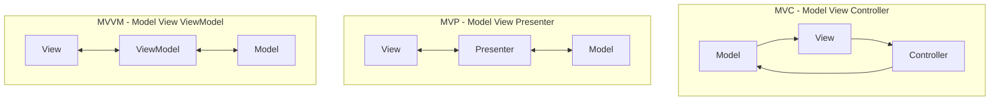

## 🎯 MVC - Model View Controller

### 📊 Diagrama de Arquitectura

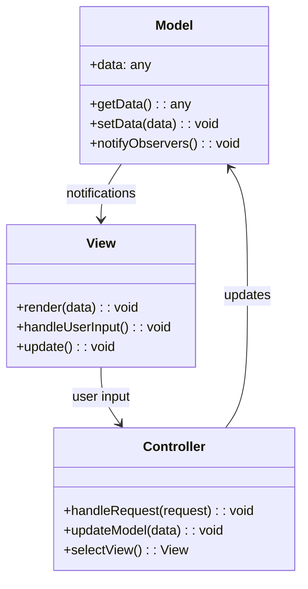

### 🏗️ Estructura Angular (MVC-like)

```
src/app/user-management/
├── models/
│   ├── user.model.ts              # Model
│   └── user-response.model.ts
├── controllers/
│   ├── user.controller.ts         # Controller
│   └── user-list.controller.ts
├── views/
│   ├── user-list.component.html   # View
│   ├── user-list.component.ts
│   └── user-form.component.html
└── services/
    ├── user.service.ts            # Model Services
    └── user-api.service.ts
```

### 🎨 Características MVC
- **Flujo unidireccional**: User → Controller → Model → View
- **Controller central**: Maneja toda la lógica de coordinación
- **Vista pasiva**: Solo renderiza, no contiene lógica
- **Modelo independiente**: No conoce vistas ni controladores

---

## 🎯 MVP - Model View Presenter

### 📊 Diagrama de Arquitectura

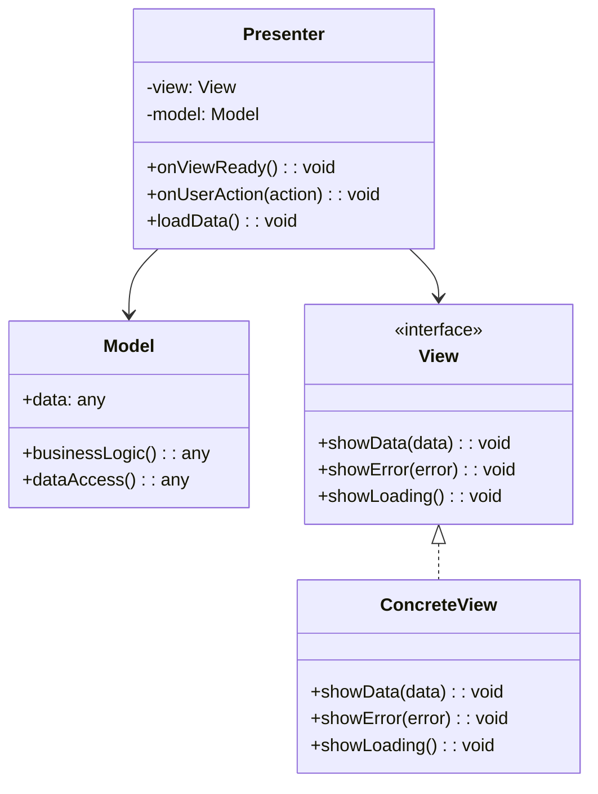

### 🏗️ Estructura Angular (MVP)

```
src/app/user-management/
├── models/
│   ├── user.model.ts
│   └── user.repository.ts         # Model
├── presenters/
│   ├── user-list.presenter.ts     # Presenter
│   └── user-form.presenter.ts
├── views/
│   ├── contracts/
│   │   ├── user-list.view.ts      # View Interface
│   │   └── user-form.view.ts
│   ├── user-list.component.ts     # Concrete View
│   ├── user-list.component.html
│   └── user-form.component.ts
└── services/
    └── user.service.ts
```

### 🎨 Características MVP
- **Vista pasiva**: No contiene lógica, solo interfaz
- **Presenter activo**: Maneja toda la lógica de presentación
- **Testeable**: Presenter se puede probar sin UI
- **Acoplamiento débil**: Vista e interfaz separadas

---

## 🎯 MVVM - Model View ViewModel

### 📊 Diagrama de Arquitectura

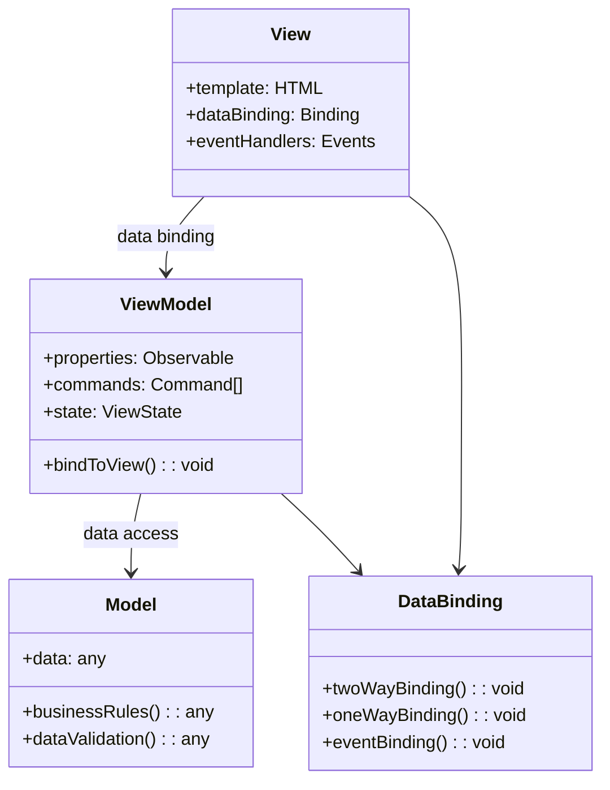

### 🏗️ Estructura Angular (MVVM)

```
src/app/user-management/
├── models/
│   ├── user.model.ts              # Model
│   ├── user.service.ts
│   └── user.repository.ts
├── view-models/
│   ├── user-list.view-model.ts    # ViewModel
│   ├── user-form.view-model.ts
│   └── base.view-model.ts
├── views/
│   ├── user-list.component.ts     # View
│   ├── user-list.component.html
│   ├── user-form.component.ts
│   └── user-form.component.html
└── shared/
    ├── commands/
    │   └── relay-command.ts
    └── observables/
        └── observable-property.ts
```

### 🎨 Características MVVM
- **Data Binding**: Sincronización automática View ↔ ViewModel
- **Commands**: Acciones encapsuladas en objetos
- **Observables**: Propiedades que notifican cambios
- **Declarativo**: Vista describe qué mostrar, no cómo

---

## 🔄 Comparación Detallada

### Flujo de Datos

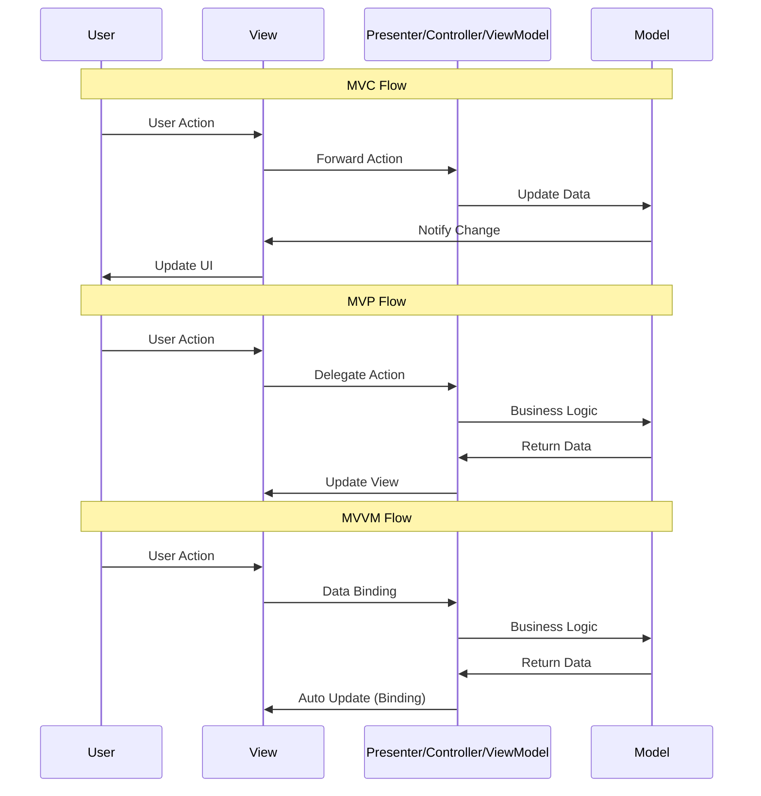

### Tabla Comparativa

| Aspecto | MVC | MVP | MVVM |
|---------|-----|-----|------|
| **Vista** | Pasiva/Activa | Pasiva | Activa (Data Binding) |
| **Lógica de Presentación** | Controller | Presenter | ViewModel |
| **Testabilidad** | Media | Alta | Alta |
| **Data Binding** | Manual | Manual | Automático |
| **Acoplamiento** | Medio | Bajo | Bajo |
| **Complejidad** | Baja | Media | Alta |

---

## 🎨 Implementación en Frameworks

### Angular (MVVM-like)

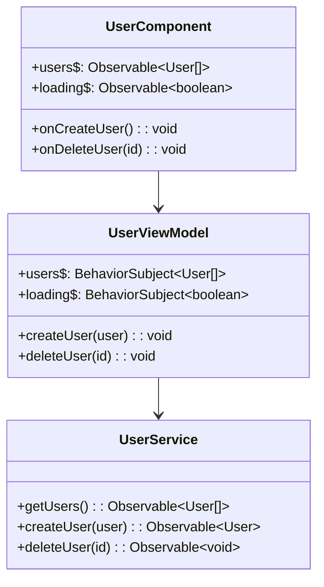

### React (MVP-like con Hooks)

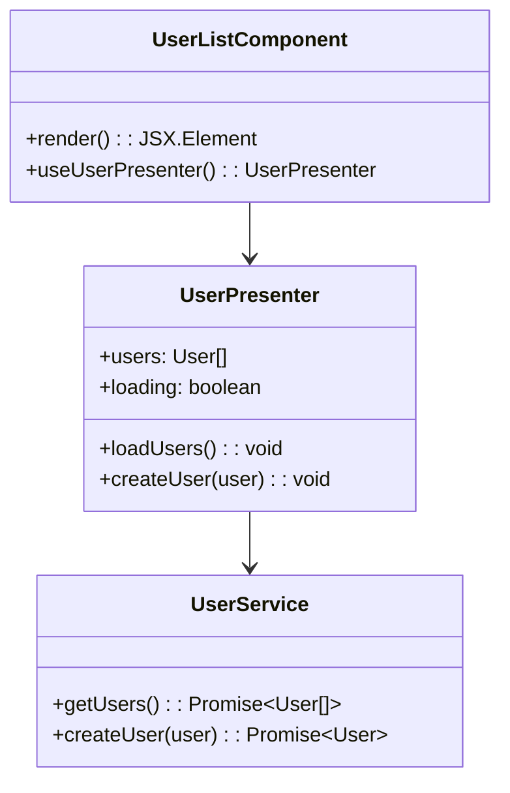

### Vue.js (MVVM-like)

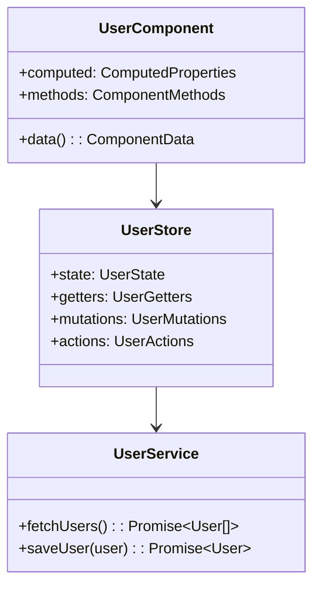

---

## 🧪 Testing Strategies

### MVC Testing
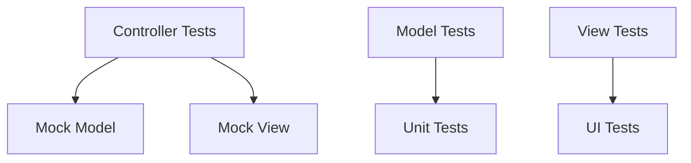

### MVP Testing
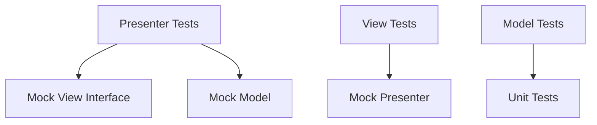

### MVVM Testing
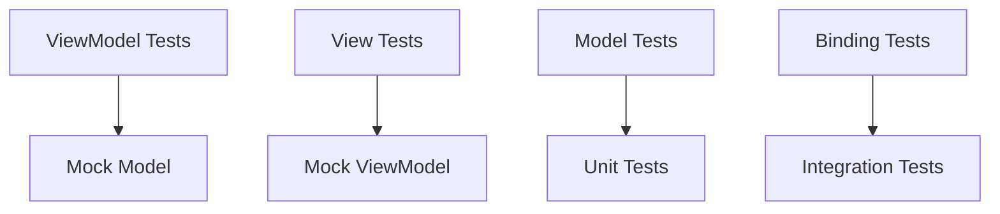

---

## 🎯 Cuándo Usar Cada Patrón

### MVC
- ✅ **Aplicaciones web tradicionales**
- ✅ **Flujo de navegación simple**
- ✅ **Equipos pequeños**
- ❌ **Interfaces complejas**
- ❌ **Mucha interactividad**

### MVP
- ✅ **Testing intensivo**
- ✅ **Lógica de presentación compleja**
- ✅ **Múltiples vistas para mismo modelo**
- ❌ **Data binding automático requerido**
- ❌ **Desarrollo rápido**

### MVVM
- ✅ **Data binding automático**
- ✅ **Interfaces reactivas**
- ✅ **Aplicaciones complejas**
- ✅ **Frameworks que lo soportan**
- ❌ **Aplicaciones simples**
- ❌ **Performance crítica**

---

## 🔧 Mejores Prácticas

### General
- **Separación clara** de responsabilidades
- **Interfaces bien definidas** entre capas
- **Testing** de cada capa por separado
- **Inyección de dependencias** para desacoplamiento

### Específicas por Patrón
- **MVC**: Controller delgado, Model rico
- **MVP**: Vista tonta, Presenter inteligente
- **MVVM**: ViewModel sin referencias a Vista