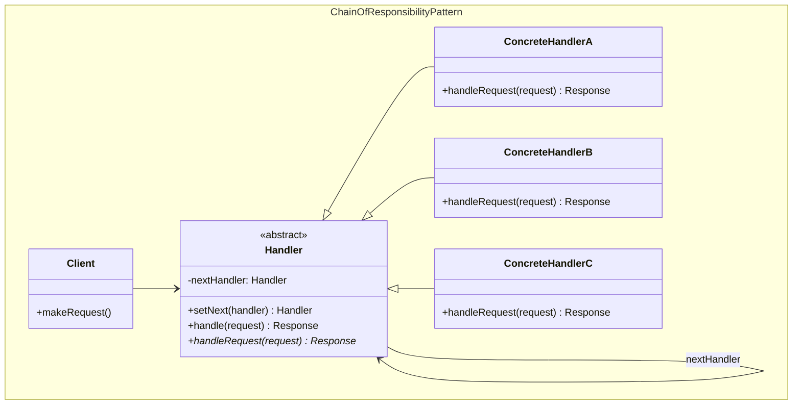
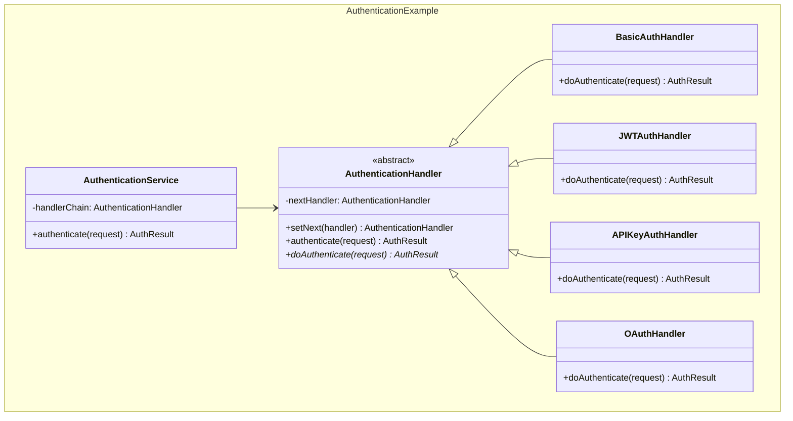
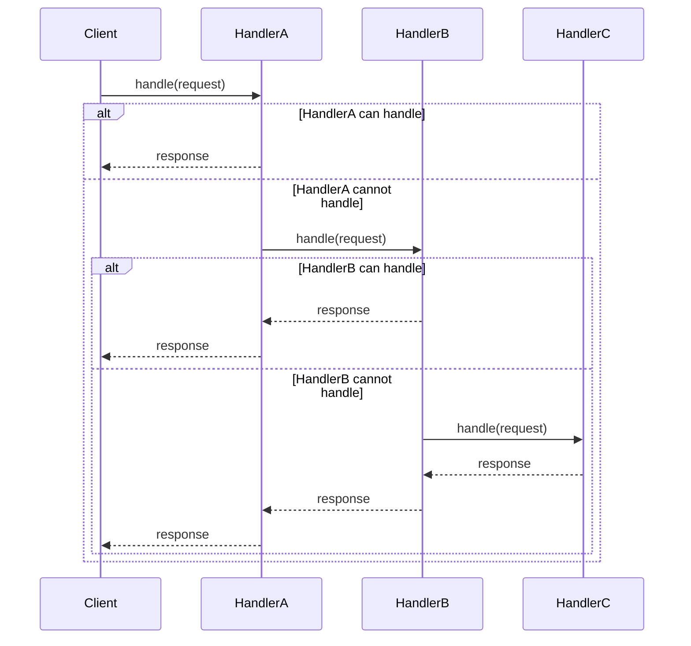

## Problema
Crear un flujo de procesamiento complejo que sea fácilmente modificable sin cambiar el código cliente.

## Propósito
Permite que múltiples objetos tengan la oportunidad de procesar una solicitud, pasándola a través de una cadena hasta que alguno la maneje. Desacopla el emisor del receptor y hace el flujo fácilmente configurable.

## Concepto clave
**Cadena configurable**: Como middleware de Express - cada handler decide si procesa la request o la pasa al siguiente. Puedes reordenar, agregar o quitar handlers sin tocar el código cliente.

## Casos de uso comunes
- Middleware en aplicaciones web
- Sistemas de validación con múltiples reglas
- Sistemas de autorización por niveles
- Procesamiento de eventos con múltiples handlers
- Filtros de contenido
- Sistemas de logging con diferentes niveles

## ¿Quién es quién en Chain of Responsibility?

| Actor | Lo que realmente es | Ejemplo | Analogía |
|-------|--------------------|---------|-----------|
| **Handler** | Interfaz que define cómo manejar requests | `AuthenticationHandler` - define `authenticate()` | "Ventanilla" (interfaz de atención) |
| **ConcreteHandler** | Manejadores que deciden si procesan o pasan | `BasicAuthHandler`, `JWTAuthHandler` | Ventanilla 1, 2, 3 (cada una maneja ciertos trámites) |
| **Client** | Envía el request, no sabe quién lo procesará | `AuthenticationService` - inicia la cadena | Ciudadano con un trámite |

## Diagrama

## Ejemplo práctico

## Flujo de la cadena

## Ventajas
- **Desacoplamiento**: Emisor y receptor no se conocen directamente
- **Flexibilidad**: Fácil agregar, quitar o reordenar handlers
- **Responsabilidad única**: Cada handler maneja un tipo específico de request
- **Configuración dinámica**: La cadena puede modificarse en tiempo de ejecución

## Desventajas
- **Performance**: Puede ser lento si la cadena es larga
- **Debugging**: Difícil rastrear qué handler procesó el request
- **Garantías**: No garantiza que el request será manejado
- **Complejidad**: Puede volverse complejo con muchos handlers

## Cuándo usar
- Tienes un flujo de procesamiento que cambia frecuentemente
- Múltiples objetos pueden manejar el mismo tipo de solicitud
- Quieres configurar el orden de procesamiento dinámicamente
- Necesitas desacoplar el cliente de los procesadores específicos

## Cuándo NO usar
- Solo hay una forma de procesar la solicitud
- Todos los handlers deben procesar la solicitud (usa Decorator)
- El orden no importa (usa Strategy)
- La performance es crítica y tienes muchos handlers