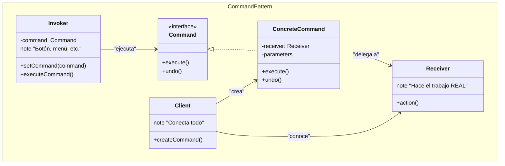
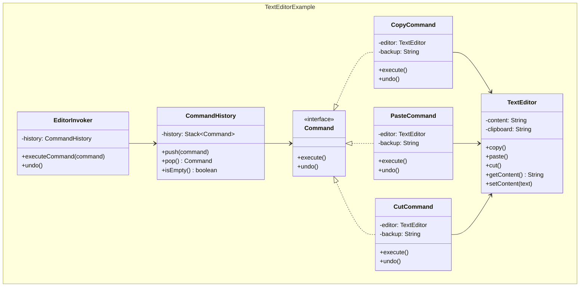
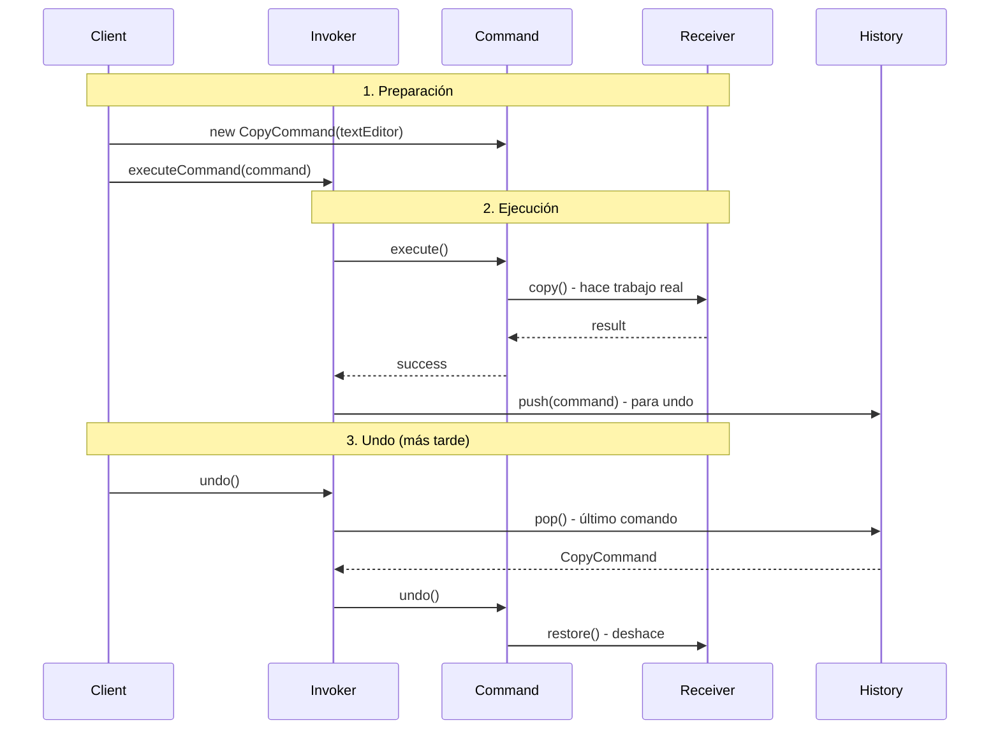

## Problema
Convertir operaciones en objetos para poder almacenarlas, pasarlas como parámetros, ejecutarlas más tarde o deshacerlas.

## Propósito
Encapsula una operación completa (acción + parámetros + receptor) en un objeto. Esto permite tratar las operaciones como objetos de primera clase: guardarlas, pasarlas, ejecutarlas cuando sea necesario y revertirlas.

## Concepto clave
**Operación como objeto**: En lugar de llamar directamente `editor.copy()`, creas un objeto `CopyCommand` que sabe cómo ejecutar y deshacer esa operación.

**Ejemplo simple**: En lugar de `suma = a + b`, creas un objeto `SumarCommand(a, b)` que:
- Sabe cómo hacer la suma
- Puede ejecutarse más tarde
- Puede deshacerse (restando)
- Puede guardarse en una lista de operaciones

## Casos de uso comunes
- Sistemas de undo/redo
- Macros y scripts
- Colas de tareas y jobs
- Logging de operaciones
- Transacciones y rollbacks
- Interfaces gráficas (botones, menús)

## ¿Quién es quién en Command?

| Actor | Lo que realmente es | Ejemplo | Analogía |
|-------|--------------------|---------|-----------|
| **Command** | Interfaz que define `execute()` y `undo()` | `Command` - operaciones que se pueden deshacer | "Señal infrarroja" (mensaje) |
| **ConcreteCommand** | Sabe QUÉ hacer y CÓMO deshacerlo | `CopyCommand`, `PasteCommand` | Comando específico del control |
| **Receiver** | El que REALMENTE hace el trabajo | `TextEditor` - tiene la lógica real | Televisor (hace el trabajo real) |
| **Invoker** | El que ejecuta comandos | `EditorInvoker` - botones, menús | Control remoto (botón) |

## Diagrama

## Ejemplo práctico

## Flujo paso a paso

**Ejemplo concreto**: Usuario hace clic en "Copiar" en un editor

1. **Client** crea: `CopyCommand(textEditor)` 
2. **Client** le dice al **Invoker** (botón): "ejecuta este comando"
3. **Invoker** llama: `command.execute()`
4. **Command** llama: `textEditor.copy()` (delega al Receiver)
5. **Receiver** (TextEditor) hace el trabajo real
6. **Invoker** guarda el comando en historial para undo

## Ventajas
- **Desacoplamiento**: Separa el objeto que invoca la operación del que la ejecuta
- **Flexibilidad**: Permite parametrizar objetos con operaciones
- **Undo/Redo**: Soporte natural para operaciones reversibles
- **Logging**: Fácil registrar y auditar operaciones
- **Macros**: Combinar múltiples comandos en uno compuesto

## Desventajas
- **Complejidad**: Introduce muchas clases pequeñas
- **Memoria**: Mantener historial puede consumir memoria
- **Overhead**: Puede ser excesivo para operaciones simples
- **Estado**: Manejar estado para undo puede ser complejo

## Cuándo usar
- Necesitas undo/redo en tu aplicación
- Quieres crear macros o secuencias de operaciones
- Necesitas hacer cola de operaciones para ejecutar más tarde
- Quieres registrar/auditar todas las operaciones
- Necesitas transacciones que se puedan revertir

## Cuándo NO usar
- Las operaciones son simples y no necesitas deshacerlas
- No hay beneficio en diferir la ejecución
- La aplicación no requiere historial de operaciones
- La complejidad adicional no se justifica