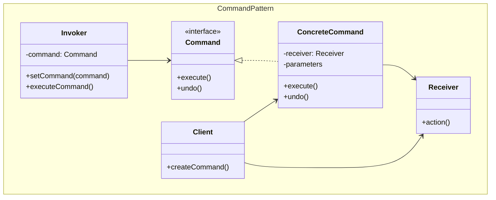
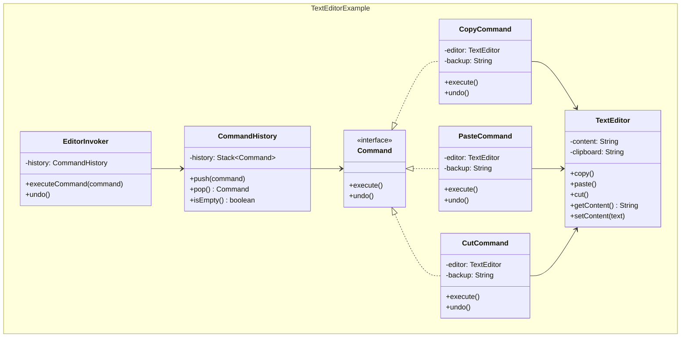
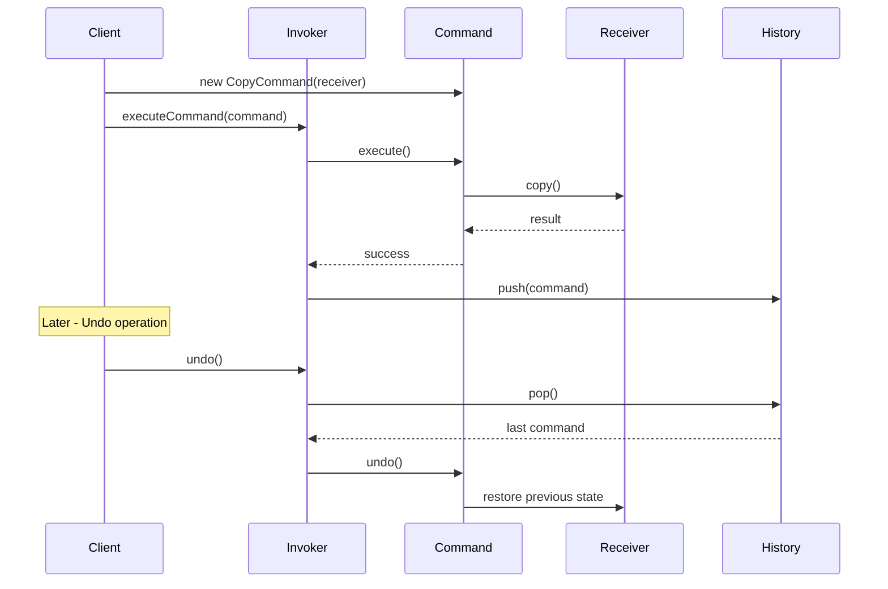

## Problema
Convertir operaciones en objetos para poder almacenarlas, pasarlas como parámetros, ejecutarlas más tarde o deshacerlas.

## Propósito
Encapsula una operación completa (acción + parámetros + receptor) en un objeto. Esto permite tratar las operaciones como objetos de primera clase: guardarlas, pasarlas, ejecutarlas cuando sea necesario y revertirlas.

## Concepto clave
**Operación como objeto**: En lugar de llamar directamente `editor.copy()`, creas un objeto `CopyCommand` que sabe cómo ejecutar y deshacer esa operación.

## Casos de uso comunes
- Sistemas de undo/redo
- Macros y scripts
- Colas de tareas y jobs
- Logging de operaciones
- Transacciones y rollbacks
- Interfaces gráficas (botones, menús)

## Diagrama



## Ejemplo práctico



## Flujo de ejecución



## Casos de uso prácticos

```java
// 1. Undo/Redo
CommandHistory history = new CommandHistory();
Command copyCmd = new CopyCommand(editor);
history.execute(copyCmd);  // Ejecuta y guarda
history.undo();           // Deshace la última operación

// 2. Macros (múltiples operaciones)
MacroCommand formatText = new MacroCommand()
    .add(new SelectAllCommand(editor))
    .add(new BoldCommand(editor))
    .add(new CenterAlignCommand(editor));
formatText.execute();     // Ejecuta todas las operaciones
formatText.undo();        // Deshace todas en orden inverso

// 3. Colas de trabajo
Queue<Command> jobQueue = new LinkedList<>();
jobQueue.add(new SendEmailCommand(email));
jobQueue.add(new GenerateReportCommand(data));
// Procesar más tarde...
```

## Ventajas
- **Desacoplamiento**: Separa el objeto que invoca la operación del que la ejecuta
- **Flexibilidad**: Permite parametrizar objetos con operaciones
- **Undo/Redo**: Soporte natural para operaciones reversibles
- **Logging**: Fácil registrar y auditar operaciones
- **Macros**: Combinar múltiples comandos en uno compuesto

## Desventajas
- **Complejidad**: Introduce muchas clases pequeñas
- **Memoria**: Mantener historial puede consumir memoria
- **Overhead**: Puede ser excesivo para operaciones simples
- **Estado**: Manejar estado para undo puede ser complejo

## Cuándo usar
- Necesitas undo/redo en tu aplicación
- Quieres crear macros o secuencias de operaciones
- Necesitas hacer cola de operaciones para ejecutar más tarde
- Quieres registrar/auditar todas las operaciones
- Necesitas transacciones que se puedan revertir

## Cuándo NO usar
- Las operaciones son simples y no necesitas deshacerlas
- No hay beneficio en diferir la ejecución
- La aplicación no requiere historial de operaciones
- La complejidad adicional no se justifica