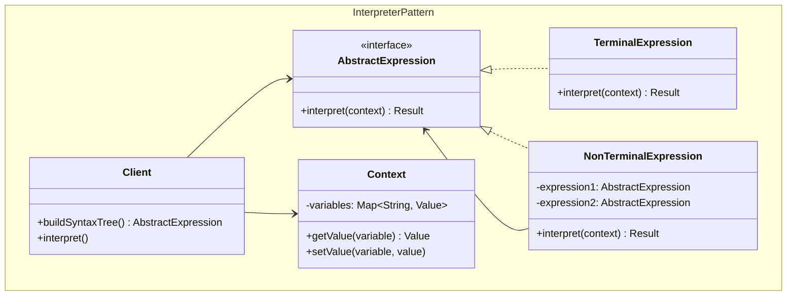
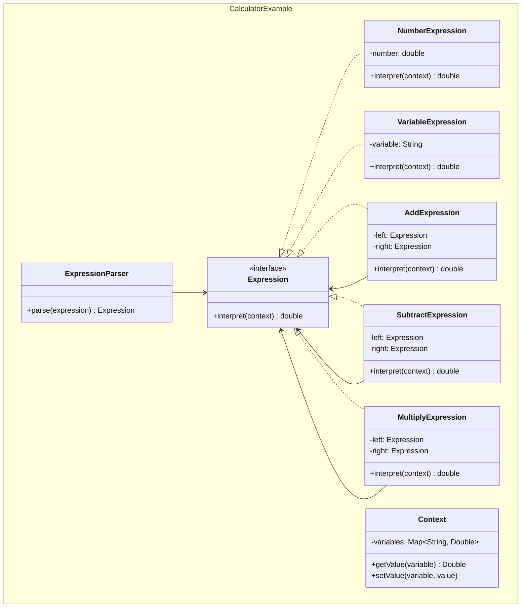
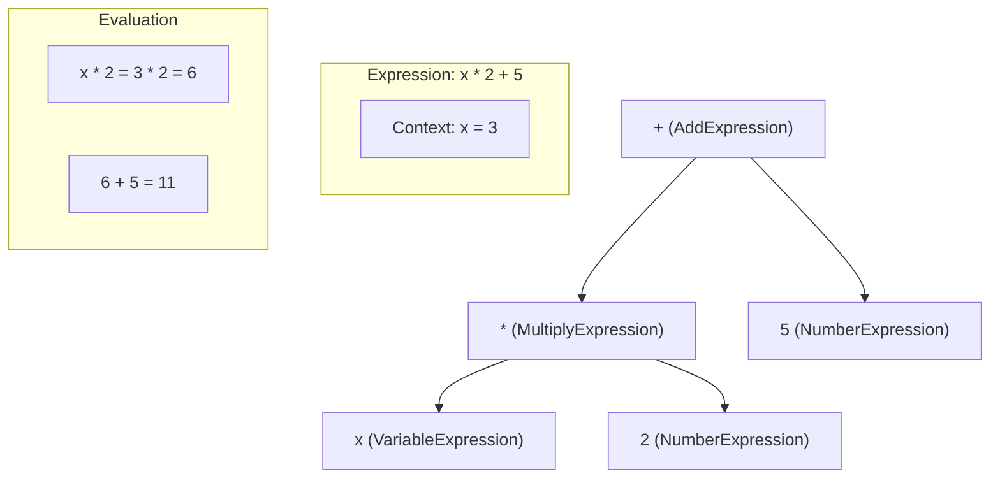
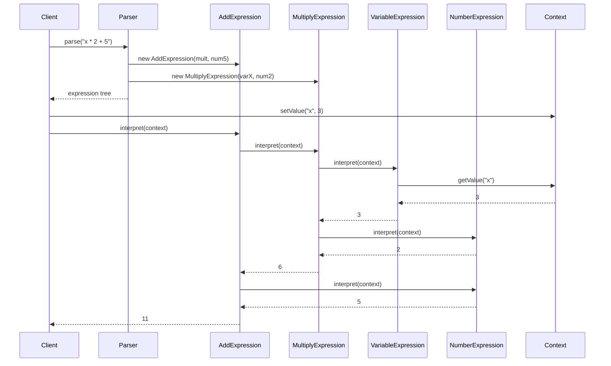

## Problema
Permitir que usuarios configuren reglas o fórmulas complejas sin programar.

## Propósito
Convierte expresiones de texto (como "age >= 18 AND income > 30000") en objetos que pueden evaluarse dinámicamente. Crea un "mini-lenguaje" para que usuarios configuren reglas de negocio.

## Concepto clave
**Árbol de expresión**: Cada parte de la expresión (números, operadores, variables) se convierte en un objeto que sabe cómo evaluarse a sí mismo.

## Casos de uso comunes
- Calculadoras con expresiones matemáticas
- Motores de reglas de negocio
- Lenguajes de consulta simples
- Parsers de configuración
- Validadores de expresiones regulares
- Intérpretes de comandos

## ¿Quién es quién en Interpreter?

| Actor | Lo que realmente es | Ejemplo | Analogía |
|-------|--------------------|---------|-----------|
| **AbstractExpression** | Interfaz que define `interpret(context)` | `Expression` - define cómo evaluarse | "Elemento de fórmula" (interfaz) |
| **TerminalExpression** | Elementos básicos (hojas del árbol) | `NumberExpression`, `VariableExpression` | Números en pantalla (3, 5, x) |
| **NonTerminalExpression** | Operadores (nodos del árbol) | `AddExpression`, `MultiplyExpression` | Botones de operación (+, -, *, /) |
| **Context** | Almacena variables y valores | `Context` con variables x=3, y=5 | Calculadora con memoria |
| **Client** | Construye y evalúa el árbol | Parser + evaluador | Persona usando calculadora |

## Diagrama



## Ejemplo práctico



## Árbol de sintaxis



## Flujo de interpretación



## Casos de uso prácticos

```java
// 1. Calculadora dinámica
Expression expr = parser.parse("x * 2 + 5");
Context context = new Context();
context.setValue("x", 3);
double result = expr.interpret(context); // = 11

// 2. Reglas de negocio configurables
Expression rule = parser.parse("age >= 18 AND income > 30000");
Context customer = new Context();
customer.setValue("age", 25);
customer.setValue("income", 45000);
boolean approved = rule.interpret(customer); // = true

// 3. Fórmulas de precios dinámicas
Expression pricing = parser.parse("basePrice * (1 + taxRate) - discount");
Context order = new Context();
order.setValue("basePrice", 100);
order.setValue("taxRate", 0.15);
order.setValue("discount", 10);
double finalPrice = pricing.interpret(order); // = 105
```

## Ventajas
- **Extensibilidad**: Fácil agregar nuevas reglas gramaticales
- **Flexibilidad**: Permite cambiar y extender el lenguaje
- **Reutilización**: Las expresiones pueden reutilizarse
- **Separación**: Separa gramática de interpretación

## Desventajas
- **Complejidad**: Muchas clases para gramáticas complejas
- **Performance**: Puede ser lento para expresiones complejas
- **Mantenimiento**: Difícil mantener gramáticas grandes
- **Memoria**: Consume memoria con árboles de sintaxis grandes

## Cuándo usar
- Necesitas que usuarios configuren reglas sin programar
- Tienes fórmulas o expresiones que cambian frecuentemente
- Quieres crear un DSL (Domain Specific Language) simple
- Las reglas de negocio son complejas pero bien definidas

## Cuándo NO usar
- Las expresiones son simples (usa Strategy)
- La performance es crítica
- El lenguaje es muy complejo (usa un parser real)
- Las reglas no cambian frecuentemente