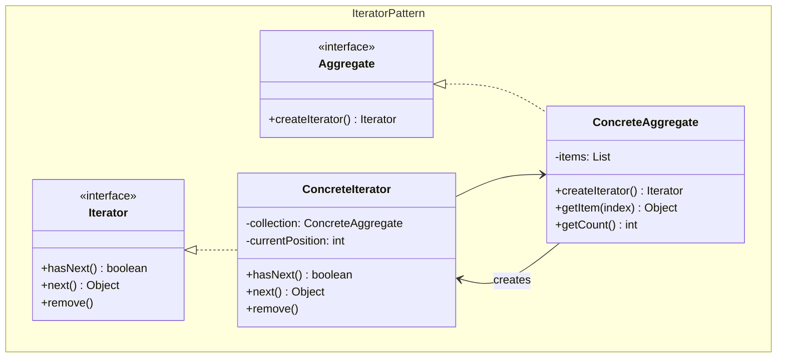
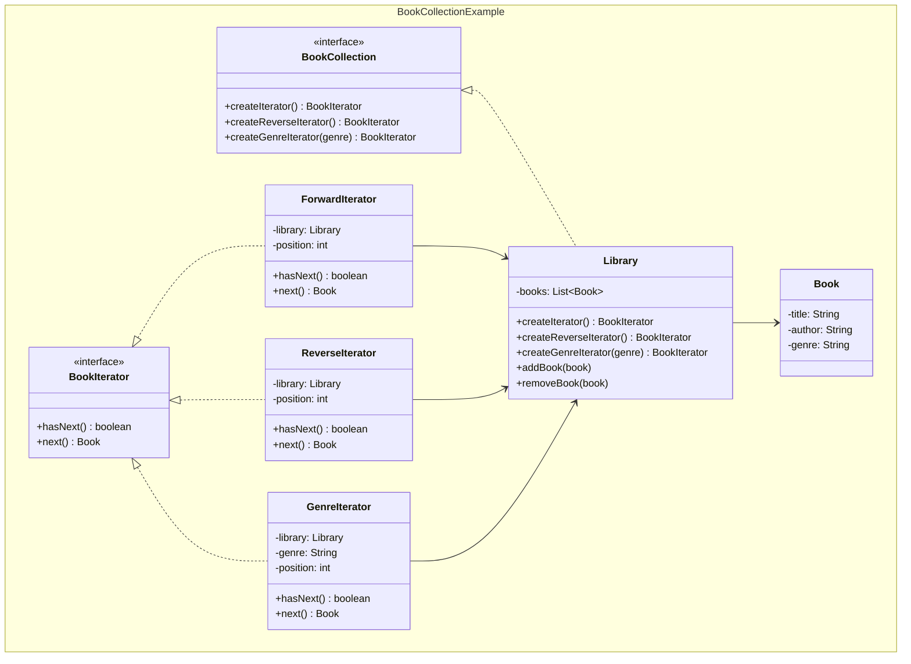
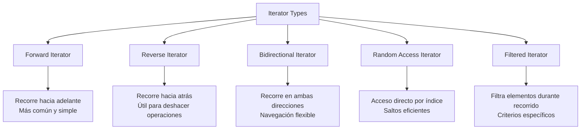
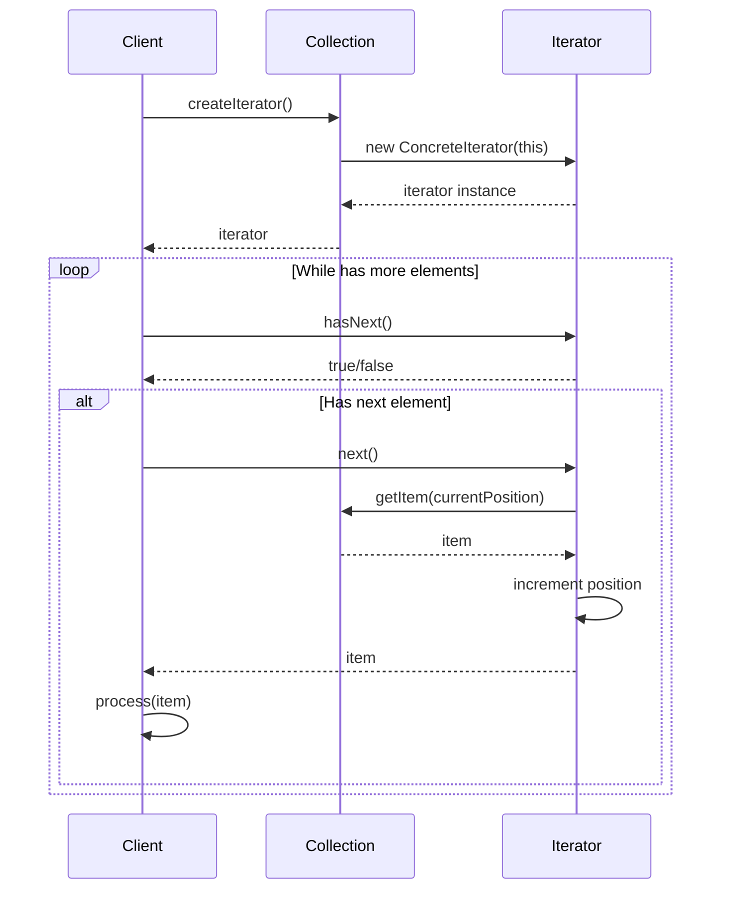

## Problema
Recorrer una colección de diferentes maneras sin saber cómo está implementada internamente.

## Propósito
Permite navegar por cualquier colección (array, lista, árbol) usando la misma interfaz. Separa el "cómo recorrer" del "qué recorrer".

## Concepto clave
**Interfaz uniforme**: `hasNext()` y `next()` funcionan igual para arrays, listas, árboles o cualquier estructura. Como el `for-each` de Java que funciona con cualquier colección.

## Casos de uso comunes
- Recorrido de estructuras de datos complejas
- Paginación de resultados
- Streaming de datos
- Navegación en menús o árboles
- Procesamiento de listas grandes
- Múltiples formas de recorrer la misma estructura

## ¿Quién es quién en Iterator?

| Actor | Lo que realmente es | Ejemplo | Analogía |
|-------|--------------------|---------|-----------|
| **Iterator** | Interfaz que define `hasNext()` y `next()` | `BookIterator` - define cómo recorrer | "Forma de recorrer" (interfaz) |
| **ConcreteIterator** | Sabe CÓMO recorrer una estructura | `ForwardIterator`, `GenreIterator` | Bibliotecario específico (por género, autor) |
| **Aggregate** | Interfaz de colección con `createIterator()` | `BookCollection` - define qué iteradores crear | "Biblioteca" (interfaz) |
| **ConcreteAggregate** | Colección que crea sus iteradores | `Library` - crea iteradores para sí misma | Biblioteca real (tiene libros) |

## Diagrama

## Ejemplo práctico

## Tipos de iteradores

## Flujo de iteración

## Ventajas
- **Encapsulación**: Oculta la representación interna de la colección
- **Múltiples recorridos**: Diferentes formas de recorrer la misma estructura
- **Interfaz uniforme**: Misma interfaz para diferentes tipos de colecciones
- **Separación de responsabilidades**: Recorrido separado de la estructura

## Desventajas
- **Complejidad**: Introduce clases adicionales
- **Overhead**: Puede ser más lento que acceso directo
- **Estado**: Mantener estado del iterador puede ser complejo
- **Concurrencia**: Problemas si la colección cambia durante iteración

## Cuándo usar
- Necesitas diferentes formas de recorrer la misma colección
- Quieres ocultar la complejidad interna de la estructura
- Necesitas una interfaz uniforme para diferentes tipos de colecciones
- Quieres poder pausar y reanudar el recorrido

## Cuándo NO usar
- Solo necesitas una forma simple de recorrido
- La colección es muy simple (array básico)
- El acceso directo por índice es suficiente
- La complejidad adicional no aporta valor