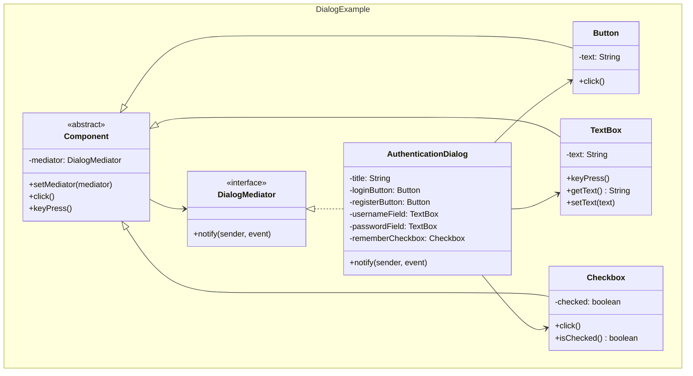
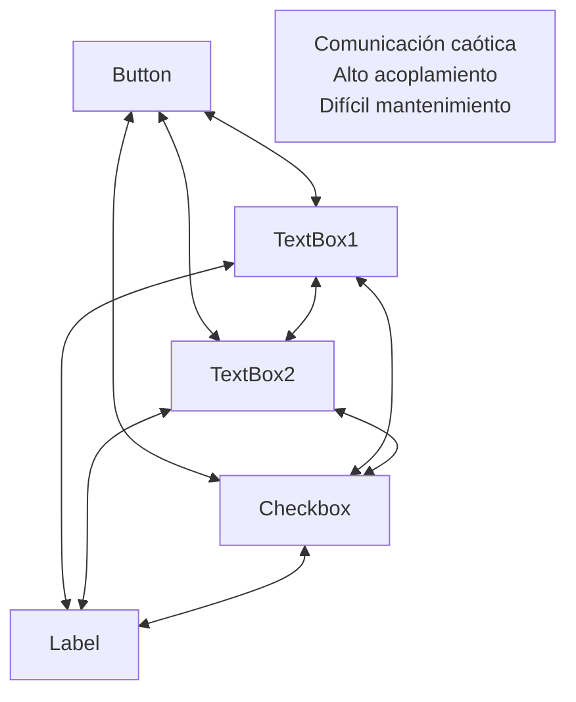
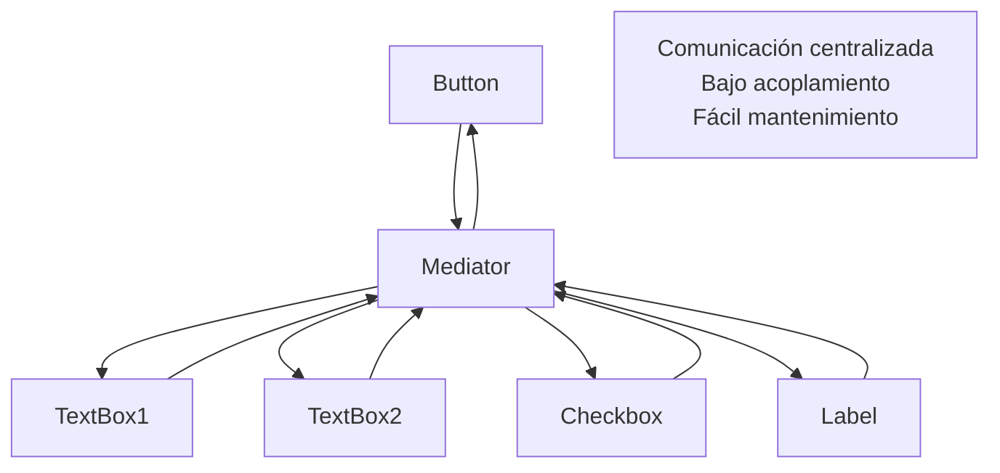
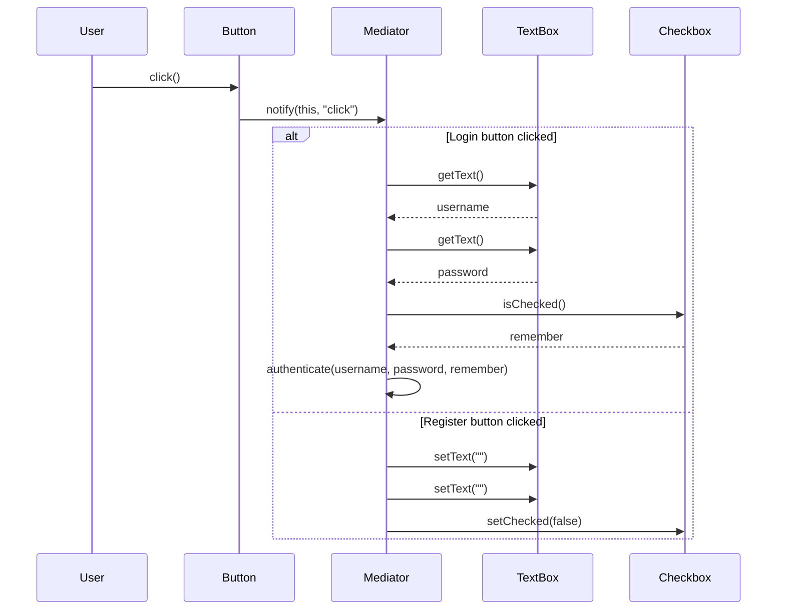
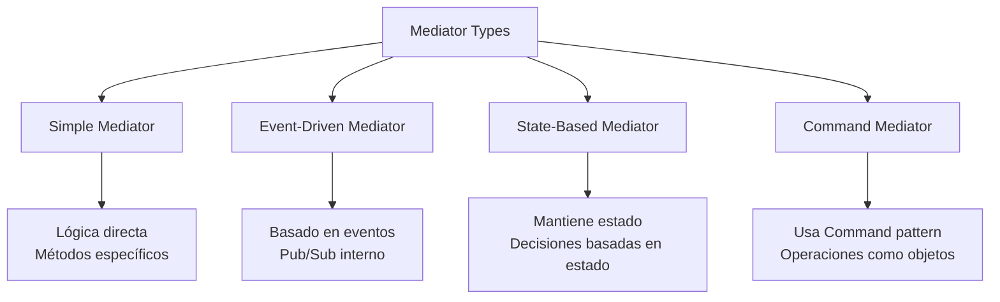

## Problema
Evitar que objetos se comuniquen directamente creando un lío de dependencias difícil de mantener.

## Propósito
Centraliza la comunicación entre objetos en un mediador. Los objetos no se conocen entre sí, solo conocen al mediador.

## Concepto clave
**Torre de control**: Como en un aeropuerto - los aviones no se comunican entre sí, todos hablan con la torre de control que coordina todo el tráfico.

## Casos de uso comunes
- Interfaces gráficas complejas (formularios, diálogos)
- Sistemas de chat y mensajería
- Controladores de tráfico aéreo
- Workflows y procesos de negocio
- Sistemas de notificaciones
- Coordinación entre microservicios

## Diagrama

```mermaid
classDiagram
    namespace Mediator {
        class Mediator {
            <<interface>>
            +notify(sender, event)
        }
        
        class ConcreteMediator {
            -componentA: ComponentA
            -componentB: ComponentB
            +notify(sender, event)
        }
        
        class BaseComponent {
            -mediator: Mediator
            +setMediator(mediator)
        }
        
        class ComponentA {
            +doA()
        }
        
        class ComponentB {
            +doB()
        }
    }
    
    Mediator <|.. ConcreteMediator
    BaseComponent <|-- ComponentA
    BaseComponent <|-- ComponentB
    BaseComponent --> Mediator
    ConcreteMediator --> ComponentA
    ConcreteMediator --> ComponentB
```

## Ejemplo práctico



## Comunicación sin mediator



## Comunicación con mediator



## Flujo de comunicación



## Tipos de mediadores



## Ventajas
- **Bajo acoplamiento**: Los componentes no se conocen directamente
- **Reutilización**: Los componentes pueden reutilizarse en diferentes contextos
- **Centralización**: La lógica de interacción está centralizada
- **Flexibilidad**: Fácil cambiar las reglas de interacción

## Desventajas
- **God Object**: El mediator puede volverse muy complejo
- **Punto único de falla**: Toda la comunicación depende del mediator
- **Complejidad**: Puede ser excesivo para interacciones simples
- **Performance**: Introduce overhead en la comunicación

## Cuándo usar
- Tienes un conjunto de objetos que se comunican de forma compleja
- Las dependencias entre objetos son difíciles de entender
- Quieres reutilizar componentes en diferentes contextos
- Necesitas centralizar la lógica de coordinación

## Cuándo NO usar
- Las interacciones son simples y directas
- Solo tienes pocos objetos que interactúan
- El mediator se volvería demasiado complejo
- La comunicación directa es más eficiente

## Diferencias con otros patrones
- **vs Observer**: Mediator coordina, Observer notifica
- **vs Facade**: Mediator para comunicación, Facade para simplificación
- **vs Command**: Mediator coordina objetos, Command encapsula operaciones