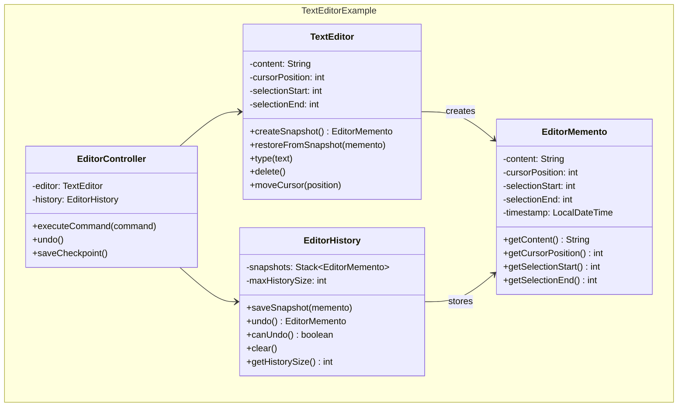
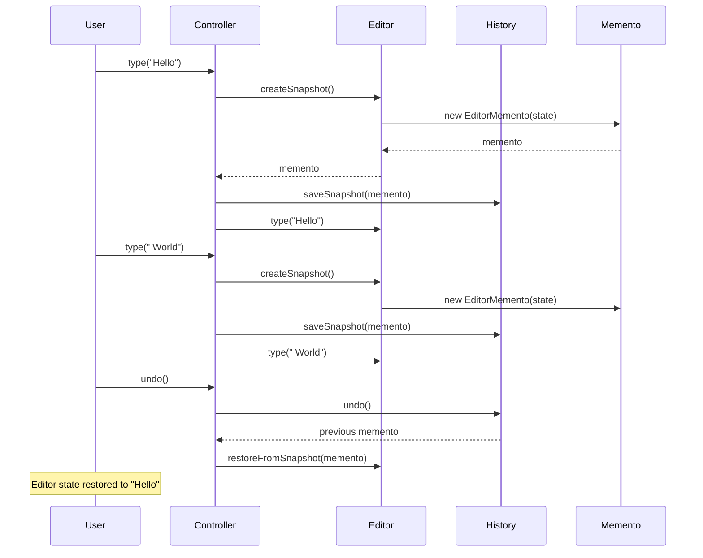

## Problema
Guardar el estado de un objeto para poder deshacerlo más tarde, sin romper la encapsulación.

## Propósito
Permite implementar undo/redo guardando "fotos" del estado de un objeto en momentos específicos. El objeto puede restaurarse a cualquiera de esos estados guardados.

## Concepto clave
**Snapshot del estado**: Como los puntos de guardado en videojuegos - capturas el estado completo en un momento y puedes volver a él cuando quieras.

## Casos de uso comunes
- Sistemas de undo/redo en editores
- Checkpoints en juegos
- Transacciones con rollback
- Snapshots de configuración
- Historial de cambios
- Sistemas de backup automático

## Diagrama

```mermaid
classDiagram
    namespace Memento {
        class Originator {
            -state: State
            +createMemento() Memento
            +restoreFromMemento(memento)
            +setState(state)
            +getState() State
        }
        
        class Memento {
            -state: State
            +getState() State
        }
        
        class Caretaker {
            -mementos: List~Memento~
            +addMemento(memento)
            +getMemento(index) Memento
            +undo() Memento
        }
    }
    
    Originator --> Memento : creates
    Caretaker --> Memento : stores
    Caretaker --> Originator : uses
```

## Ejemplo práctico




## Flujo de operaciones




## Ventajas
- **Encapsulación**: No viola la encapsulación del originator
- **Simplicidad**: Simplifica el originator al delegar el guardado de estado
- **Flexibilidad**: Permite múltiples puntos de restauración
- **Aislamiento**: El caretaker no necesita conocer el estado interno

## Desventajas
- **Memoria**: Puede consumir mucha memoria con muchos snapshots
- **Performance**: Crear snapshots puede ser costoso
- **Complejidad**: Manejar referencias y objetos complejos puede ser difícil
- **Consistencia**: Mantener consistencia entre snapshots puede ser complejo

## Cuándo usar
- Necesitas implementar undo/redo
- Quieres crear checkpoints o snapshots
- Necesitas rollback de transacciones
- Quieres mantener historial de cambios sin violar encapsulación

## Cuándo NO usar
- El estado del objeto es simple y fácil de recrear
- La memoria es muy limitada
- Los snapshots son muy costosos de crear
- No necesitas funcionalidad de undo

