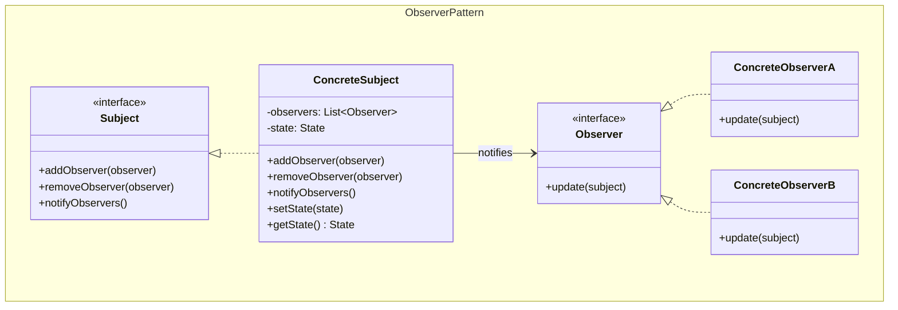
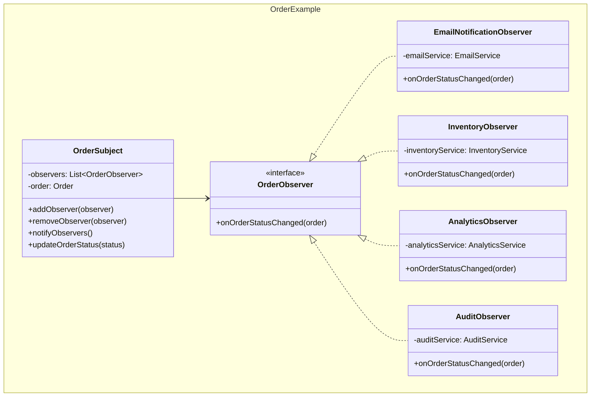
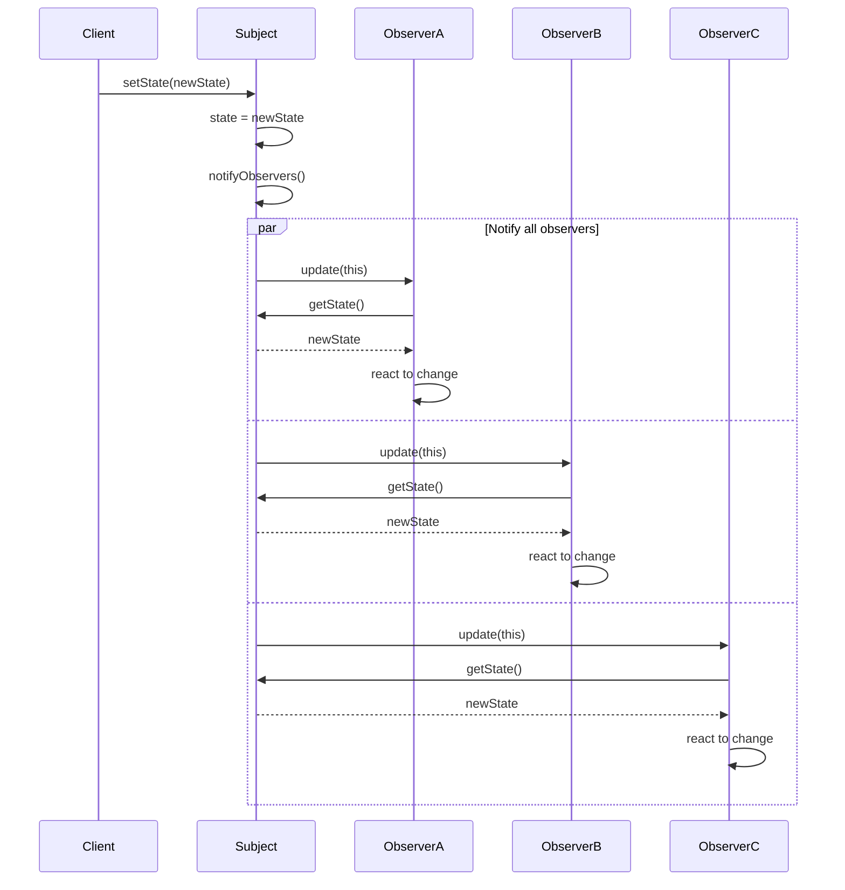

## Problema
Notificar automáticamente a múltiples objetos cuando algo cambia, sin que se conozcan entre sí.

## Propósito
Cuando un objeto cambia, notifica automáticamente a todos los interesados. Los observadores se suscriben/desuscriben dinámicamente.

## Concepto clave
**Suscripción a cambios**: Como suscribirse a un canal de YouTube - cuando suben video nuevo, todos los suscriptores reciben notificación automáticamente.

## Casos de uso comunes
- Eventos de dominio en sistemas
- Notificaciones de cambios de estado
- Interfaces gráficas reactivas (MVC)
- Sistemas de logging y auditoría
- Actualizaciones en tiempo real
- Sistemas de suscripción/publicación

## ¿Quién es quién en Observer?

| Actor | Lo que realmente es | Ejemplo | Analogía |
|-------|--------------------|---------|-----------|
| **Subject** | El observado, mantiene lista de observers | `OrderSubject` - notifica cuando cambia estado | Canal de YouTube (publica contenido) |
| **Observer** | Interfaz que define cómo recibir notificaciones | `OrderObserver` - define `onOrderStatusChanged()` | "Suscriptor" (interfaz para notificaciones) |
| **ConcreteObserver** | Suscriptores que reaccionan diferente | `EmailObserver`, `InventoryObserver` | Tú, tu amigo (cada uno reacciona diferente) |

## Diagrama

## Ejemplo práctico

## Flujo de notificación

## Ventajas
- **Bajo acoplamiento**: Subject y observers no se conocen directamente
- **Comunicación dinámica**: Observers pueden agregarse/quitarse en runtime
- **Principio abierto/cerrado**: Fácil agregar nuevos observers sin modificar subject
- **Broadcast**: Un cambio notifica a múltiples objetos automáticamente

## Desventajas
- **Complejidad**: Puede ser difícil rastrear el flujo de notificaciones
- **Performance**: Muchos observers pueden impactar el rendimiento
- **Memory leaks**: Observers no removidos pueden causar memory leaks
- **Orden**: No garantiza orden específico de notificaciones

## Cuándo usar
- Necesitas notificar múltiples objetos sobre cambios de estado
- Quieres bajo acoplamiento entre objetos dependientes
- El número de observers puede variar dinámicamente
- Implementas patrones como MVC o MVP

## Cuándo NO usar
- Solo tienes un observer (usa referencia directa)
- Las notificaciones son muy frecuentes y afectan performance
- La relación entre objects es simple y estática
- Prefieres comunicación síncrona y directa

## Diferencias con otros patrones
- **vs Mediator**: Observer es 1-a-muchos (notificaciones), Mediator es muchos-a-muchos (coordinación)
- **vs Publish-Subscribe**: Observer conoce al subject, Pub-Sub es completamente desacoplado