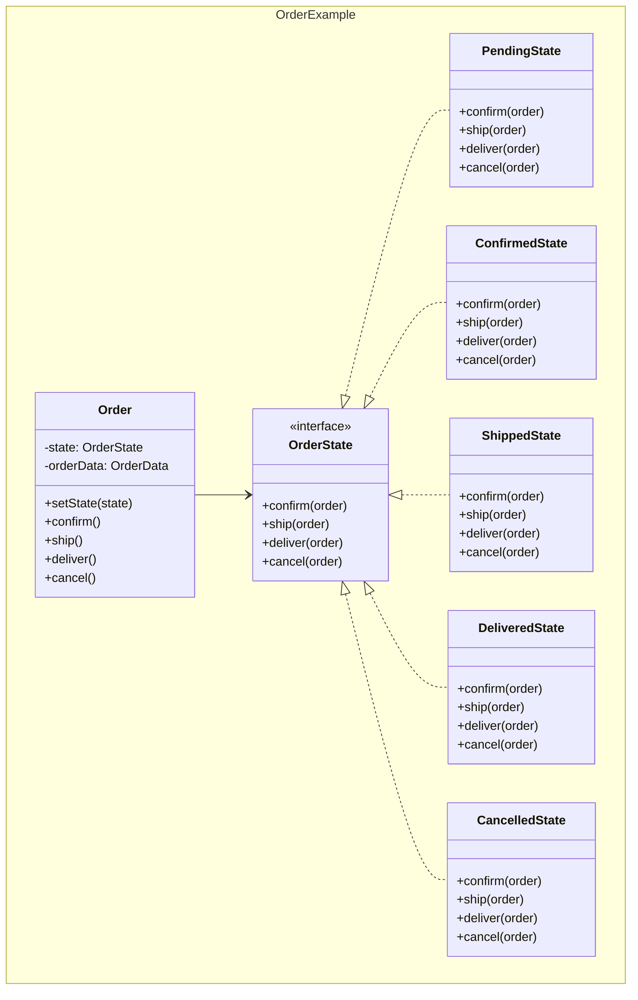
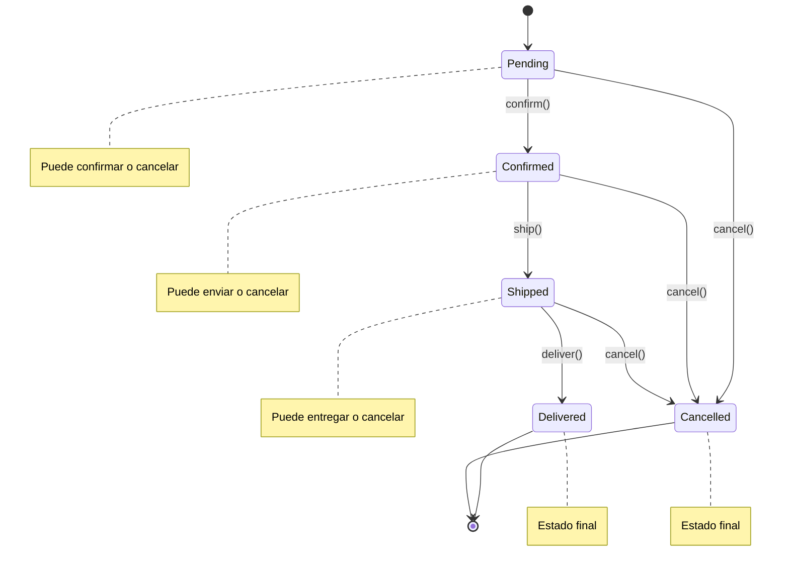
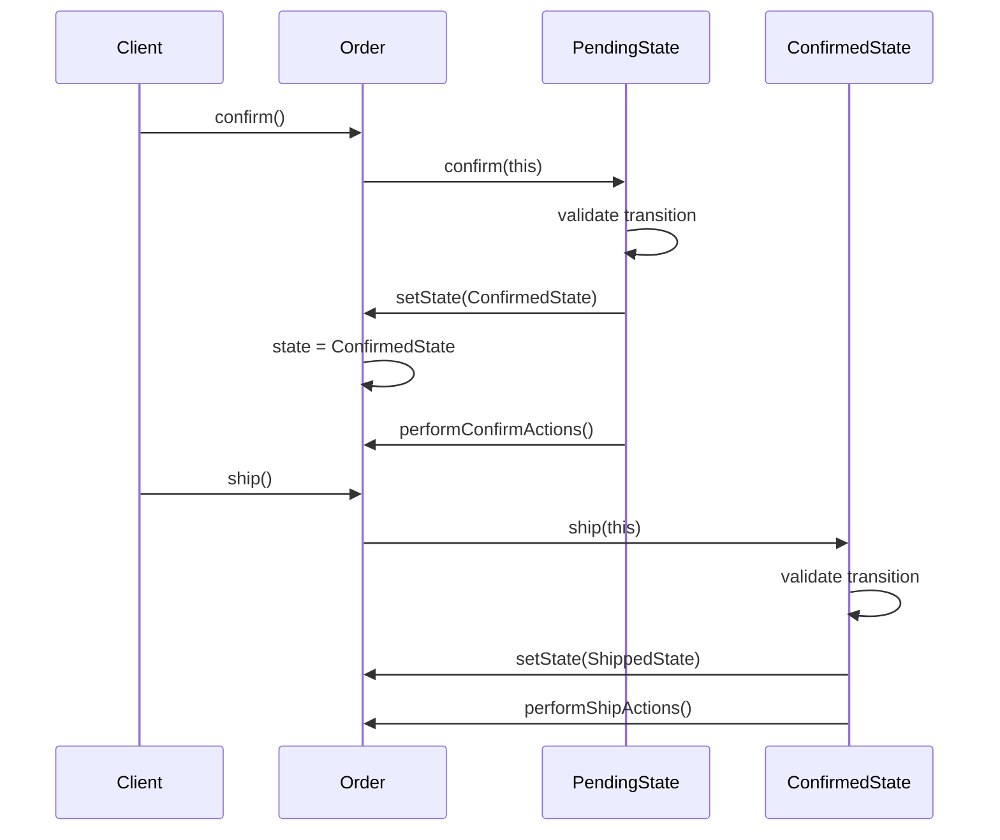

## Problema
Cambiar el comportamiento de un objeto según su estado interno, evitando condicionales complejas.

## Propósito
Cada estado tiene su propia clase con su comportamiento específico. El objeto delega las operaciones al estado actual, eliminando if/switch complejos.

## Concepto clave
**Estado como clase**: En lugar de `if (estado == PENDIENTE)`, tienes una clase `EstadoPendiente` que sabe qué hacer. El objeto cambia de clase de estado automáticamente.

## Casos de uso comunes
- State machines (máquinas de estado)
- Workflows y procesos de negocio
- Estados de conexión (conectado, desconectado, reconectando)
- Estados de pedidos (pendiente, confirmado, enviado, entregado)
- Estados de documentos (borrador, revisión, aprobado, publicado)
- Estados de juegos (menú, jugando, pausado, game over)

## Diagrama

```mermaid
classDiagram
    namespace State {
        class Context {
            -state: State
            +setState(state)
            +request1()
            +request2()
        }
        
        class State {
            <<interface>>
            +handle1(context)
            +handle2(context)
        }
        
        class ConcreteStateA {
            +handle1(context)
            +handle2(context)
        }
        
        class ConcreteStateB {
            +handle1(context)
            +handle2(context)
        }
        
        class ConcreteStateC {
            +handle1(context)
            +handle2(context)
        }
    }
    
    Context --> State
    State <|.. ConcreteStateA
    State <|.. ConcreteStateB
    State <|.. ConcreteStateC
```

## Ejemplo práctico



## Transiciones de estado



## Flujo de cambio de estado



## Ventajas
- **Eliminación de condicionales**: No más if/switch complejos
- **Extensibilidad**: Fácil agregar nuevos estados
- **Encapsulación**: Cada estado encapsula su comportamiento
- **Transiciones explícitas**: Las transiciones son claras y controladas

## Desventajas
- **Complejidad**: Introduce muchas clases pequeñas
- **Overhead**: Puede ser excesivo para state machines simples
- **Distribución**: La lógica se distribuye entre múltiples clases
- **Dependencias**: Estados pueden necesitar conocer otros estados

## Cuándo usar
- Tienes objetos con comportamiento que cambia según su estado
- Muchas condicionales basadas en estado
- Las transiciones de estado son complejas
- Quieres hacer explícitas las transiciones de estado

## Cuándo NO usar
- Pocos estados simples
- Las transiciones son triviales
- El comportamiento no cambia significativamente entre estados
- Prefieres simplicidad sobre flexibilidad

## Diferencias con otros patrones
- **vs Strategy**: State cambia automáticamente según estado interno, Strategy se cambia externamente por el cliente