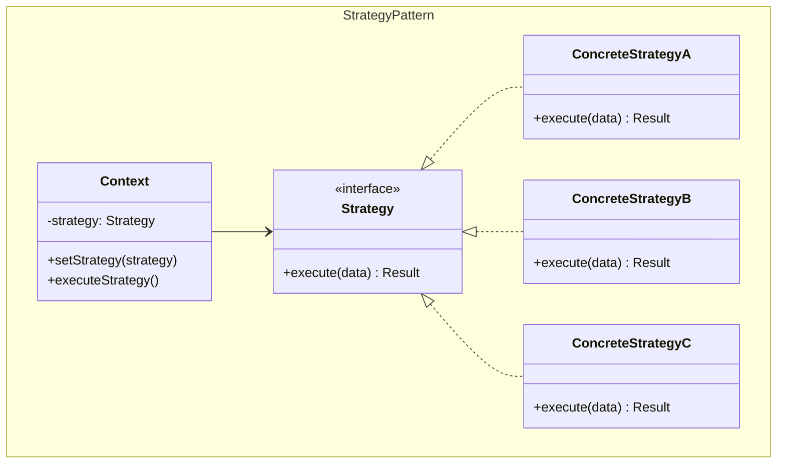
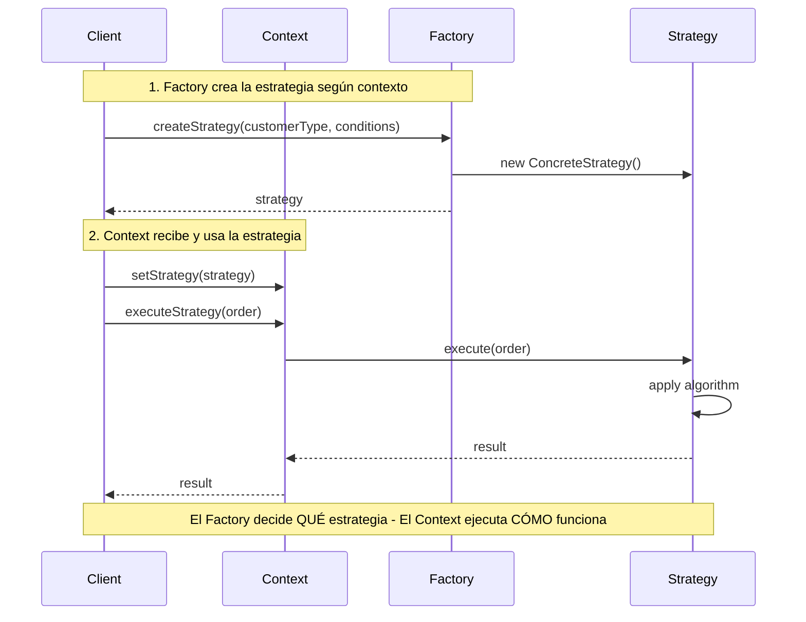

## Problema
Cambiar algoritmos dinámicamente según el contexto, evitando condicionales complejas.

## Propósito
Encapsula diferentes algoritmos en clases separadas y permite intercambiarlos en tiempo de ejecución. El cliente elige qué algoritmo usar.

## Concepto clave
**Algoritmo intercambiable**: Como cambiar el método de pago en una tienda online - el proceso es el mismo pero el algoritmo de pago cambia (tarjeta, PayPal, transferencia).

**En términos simples**: Cambiar el "cómo" sin cambiar el "qué". El Context siempre hace lo mismo (calcular precio), pero la Strategy define cómo lo hace.

## Casos de uso comunes
- Algoritmos de pricing (descuentos, promociones)
- Métodos de pago (tarjeta, PayPal, transferencia)
- Algoritmos de ordenamiento
- Estrategias de validación
- Algoritmos de compresión
- Estrategias de caching

## ¿Quién es quién en Strategy?

| Actor | Lo que realmente es | Ejemplo | Analogía |
|-------|--------------------|---------|-----------|
| **Context** | Usa las estrategias, mantiene referencia actual | `PricingContext` - siempre calcula precios | Calculadora de precios |
| **Strategy** | Interfaz que define qué pueden hacer | `PricingStrategy` - define `calculatePrice()` | "Método de cálculo" (interfaz) |
| **ConcreteStrategy** | Implementaciones que hacen el trabajo diferente | `VIPPricingStrategy`, `SeasonalPricingStrategy` | Descuento VIP, descuento temporal |

## Diagrama

## Ejemplo práctico

## Selección de estrategia

## Flujo de ejecución

## Ventajas
- **Flexibilidad**: Algoritmos intercambiables en tiempo de ejecución
- **Extensibilidad**: Fácil agregar nuevas estrategias
- **Eliminación de condicionales**: No más if/switch complejos
- **Testabilidad**: Cada estrategia se puede probar independientemente

## Desventajas
- **Complejidad**: Introduce más clases
- **Conocimiento del cliente**: El cliente debe conocer las diferentes estrategias
- **Comunicación**: Todas las estrategias deben usar la misma interfaz
- **Overhead**: Puede ser excesivo para algoritmos simples

## Cuándo usar
- Tienes múltiples formas de realizar la misma tarea
- Quieres cambiar algoritmos dinámicamente
- Tienes muchas condicionales relacionadas con algoritmos
- Diferentes clientes necesitan diferentes variantes de un algoritmo

## Cuándo NO usar
- Solo tienes un algoritmo
- Los algoritmos nunca cambian
- Las diferencias entre algoritmos son mínimas
- La complejidad adicional no se justifica

## Diferencias con otros patrones
- **vs State**: Strategy se cambia externamente por el cliente, State cambia automáticamente según estado interno
- **vs Template Method**: Strategy cambia todo el algoritmo, Template Method solo algunos pasos del algoritmo
- **vs Factory**: Factory decide QUÉ crear, Strategy define CÓMO ejecutar