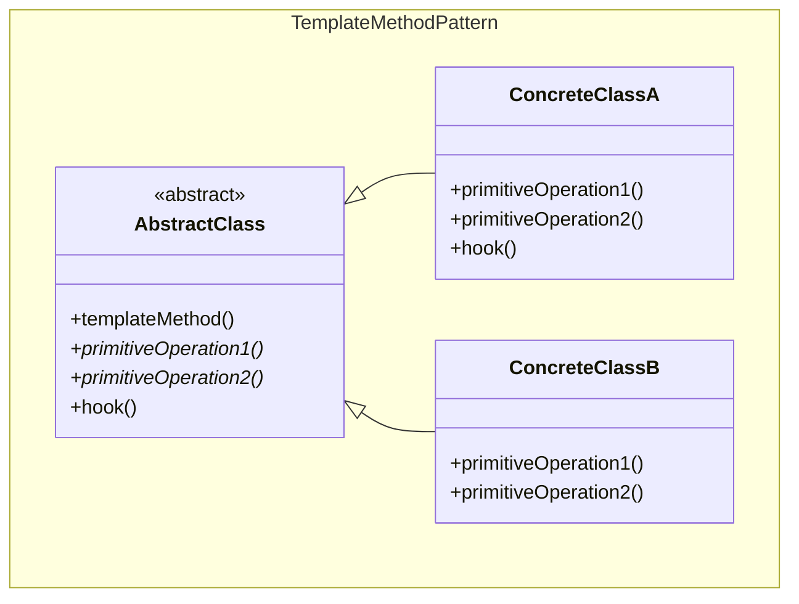
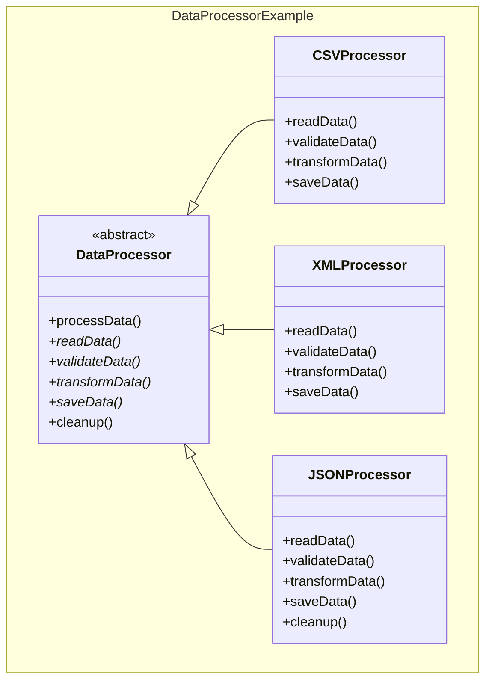
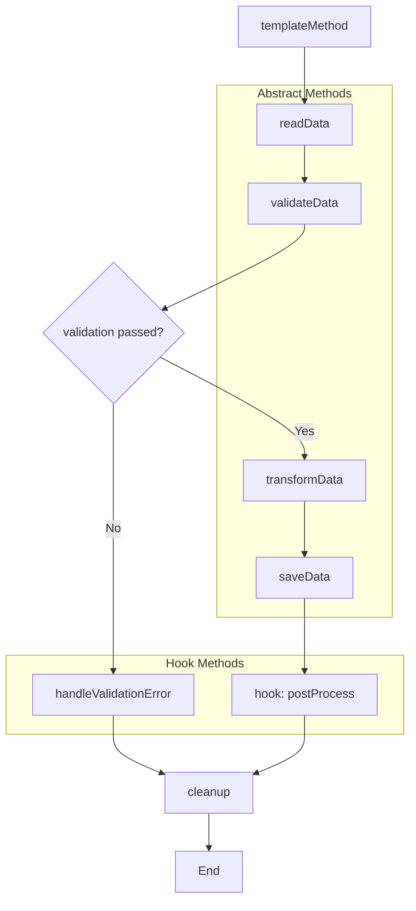
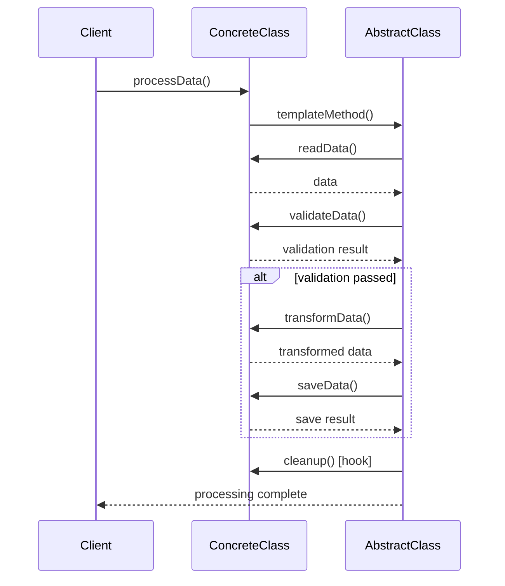

## Problema
Tener algoritmos con la misma estructura pero pasos diferentes, evitando duplicar el flujo común.

## Propósito
Define el esqueleto del algoritmo en la clase padre y deja que las subclases implementen los pasos específicos. El flujo general no cambia, solo los detalles.

## Concepto clave
**Esqueleto fijo, detalles variables**: Como una receta de cocina - los pasos son siempre los mismos (preparar, cocinar, servir) pero los ingredientes y técnicas cambian según el plato.

## Casos de uso comunes
- Frameworks de procesamiento de datos
- Algoritmos de ordenamiento con comparaciones personalizadas
- Pipelines de transformación
- Procesos de autenticación
- Workflows de negocio
- Algoritmos de parsing

## ¿Quién es quién en Template Method?

| Actor | Lo que realmente es | Ejemplo | Analogía |
|-------|--------------------|---------|-----------|
| **AbstractClass** | Define el esqueleto del algoritmo | `DataProcessor` - define pasos: leer, validar, transformar | Receta de cocina (pasos fijos) |
| **ConcreteClass** | Implementa los pasos específicos | `CSVProcessor`, `XMLProcessor` | Cocinero específico (pasta vs pizza) |
| **Hook Methods** | Puntos de extensión opcionales | `cleanup()`, `postProcess()` | Pasos opcionales ("agregar especias") |

## Diagrama

## Ejemplo práctico

## Flujo del algoritmo

## Flujo de ejecución

## Ventajas
- **Reutilización**: Reutiliza la estructura común del algoritmo
- **Control**: La clase base controla el flujo del algoritmo
- **Extensibilidad**: Fácil agregar nuevas variaciones
- **Inversión de control**: "Don't call us, we'll call you"

## Desventajas
- **Rigidez**: La estructura del algoritmo está fija
- **Herencia**: Requiere herencia, no composición
- **Complejidad**: Puede ser difícil entender el flujo completo
- **Liskov**: Puede violar el principio de sustitución de Liskov

## Cuándo usar
- Tienes algoritmos con estructura similar pero pasos diferentes
- Quieres controlar el flujo del algoritmo desde la clase base
- Necesitas evitar duplicación de código en algoritmos similares
- Quieres permitir extensiones en puntos específicos

## Cuándo NO usar
- Los algoritmos son completamente diferentes
- Prefieres composición sobre herencia
- La estructura del algoritmo cambia frecuentemente
- Solo tienes una implementación del algoritmo

## Diferencias con otros patrones
- **vs Strategy**: Template Method cambia solo algunos pasos del algoritmo, Strategy cambia todo el algoritmo