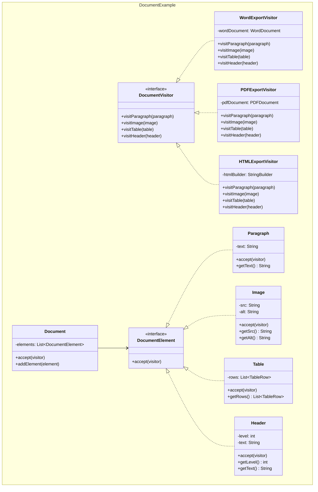
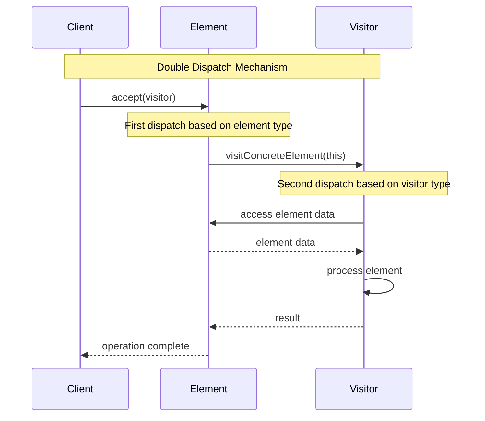

## Problema
Agregar nuevas operaciones a una jerarquía de clases sin modificar esas clases.

## Propósito
Separa las operaciones de los objetos sobre los que actúan. Puedes agregar nuevas operaciones creando nuevos visitors sin tocar las clases existentes.

## Concepto clave
**Operación externa**: Como un inspector que visita diferentes tipos de edificios - cada edificio sabe cómo recibir al inspector, pero el inspector define qué inspeccionar.

## Casos de uso comunes
- Procesamiento de AST (Abstract Syntax Trees)
- Sistemas de reporting sobre estructuras complejas
- Operaciones sobre estructuras de documentos
- Compiladores e intérpretes
- Análisis de código fuente
- Transformaciones de datos

## Diagrama

```mermaid
classDiagram
    namespace Visitor {
        class Visitor {
            <<interface>>
            +visitConcreteElementA(element)
            +visitConcreteElementB(element)
        }
        
        class ConcreteVisitor1 {
            +visitConcreteElementA(element)
            +visitConcreteElementB(element)
        }
        
        class ConcreteVisitor2 {
            +visitConcreteElementA(element)
            +visitConcreteElementB(element)
        }
        
        class Element {
            <<interface>>
            +accept(visitor)
        }
        
        class ConcreteElementA {
            +accept(visitor)
            +operationA()
        }
        
        class ConcreteElementB {
            +accept(visitor)
            +operationB()
        }
        
        class ObjectStructure {
            -elements: List~Element~
            +accept(visitor)
        }
    }
    
    Visitor <|.. ConcreteVisitor1
    Visitor <|.. ConcreteVisitor2
    Element <|.. ConcreteElementA
    Element <|.. ConcreteElementB
    ObjectStructure --> Element
```

## Ejemplo práctico



## Double Dispatch



## Flujo de procesamiento

```mermaid
flowchart TD
    A[Document] --> B[Accept Visitor]
    B --> C{For each element}
    C --> D[Paragraph]
    C --> E[Image]
    C --> F[Table]
    C --> G[Header]
    
    D --> H[paragraph.accept(visitor)]
    E --> I[image.accept(visitor)]
    F --> J[table.accept(visitor)]
    G --> K[header.accept(visitor)]
    
    H --> L[visitor.visitParagraph(this)]
    I --> M[visitor.visitImage(this)]
    J --> N[visitor.visitTable(this)]
    K --> O[visitor.visitHeader(this)]
    
    L --> P[Process & Export]
    M --> P
    N --> P
    O --> P
```

## Ventajas
- **Extensibilidad**: Fácil agregar nuevas operaciones sin modificar elementos
- **Separación**: Separa algoritmos de la estructura de datos
- **Centralización**: Operaciones relacionadas están en una clase visitor
- **Type Safety**: Aprovecha el polimorfismo para type safety

## Desventajas
- **Complejidad**: Introduce muchas clases y métodos
- **Acoplamiento**: Visitors conocen la estructura interna de elementos
- **Extensibilidad de elementos**: Difícil agregar nuevos tipos de elementos
- **Circular dependencies**: Puede crear dependencias circulares

## Cuándo usar
- Necesitas realizar muchas operaciones diferentes sobre una estructura compleja
- La estructura de objetos es estable pero las operaciones cambian frecuentemente
- Quieres evitar "contaminar" las clases de elementos con operaciones no relacionadas
- Tienes una jerarquía de clases con operaciones que no encajan naturalmente

## Cuándo NO usar
- La estructura de objetos cambia frecuentemente
- Solo tienes pocas operaciones simples
- Las operaciones están fuertemente relacionadas con los elementos
- Prefieres simplicidad sobre flexibilidad

