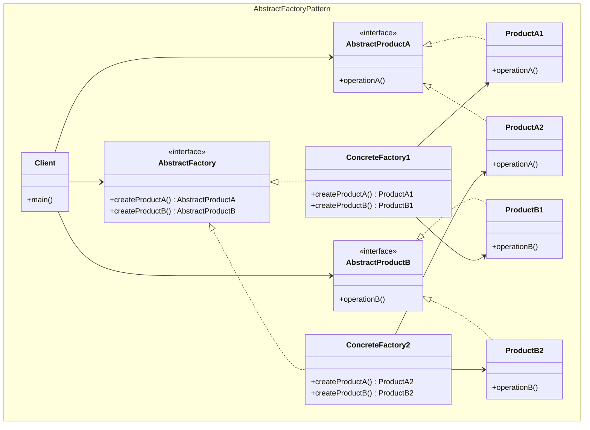
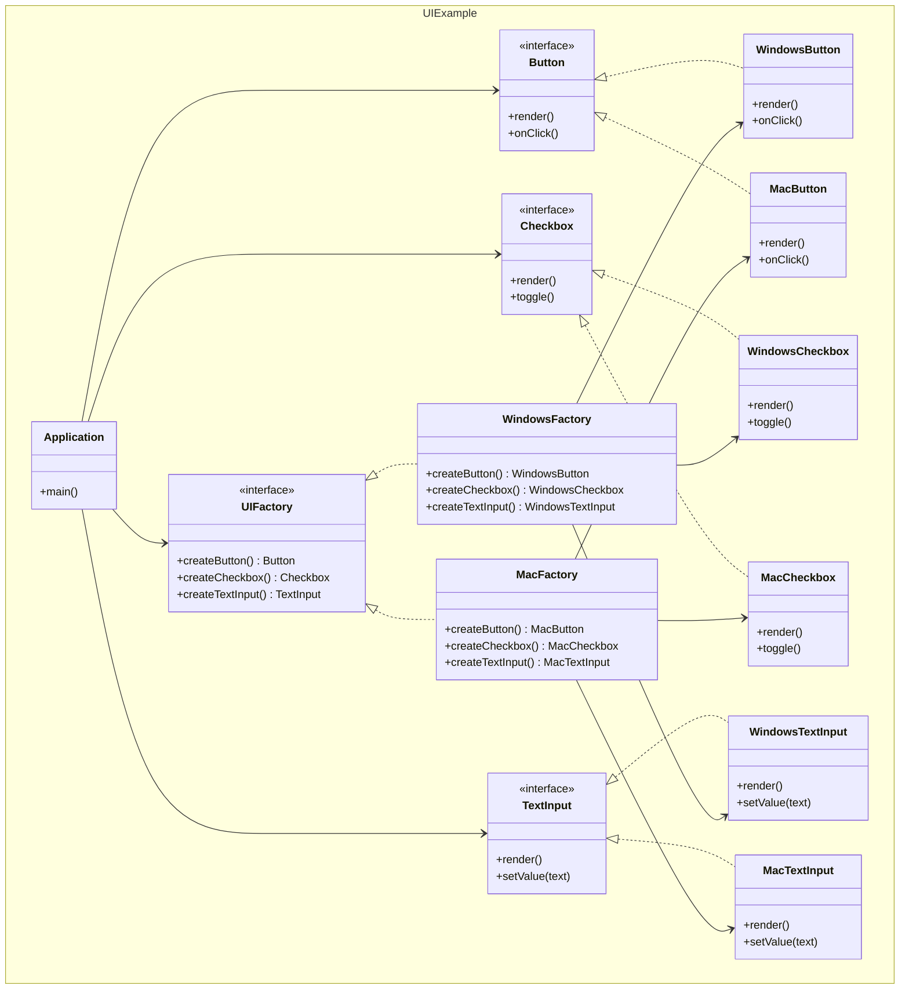
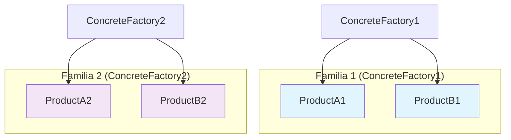
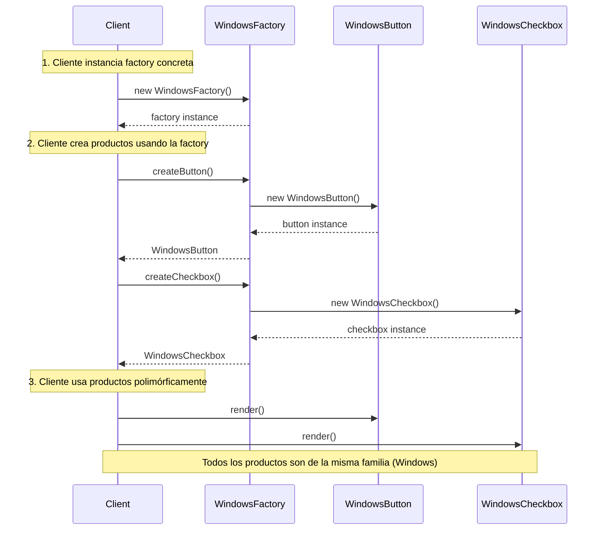

## Problema
Crear familias de objetos relacionados sin especificar sus clases concretas, garantizando que los productos de una familia sean compatibles entre sí.

## Propósito
Proporcionar una interfaz para crear familias de objetos relacionados o dependientes sin especificar sus clases concretas. Asegura que los productos creados por una factory sean compatibles entre sí.

## Casos de uso comunes
- UI components para diferentes sistemas operativos
- Drivers de base de datos con diferentes proveedores
- Temas visuales (dark/light mode)
- Formatos de exportación (PDF, Excel, Word)
- Protocolos de comunicación (HTTP, HTTPS, FTP)

## ¿Quién es quién en Abstract Factory?

| Actor | Lo que realmente es | Ejemplo | Analogía |
|-------|--------------------|---------|-----------|
| **AbstractFactory** | Interfaz de fábrica que define `createProductX()` | `UIFactory` - define qué componentes crear | "Fábrica de muebles" (interfaz) |
| **ConcreteFactory** | Fábricas que crean productos de UNA familia | `WindowsFactory`, `MacFactory` | Fábrica de muebles modernos vs clásicos |
| **AbstractProduct** | Interfaces de productos | `Button`, `Checkbox` - definen qué pueden hacer | "Silla", "Mesa" (tipos de muebles) |
| **ConcreteProduct** | Implementaciones concretas de productos | `WindowsButton`, `MacButton` | Silla moderna vs Silla clásica |
| **Client** | Usa productos, solo conoce interfaces abstractas | `Application` - no sabe si usa Windows o Mac | Decorador (quiere muebles que combinen) |

## Diagrama



## Ejemplo práctico



## Familias de productos



## Flujo de creación



## Ventajas
- **Consistencia**: Garantiza que los productos de una familia sean compatibles
- **Flexibilidad**: Fácil intercambio entre familias de productos
- **Aislamiento**: El código cliente no depende de clases concretas
- **Extensibilidad**: Fácil agregar nuevas familias de productos

## Desventajas
- **Complejidad**: Introduce muchas interfaces y clases
- **Extensibilidad**: Agregar nuevos productos requiere modificar todas las factories
- **Rigidez**: Difícil cambiar la interfaz de productos existentes

## Cuándo usar
- El sistema debe ser independiente de cómo se crean sus productos
- Necesitas garantizar que productos de una familia se usen juntos
- Quieres proporcionar una biblioteca de productos ocultando sus implementaciones
- Tienes múltiples familias de productos relacionados

## Cuándo NO usar
- Solo tienes una familia de productos
- Los productos no están relacionados entre sí
- La complejidad adicional no se justifica
- No necesitas garantizar compatibilidad entre productos

## Extensiones prácticas comunes

En implementaciones reales, es común agregar un **Factory Provider** (Simple Factory o Factory Method) para decidir qué factory concreta usar:

```javascript
// Patrón puro (cliente decide)
const factory = new WindowsFactory();

// Extensión práctica (provider decide)
const factory = FactoryProvider.getFactory(platform);
```

Esto **no es parte del patrón Abstract Factory**, sino un patrón complementario que resuelve el problema de selección dinámica.
