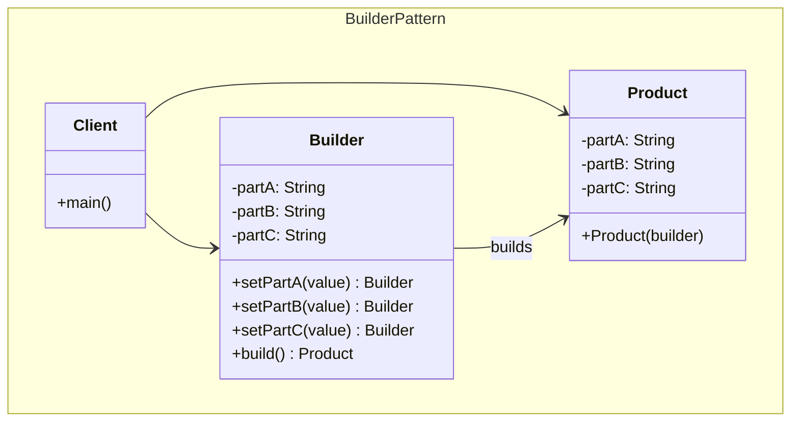
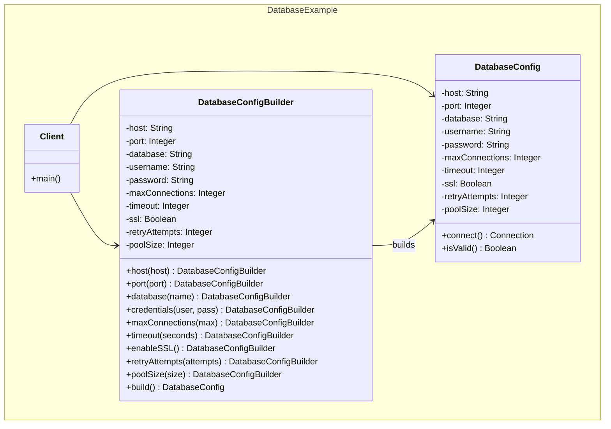
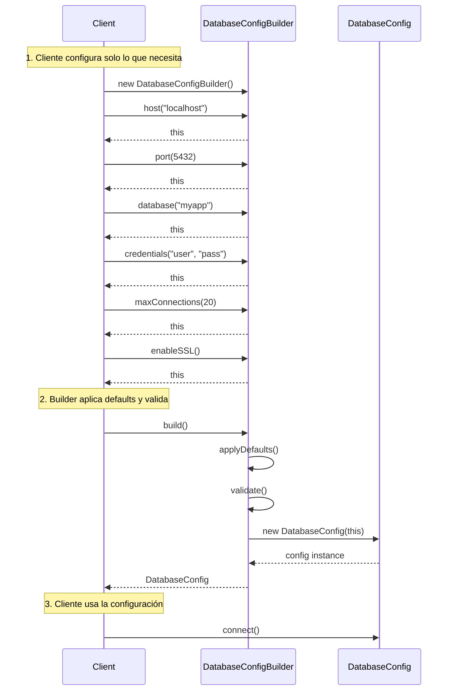

## Problema
Construir objetos complejos paso a paso, evitando constructores con muchos parámetros y permitiendo diferentes representaciones del mismo objeto.

## Propósito
Separar la construcción de un objeto complejo de su representación, permitiendo que el mismo proceso de construcción pueda crear diferentes representaciones. Facilita la creación de objetos inmutables complejos.

## Casos de uso comunes
- Configuraciones complejas (base de datos, APIs, servidores)
- Objetos con muchos parámetros opcionales
- Consultas SQL dinámicas
- Objetos inmutables complejos
- Builders de UI (formularios, ventanas)
- Configuraciones de testing

## ¿Quién es quién en Builder?

| Actor | Lo que realmente es | Ejemplo | Analogía |
|-------|--------------------|---------|-----------|
| **Builder** | Acumula parámetros y valida antes de crear | `DatabaseConfigBuilder` - configura paso a paso | Arquitecto (diseña casa paso a paso) |
| **Product** | Objeto final complejo e inmutable | `DatabaseConfig` - configuración completa | Casa terminada (compleja, muchas opciones) |
| **Director** | Coordinador opcional que conoce pasos | Cliente que dice "configuración de producción" | Cliente ("casa familiar" vs "casa de lujo") |
| **Fluent Interface** | API encadenada para facilidad de uso | `.host().port().database().build()` | Conversación natural ("3 habitaciones, 2 baños") |

## Diagrama



## Ejemplo práctico: Configuración de Base de Datos



## Flujo de construcción



## Ventajas
- **Legibilidad**: Código más claro que constructores con muchos parámetros
- **Flexibilidad**: Permite diferentes representaciones del mismo objeto
- **Inmutabilidad**: Facilita la creación de objetos inmutables
- **Validación**: Centraliza validaciones antes de crear el objeto
- **Fluent Interface**: API más expresiva y fácil de usar

## Desventajas
- **Complejidad**: Introduce más código y clases
- **Memoria**: Crea objetos intermedios durante la construcción
- **Duplicación**: Puede duplicar campos entre builder y producto
- **Overhead**: Más costoso que constructores simples

## Cuándo usar
- Objetos con muchos parámetros (más de 4-5)
- Muchos parámetros opcionales
- Necesitas objetos inmutables complejos
- Quieres validar antes de crear el objeto
- Diferentes representaciones del mismo objeto

## Cuándo NO usar
- Objetos simples con pocos parámetros
- Todos los parámetros son obligatorios
- No necesitas inmutabilidad
- La complejidad adicional no se justifica

## Ejemplo de uso

```javascript
// Construcción fluent - solo configuras lo que necesitas
const dbConfig = new DatabaseConfigBuilder()
    .host("localhost")
    .port(5432)
    .database("myapp")
    .credentials("admin", "secret123")
    .maxConnections(20)
    .timeout(30)
    .enableSSL()
    .retryAttempts(3)
    .build();

const connection = dbConfig.connect();

// vs Constructor tradicional (pesadilla de parámetros)
const dbConfig2 = new DatabaseConfig(
    "localhost",    // host
    5432,           // port  
    "myapp",        // database
    "admin",        // username
    "secret123",    // password
    20,             // maxConnections
    30,             // timeout
    true,           // ssl
    3,              // retryAttempts
    10,             // poolSize
    null,           // ¿Qué es esto?
    false,          // ¿y esto?
    null            // ¿y esto otro?
);
```

## Diferencias con otros patrones

| Patrón | Propósito | Cuándo usar |
|--------|-----------|-------------|
| **Builder** | Construir objetos complejos paso a paso | Muchos parámetros opcionales |
| **Factory Method** | Crear objetos sin especificar clase exacta | Múltiples implementaciones |
| **Abstract Factory** | Crear familias de objetos relacionados | Productos que deben ser compatibles |
| **Prototype** | Crear objetos clonando existentes | Creación costosa, muchas variaciones |
