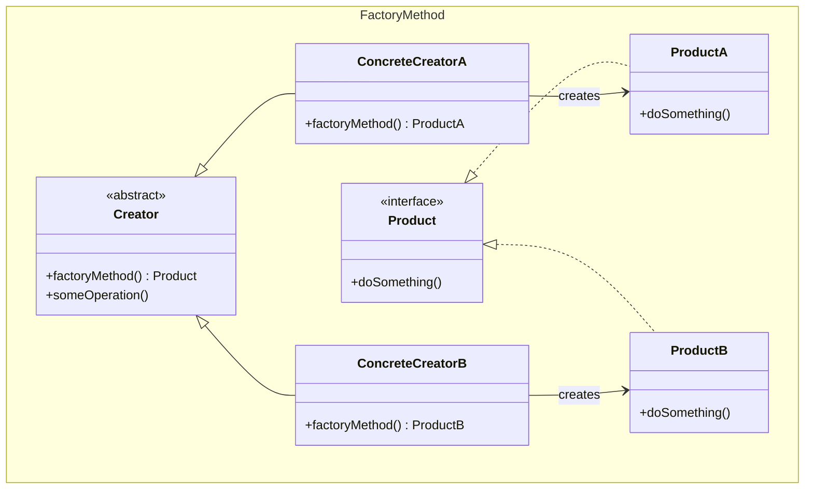
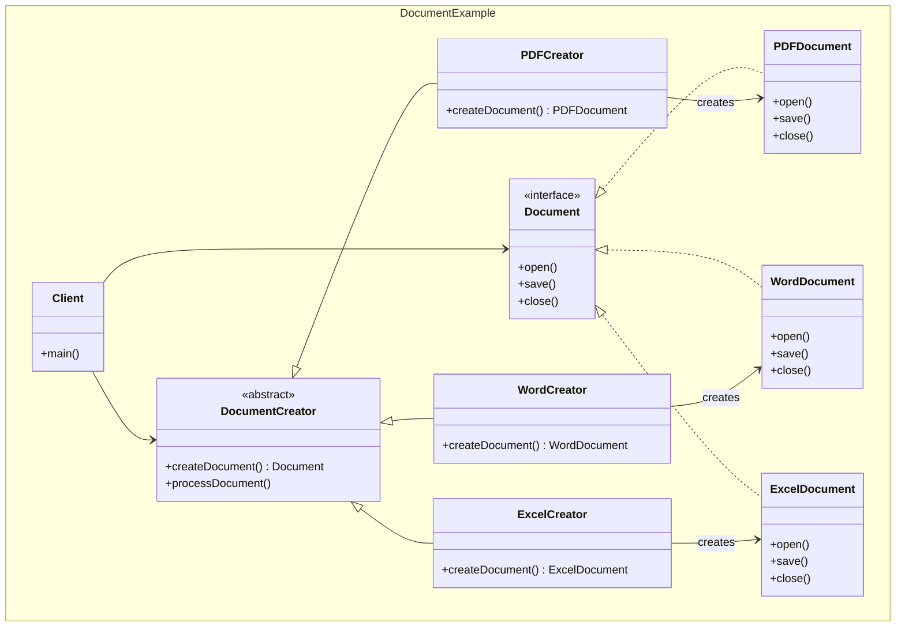
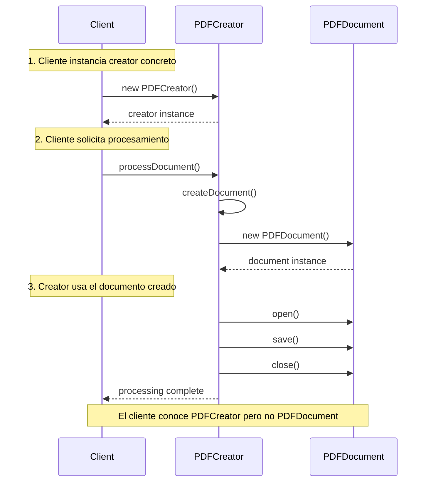
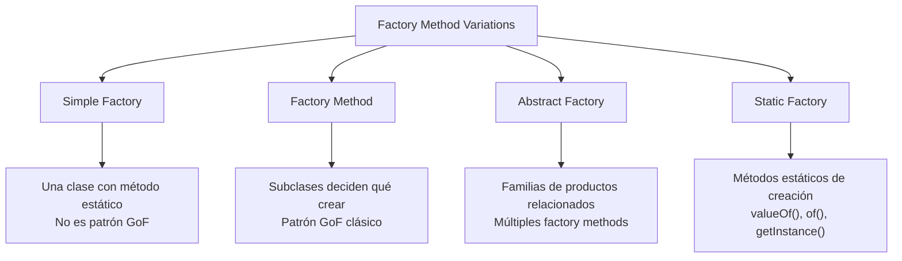
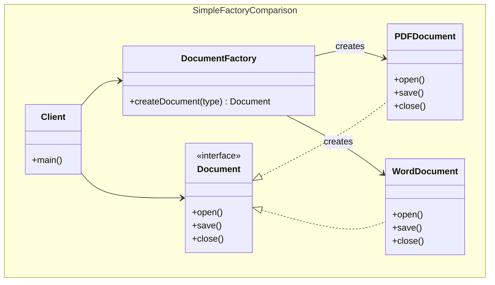

## Problema
Crear objetos sin especificar su clase exacta, delegando la decisión de instanciación a las subclases.

## Propósito
Definir una interfaz para crear objetos, pero permitir que las subclases decidan qué clase instanciar. Encapsula la lógica de creación y reduce el acoplamiento entre el código cliente y las clases concretas.

## Casos de uso comunes
- Creadores de documentos (PDF, Word, Excel)
- Servicios de notificación (email, SMS, push)
- Parsers de diferentes formatos (JSON, XML, CSV)
- Loggers con diferentes destinos (archivo, consola, red)
- Conexiones de base de datos (MySQL, PostgreSQL, MongoDB)

## ¿Quién es quién en Factory Method?

| Actor | Lo que realmente es | Ejemplo | Analogía |
|-------|--------------------|---------|-----------|
| **Creator** | Clase abstracta con factory method y lógica común | `DocumentCreator` - define `createDocument()` | "Fábrica" (proceso general) |
| **ConcreteCreator** | Creadores que saben qué producto crear | `PDFCreator`, `WordCreator` | Fábrica de autos, fábrica de motos |
| **Product** | Interfaz que define qué pueden hacer | `Document` - define `open()`, `save()`, `close()` | "Vehículo" (qué puede hacer) |
| **ConcreteProduct** | Implementaciones reales de productos | `PDFDocument`, `WordDocument` | Auto, Moto (vehículos específicos) |

**Clave**: El cliente conoce el Creator pero NO el Product concreto

## Diagrama



## Ejemplo práctico



## Flujo de creación



## Limitación importante

En Factory Method **puro**, el cliente debe conocer qué creator concreto usar:

```javascript
// Cliente DEBE decidir qué creator usar
const creator = new PDFCreator();  // Cliente conoce PDFCreator
const doc = creator.processDocument(); // Pero NO conoce PDFDocument
doc.open(); // Usa polimorfismo
```

**El patrón desacopla**:
- ✅ Cliente de productos concretos
- ❌ Cliente de creators concretos

## Ventajas
- **Desacoplamiento**: Elimina dependencias directas con clases concretas
- **Extensibilidad**: Fácil agregar nuevos productos sin modificar código existente
- **Polimorfismo**: Permite crear objetos basados en parámetros o contexto
- **Single Responsibility**: Separa la lógica de creación de la lógica de negocio

## Desventajas
- **Complejidad**: Introduce más clases e interfaces
- **Jerarquías paralelas**: Cada producto requiere su creator correspondiente
- **Overhead**: Puede ser excesivo para casos simples

## Cuándo usar
- Necesitas crear objetos sin conocer su clase exacta
- Quieres delegar la decisión de creación a subclases
- Tienes múltiples implementaciones de una interfaz
- La lógica de creación es compleja o puede cambiar

## Cuándo NO usar
- Solo tienes una implementación
- La creación es simple y no cambiará
- No necesitas polimorfismo en la creación

## Variaciones del patrón



## Simple Factory



**Simple Factory vs Factory Method**:

| Aspecto | Simple Factory | Factory Method |
|---------|----------------|----------------|
| **Estructura** | Una clase con switch/if | Jerarquía de clases |
| **Extensibilidad** | Modificar factory existente | Agregar nueva subclase |
| **Cliente conoce** | Solo la factory | Creator concreto |
| **Complejidad** | Menor | Mayor |
| **Flexibilidad** | Menor | Mayor |