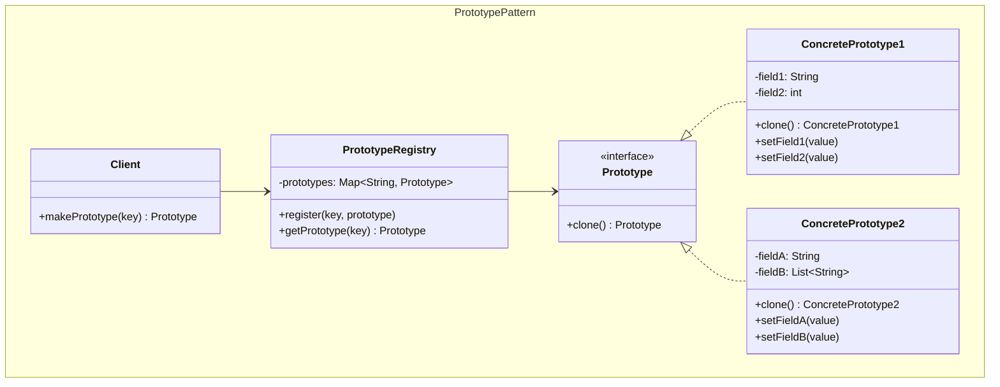
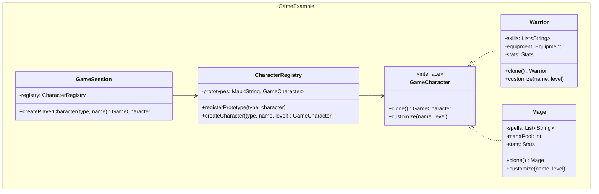
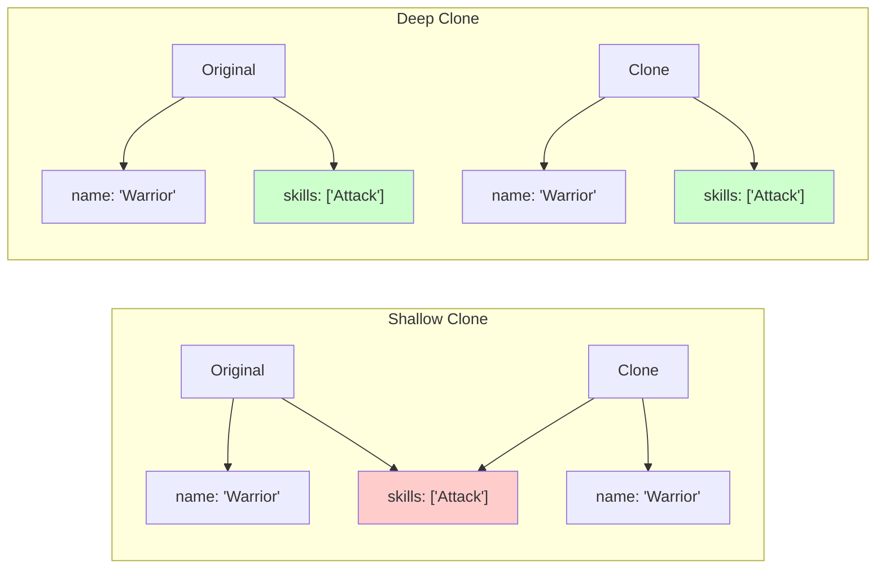
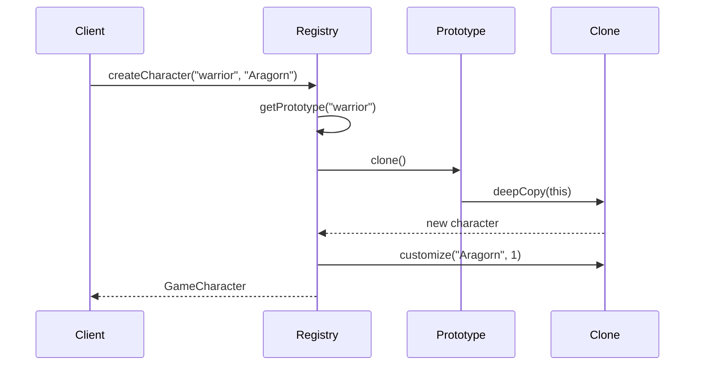

## Problema
Crear objetos clonando instancias existentes cuando la creación directa es costosa o compleja.

## Propósito
Especificar los tipos de objetos a crear usando una instancia prototípica, y crear nuevos objetos copiando este prototipo. Evita el costo de creación desde cero cuando la clonación es más eficiente.

## Casos de uso comunes
- Configuraciones de juegos (personajes, niveles)
- Templates de documentos o emails
- Objetos con inicialización costosa
- Caches de objetos complejos
- Sistemas con muchas variaciones de objetos similares

## Diagrama

## Ejemplo práctico

## Tipos de clonación

**Shallow Clone**: Copia el objeto pero comparte referencias internas (arrays, objetos)
**Deep Clone**: Copia el objeto y todos sus objetos internos independientemente

## Flujo de clonación

## Ventajas
- **Performance**: Evita el costo de creación de objetos complejos
- **Flexibilidad**: Permite crear objetos en tiempo de ejecución
- **Configuración**: Útil para objetos con muchas configuraciones predefinidas
- **Independencia**: Reduce dependencias de clases concretas

## Desventajas
- **Complejidad**: Implementar deep cloning puede ser complejo
- **Referencias circulares**: Problemas con objetos que se referencian mutuamente
- **Mantenimiento**: Cambios en la clase requieren actualizar el método clone
- **Inmutabilidad**: Los prototipos deben manejar correctamente la mutabilidad

## Cuándo usar
- La creación de objetos es costosa (consultas DB, cálculos complejos)
- Necesitas muchas variaciones de un objeto base
- Quieres evitar subclases de Factory
- Los objetos tienen configuraciones complejas que se reutilizan

## Cuándo NO usar
- La creación de objetos es simple y rápida
- Los objetos no comparten configuraciones comunes
- Deep cloning es demasiado complejo de implementar
- Prefieres inmutabilidad sobre clonación

## Diferencias con otros patrones
- **vs Factory Method**: Prototype clona existentes, Factory crea desde cero
- **vs Builder**: Prototype clona configurados, Builder construye paso a paso