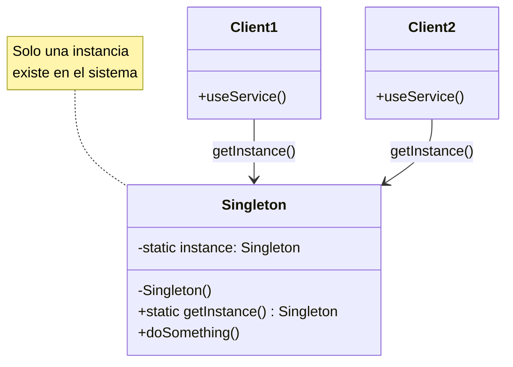
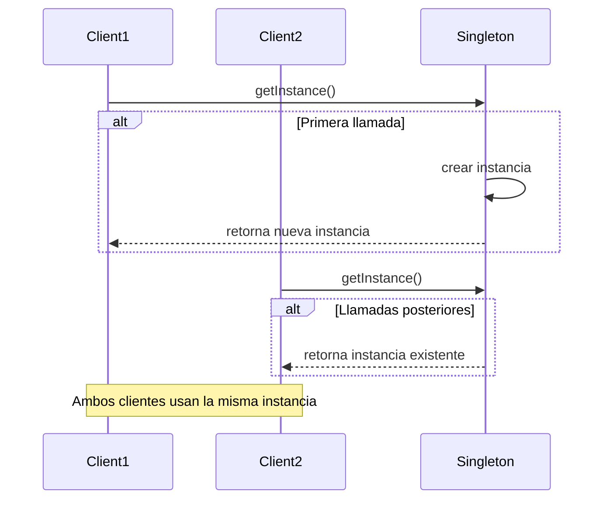

## Problema
Garantizar que una clase tenga solo una instancia y proporcionar un punto de acceso global a ella.

## Propósito
Controlar la instanciación de una clase para asegurar que solo exista un objeto de esa clase en todo el sistema, proporcionando acceso global a esa instancia única.

## Casos de uso comunes
- Loggers del sistema
- Configuraciones de aplicación
- Conexiones a base de datos
- Caches globales
- Pools de recursos
- Managers de estado global

## Diagrama

## Flujo de creación

## Ventajas
- **Instancia única**: Garantiza una sola instancia en el sistema
- **Acceso global**: Punto de acceso controlado desde cualquier parte
- **Lazy loading**: Puede crear la instancia solo cuando se necesita
- **Control de recursos**: Útil para recursos costosos o limitados

## Desventajas
- **Testing**: Dificulta las pruebas unitarias (hard to mock)
- **Acoplamiento**: Crea dependencias globales ocultas
- **Concurrencia**: Requiere consideraciones especiales para thread-safety
- **Principio de responsabilidad única**: Viola SRP (controla instanciación + lógica de negocio)

## Cuándo usar
- Necesitas exactamente una instancia de una clase
- Requieres acceso global a esa instancia
- La instancia debe ser creada de forma lazy
- Controlas recursos compartidos (conexiones, caches)

## Cuándo NO usar
- Puedes usar Dependency Injection
- Necesitas múltiples instancias en el futuro
- Dificulta el testing
- Crea acoplamiento innecesario
- El framework ya maneja singletons (Spring Boot)

## Alternativas modernas
- **Dependency Injection**: Spring Boot maneja singletons automáticamente
- **Static classes**: Para funcionalidades sin estado
- **Factory patterns**: Para control más flexible de instancias