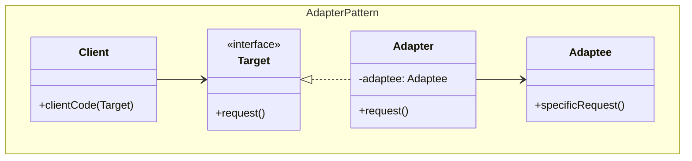
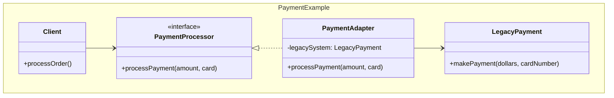
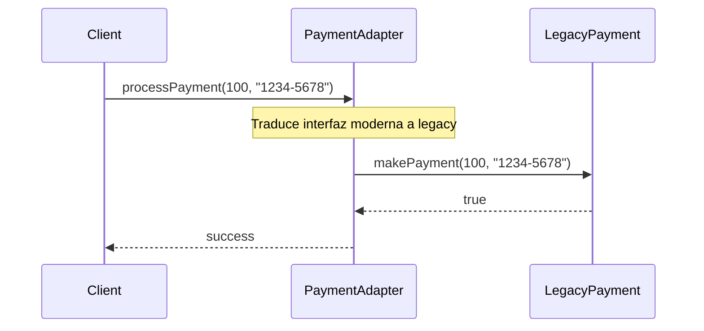

## Problema
Hacer que clases con interfaces incompatibles puedan trabajar juntas sin modificar su código fuente.

## Propósito
Convertir la interfaz de una clase en otra interfaz que el cliente espera. Permite que clases con interfaces incompatibles colaboren, actuando como un puente entre el código existente y el nuevo.

## Casos de uso comunes
- Integrar sistemas legacy con código moderno
- Adaptar bibliotecas de terceros a tu interfaz
- Conectar APIs con diferentes formatos de datos
- Reutilizar código existente sin modificarlo

## Diagrama

## Ejemplo práctico

## Flujo de funcionamiento

## Ventajas
- **Reutilización**: Permite usar código existente sin modificarlo
- **Desacoplamiento**: Separa el cliente del sistema adaptado
- **Flexibilidad**: Fácil intercambio de implementaciones
- **Integración**: Conecta sistemas con interfaces diferentes

## Desventajas
- **Complejidad**: Añade una capa adicional de abstracción
- **Performance**: Puede introducir overhead mínimo
- **Mantenimiento**: Cambios en el adaptee pueden requerir cambios en el adapter

## Cuándo usar
- Necesitas usar una clase existente con interfaz incompatible
- Quieres integrar bibliotecas de terceros
- Tienes sistemas legacy que no puedes modificar
- Necesitas que clases no relacionadas trabajen juntas

## Cuándo NO usar
- Las interfaces ya son compatibles
- Puedes modificar directamente las clases existentes
- La adaptación es demasiado compleja o forzada
- Solo necesitas cambios menores en la interfaz

## Diferencias con otros patrones
- **vs Facade**: Adapter cambia interfaz, Facade simplifica interfaz compleja
- **vs Decorator**: Adapter cambia interfaz, Decorator añade funcionalidad
- **vs Proxy**: Adapter cambia interfaz, Proxy controla acceso con misma interfaz
- **vs Bridge**: Adapter conecta incompatibles, Bridge separa abstracción de implementación