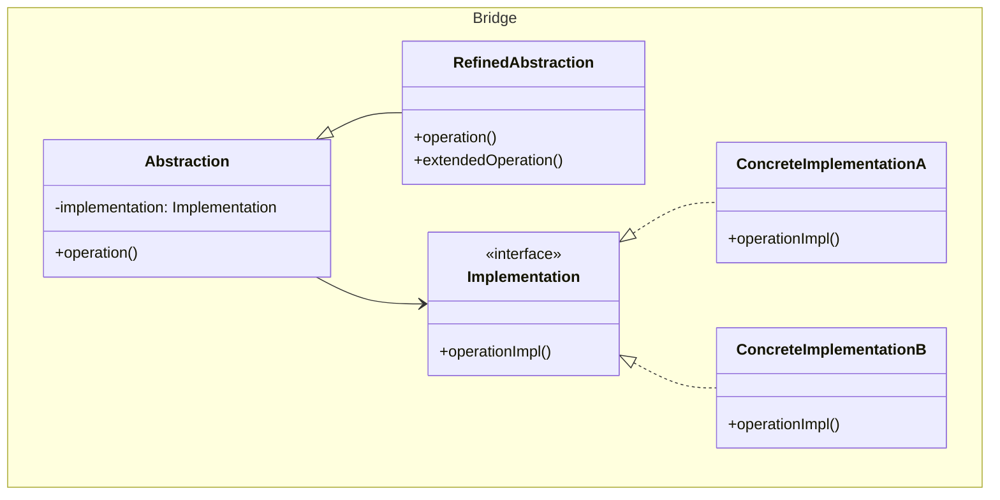
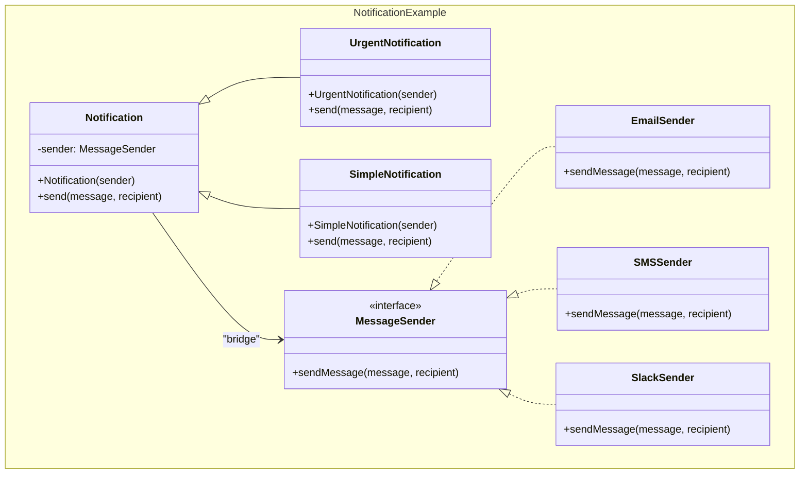
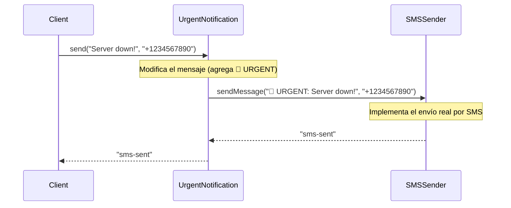
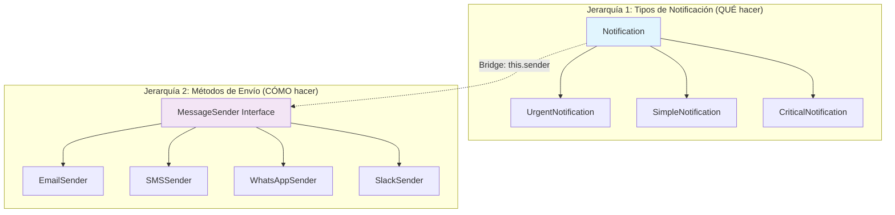

## Problema
Evitar el binding permanente entre una abstracción y su implementación, permitiendo que ambas puedan variar independientemente.

## Propósito
Separar una abstracción de su implementación para que ambas puedan evolucionar de forma independiente. Utiliza composición en lugar de herencia para conectar diferentes jerarquías de clases.

## Casos de uso comunes
- Sistemas multiplataforma (Windows, Mac, Linux)
- Drivers de base de datos (MySQL, PostgreSQL, Oracle)
- Sistemas de notificación con múltiples canales
- APIs con diferentes proveedores

## ¿Quién es quién en Bridge?

| Actor | Lo que realmente es | Ejemplo | Analogía |
|-------|--------------------|---------|-----------|
| **Abstraction** | Clase de alto nivel que define QUÉ hacer | `Notification` - maneja lógica de notificaciones | Control remoto (sabe QUÉ botones presionar) |
| **RefinedAbstraction** | Variaciones de la abstracción | `UrgentNotification` - agrega urgencia al mensaje | Control remoto con botones extra |
| **Implementation** | Interfaz que define CÓMO hacer | `MessageSender` - define cómo enviar mensajes | "Protocolo de comunicación" (interfaz) |
| **ConcreteImplementation** | Implementaciones reales del CÓMO | `SMSSender`, `EmailSender` - formas concretas de enviar | TV Samsung, TV LG (CÓMO responden) |

## Diagrama



## Ejemplo práctico



## Flujo de funcionamiento



## Flexibilidad del Bridge

**El poder del patrón: cualquier abstracción con cualquier implementación**

```javascript
// Puedes combinar CUALQUIER tipo de notificación con CUALQUIER sender
const urgentEmail = new UrgentNotification(new EmailSender());
const urgentSMS = new UrgentNotification(new SMSSender());
const urgentSlack = new UrgentNotification(new SlackSender());

const simpleEmail = new SimpleNotification(new EmailSender());
const simpleSMS = new SimpleNotification(new SMSSender());
const simpleSlack = new SimpleNotification(new SlackSender());

// Todas estas combinaciones funcionan sin modificar código existente
urgentEmail.send("Server down!", "admin@company.com");
simpleSMS.send("Meeting reminder", "+1234567890");
```

## ¿Cómo separa abstracción de implementación?

**Básicamente es polimorfismo en el constructor, pero el valor está en la SEPARACIÓN:**

```javascript
// ABSTRACCIÓN: Define QUÉ hacer (lógica de negocio)
class UrgentNotification {
    constructor(sender) {
        this.sender = sender; // Bridge: no sabe CÓMO enviar
    }
    
    send(message, recipient) {
        // Lógica de negocio: agregar urgencia
        const urgentMessage = `🚨 URGENT: ${message}`;
        
        // Delega el CÓMO a la implementación
        return this.sender.sendMessage(urgentMessage, recipient);
    }
}

// IMPLEMENTACIÓN: Define CÓMO hacer (detalles técnicos)
class SMSSender {
    sendMessage(message, recipient) {
        // Detalles técnicos: cómo enviar SMS
        console.log(`Connecting to SMS gateway...`);
        console.log(`Sending SMS to ${recipient}: ${message}`);
        return "sms-sent";
    }
}
```

## El valor real: Evolución independiente

**Sin Bridge (acoplado):**
```javascript
class UrgentEmailNotification {
    send(message, recipient) {
        const urgentMessage = `🚨 URGENT: ${message}`;
        // Acoplado: sabe cómo enviar email
        console.log(`Email to ${recipient}: ${urgentMessage}`);
    }
}

// Si cambias cómo enviar email, debes tocar TODAS las clases
// Si agregas nuevo tipo, debes crear clases para TODOS los métodos
```

**Con Bridge (desacoplado):**
```javascript
class UrgentNotification {
    constructor(sender) {
        this.sender = sender; // Desacoplado: no sabe cómo enviar
    }
    
    send(message, recipient) {
        const urgentMessage = `🚨 URGENT: ${message}`;
        return this.sender.sendMessage(urgentMessage, recipient);
    }
}

// Cambios en implementación NO afectan abstracción
// Cambios en abstracción NO afectan implementación
```

## Ventajas
- **Desacoplamiento**: Abstracción e implementación evolucionan independientemente
- **Extensibilidad**: Fácil agregar nuevas abstracciones o implementaciones
- **Flexibilidad**: Combinaciones dinámicas en tiempo de ejecución
- **Reutilización**: Las implementaciones pueden ser compartidas

## Desventajas
- **Complejidad**: Introduce más clases e interfaces
- **Indirección**: Puede afectar ligeramente el rendimiento
- **Diseño inicial**: Requiere planificación previa de las jerarquías

## Cuándo usar
- Quieres evitar binding permanente entre abstracción e implementación
- Tanto abstracción como implementación deben ser extensibles
- Necesitas compartir implementaciones entre múltiples abstracciones
- Cambios en implementación no deben afectar clientes

## Cuándo NO usar
- Solo tienes una abstracción y una implementación
- La relación entre abstracción e implementación es simple y estable
- La complejidad adicional no se justifica

## Las dos jerarquías independientes



**El Bridge conecta ambas jerarquías:**
- **Jerarquía 1** puede evolucionar independientemente (agregar nuevos tipos)
- **Jerarquía 2** puede evolucionar independientemente (agregar nuevos métodos)
- **Cualquier combinación** funciona automáticamente

**Matriz de combinaciones:**

| Abstracción \ Implementación | EmailSender | SMSSender | WhatsAppSender | SlackSender |
|------------------------------|-------------|-----------|----------------|-------------|
| **UrgentNotification** | ✅ | ✅ | ✅ | ✅ |
| **SimpleNotification** | ✅ | ✅ | ✅ | ✅ |
| **CriticalNotification** | ✅ | ✅ | ✅ | ✅ |

**12 combinaciones con solo 7 clases**

## Diferencias con otros patrones
- **vs Adapter**: Bridge planifica flexibilidad, Adapter arregla incompatibilidad
- **vs Strategy**: Bridge separa jerarquías, Strategy intercambia algoritmos