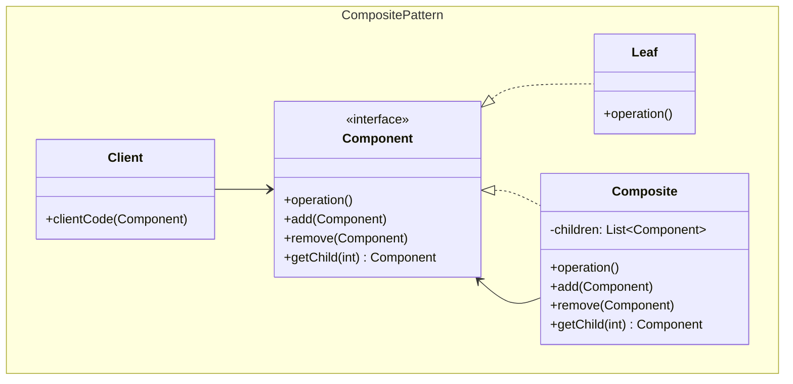
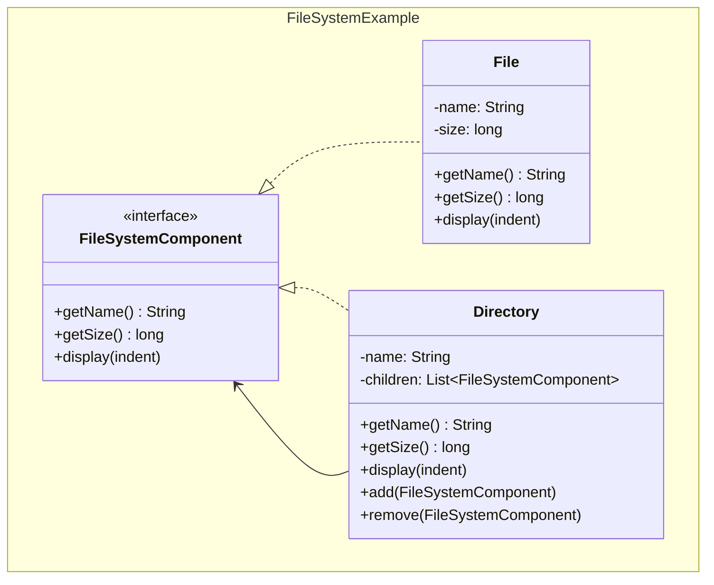

## Problema
Tratar objetos individuales y composiciones de objetos de manera uniforme en estructuras jerárquicas.

## Propósito
Permite que objetos individuales (Leaf) y contenedores (Composite) implementen la misma interfaz, de modo que las operaciones se ejecuten recursivamente por toda la estructura sin que el cliente sepa si está tratando con un elemento simple o compuesto.

## Concepto clave
**Tratar lo simple y lo complejo igual**: Un archivo y una carpeta implementan la misma interfaz. Cuando pides el tamaño de una carpeta, automáticamente suma el tamaño de todo su contenido recursivamente.

## Casos de uso comunes
- **Sistemas de archivos**: archivos y carpetas
- **UI**: botones individuales y paneles que contienen otros componentes
- **Menús**: elementos de menú y submenús
- **Organizaciones**: empleados y departamentos
- **Validación**: reglas simples y grupos de reglas

## ¿Quién es quién en Composite?

| Actor | Lo que realmente es | Ejemplo | Analogía |
|-------|--------------------|---------|-----------|
| **Component** | Interfaz común para simples y compuestos | `FileSystemComponent` - operaciones para archivos y carpetas | "Elemento del sistema de archivos" |
| **Leaf** | Objetos simples, no tienen hijos | `File` - hace el trabajo real, no contiene otros | Archivo (no contiene nada más) |
| **Composite** | Contenedores, delegan recursivamente | `Directory` - contiene otros componentes | Carpeta (contiene archivos y carpetas) |
| **Client** | Usa la estructura, trata todo igual | Usuario - pide tamaño sin saber si es archivo o carpeta | Usuario (transparencia total) |

## Diagrama



## Ejemplo práctico



## Ejemplo de recursión

```
📁 root/ (25KB total)
├── 📄 README.md (7KB)        ← Leaf: devuelve 7KB
├── 📁 documents/ (13KB)      ← Composite: suma sus hijos
│   ├── 📄 config.json (8KB)  ← Leaf: devuelve 8KB  
│   └── 📄 notes.txt (5KB)    ← Leaf: devuelve 5KB
└── 📁 photos/ (5KB)          ← Composite: suma sus hijos
    └── 📄 vacation.jpg (5KB) ← Leaf: devuelve 5KB
```

**Llamada**: `root.getSize()` → 7 + documents.getSize() + photos.getSize() → 7 + (8+5) + (5) = 25KB

## Ventajas
- **Uniformidad**: Trata objetos simples y complejos de la misma manera
- **Flexibilidad**: Fácil agregar nuevos tipos de componentes
- **Recursión**: Operaciones se propagan automáticamente por la estructura
- **Transparencia**: Cliente no necesita distinguir entre leaf y composite

## Desventajas
- **Generalización excesiva**: Puede hacer el diseño demasiado general
- **Restricciones**: Difícil restringir qué componentes puede contener un composite
- **Complejidad**: Puede ser confuso si la jerarquía es muy profunda

## Cuándo usar
- Quieres representar jerarquías parte-todo
- Quieres que clientes ignoren diferencias entre objetos individuales y composiciones
- La estructura puede ser representada como árbol
- Necesitas aplicar operaciones uniformemente en toda la estructura

## Cuándo NO usar
- La estructura es plana (no jerárquica)
- Los objetos individuales y las composiciones tienen comportamientos muy diferentes
- La complejidad adicional no se justifica