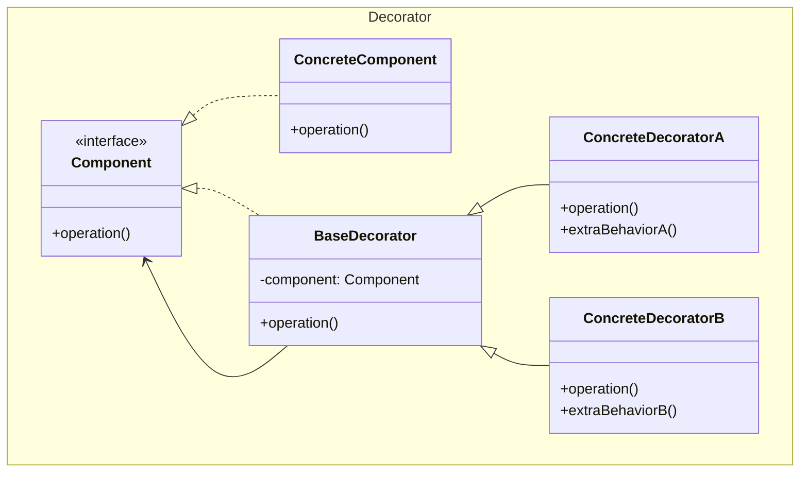
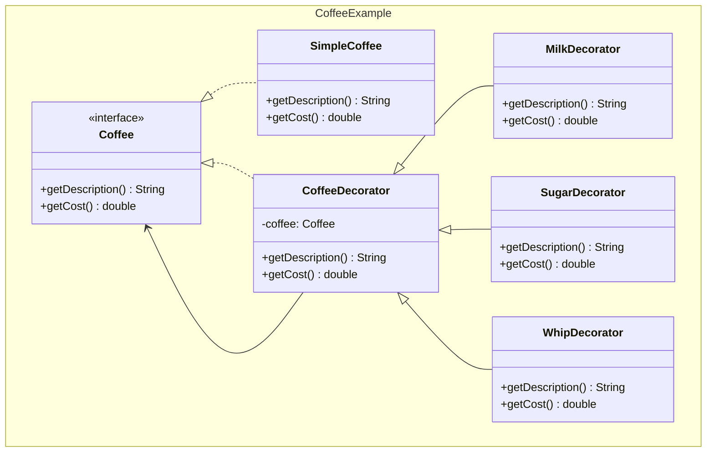

## Problema
Agregar funcionalidades a objetos dinámicamente sin alterar su estructura ni crear subclases.

## Propósito
Envolver un objeto con capas adicionales de funcionalidad. Cada decorador añade una característica específica y puede combinarse con otros decoradores como capas de cebolla.

## Concepto clave
**Envoltorio en cadena**: Cada decorador envuelve al objeto anterior, añadiendo su funcionalidad y delegando el resto. Es como poner calcetines: cada capa añade algo pero mantiene lo que había debajo.

## Casos de uso comunes
- **Middleware web**: autenticación + logging + compresión en capas
- **Streams**: FileInputStream + Buffer + Compresión
- **Validación**: required + email + longitud mínima
- **UI**: botón + sombra + borde + animación
- **Texto**: texto + negrita + cursiva + subrayado

## Diagrama



## Ejemplo práctico



## Ejemplo de envoltorio

```
Cliente solicita: getCost()

┌─────────────────────────────────────┐
│ WhipDecorator (+0.7)                │
│ ┌─────────────────────────────────┐ │
│ │ SugarDecorator (+0.2)           │ │
│ │ ┌─────────────────────────────┐ │ │
│ │ │ MilkDecorator (+0.5)        │ │ │
│ │ │ ┌─────────────────────────┐ │ │ │
│ │ │ │ SimpleCoffee (2.0)      │ │ │ │
│ │ │ └─────────────────────────┘ │ │ │
│ │ └─────────────────────────────┘ │ │
│ └─────────────────────────────────┘ │
└─────────────────────────────────────┘

Flujo: 2.0 → 2.5 → 2.7 → 3.4
```

## Ventajas
- **Combinaciones infinitas**: Puedes mezclar decoradores como quieras
- **Responsabilidad única**: Cada decorador hace una sola cosa
- **Extensible**: Agregar nuevos decoradores sin tocar código existente
- **Dinámico**: Añadir/quitar funcionalidades en tiempo de ejecución

## Desventajas
- **Muchos objetos pequeños**: Puede ser confuso rastrear todas las capas
- **Orden importa**: `encrypt(compress(data))` ≠ `compress(encrypt(data))`
- **Performance**: Cada capa añade overhead
- **Debugging complejo**: Difícil saber en qué capa está el problema

## Cuándo usar
- Tienes muchas combinaciones posibles de funcionalidades
- Quieres añadir/quitar características dinámicamente
- Cada funcionalidad es independiente y reutilizable
- La herencia crearía demasiadas subclases

## Cuándo NO usar
- Solo necesitas 2-3 variaciones (usa herencia simple)
- Las funcionalidades están fuertemente acopladas
- La performance es crítica
- El orden de aplicación no importa (considera Strategy)