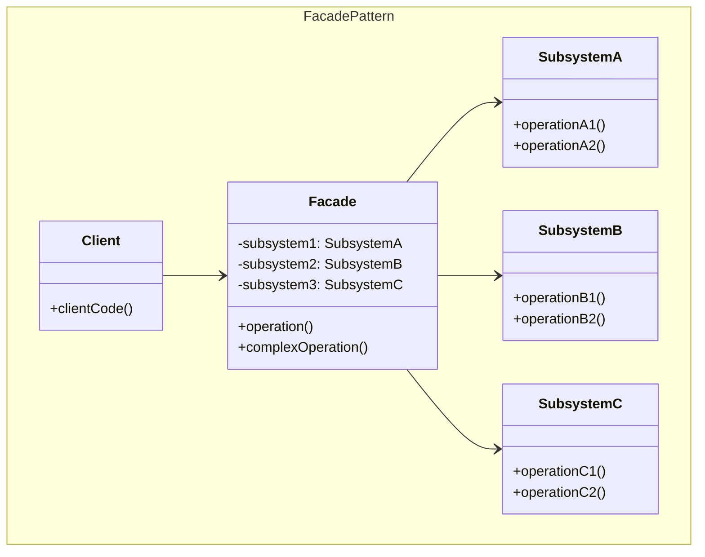
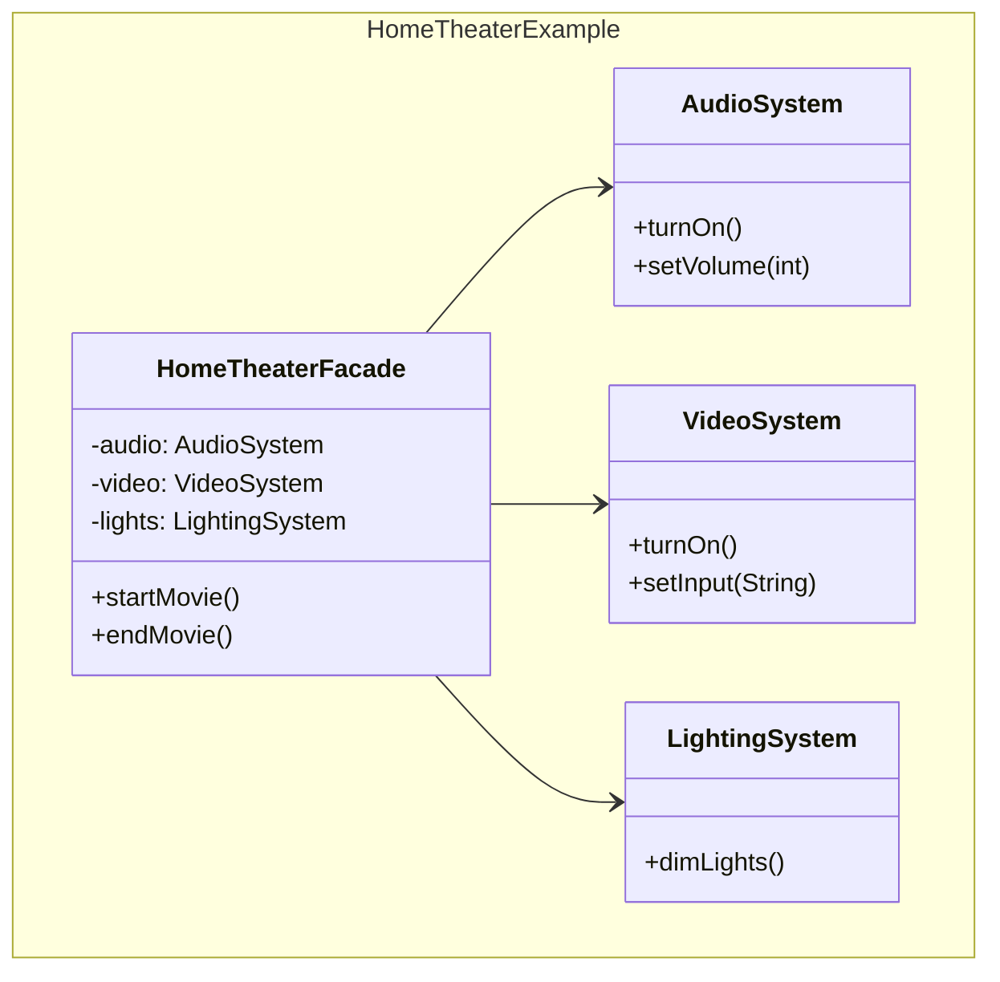

## Problema
Simplificar el acceso a un subsistema complejo proporcionando una interfaz unificada y fácil de usar.

## Propósito
Proporcionar una interfaz unificada para un conjunto de interfaces en un subsistema. Define una interfaz de alto nivel que hace que el subsistema sea más fácil de usar, ocultando su complejidad interna.

## Casos de uso comunes
- **Home automation**: Un botón "Ver película" controla audio, video y luces
- **APIs unificadas**: Un endpoint que coordina múltiples microservicios
- **Frameworks**: jQuery simplifica el DOM complejo del navegador
- **Servicios de alto nivel**: Un servicio que coordina base de datos, cache y logs
- **Integraciones**: Un cliente que simplifica APIs complejas de terceros

## ¿Quién es quién en Facade?

| Actor | Lo que realmente es | Ejemplo | Analogía |
|-------|--------------------|---------|-----------|
| **Facade** | Interfaz simplificada que coordina | `HomeTheaterFacade` - ofrece `startMovie()` | Recepcionista de hotel (interfaz simple) |
| **Subsystem Classes** | Clases complejas con responsabilidades específicas | `AudioSystem`, `VideoSystem`, `LightingSystem` | Limpieza, Cocina, Mantenimiento |
| **Client** | Usuario que solo conoce la interfaz simple | Cliente que llama `theater.startMovie()` | Huésped (solo habla con recepcionista) |

**Clave**: El Facade NO reemplaza el subsistema, solo lo simplifica

## Diagrama



## Ejemplo práctico



## Sin Facade vs Con Facade

```
// Sin Facade (cliente hace todo)
audio.turnOn();
audio.setVolume(70);
video.turnOn();
video.setInput("HDMI1");
lights.dimLights();

// Con Facade (una sola llamada)
theater.startMovie();
```

## Ventajas
- **Simplicidad**: Interfaz simple para subsistema complejo
- **Desacoplamiento**: Clientes no dependen de clases del subsistema
- **Flexibilidad**: Cambios internos no afectan clientes
- **Organización**: Agrupa funcionalidades relacionadas

## Desventajas
- **Limitaciones**: Puede no exponer toda la funcionalidad del subsistema
- **God Object**: El facade puede volverse demasiado grande
- **Rigidez**: Puede limitar la flexibilidad si es muy específico
- **Dependencia**: Crea un punto único de falla

## Cuándo usar
- Quieres proporcionar una interfaz simple a un subsistema complejo
- Hay muchas dependencias entre clientes y clases de implementación
- Quieres estructurar un subsistema en capas
- Necesitas un punto de entrada unificado para múltiples servicios

## Cuándo NO usar
- El subsistema ya es simple
- Los clientes necesitan acceso directo a funcionalidades específicas
- El facade se volvería demasiado complejo
- Solo tienes un subsistema simple