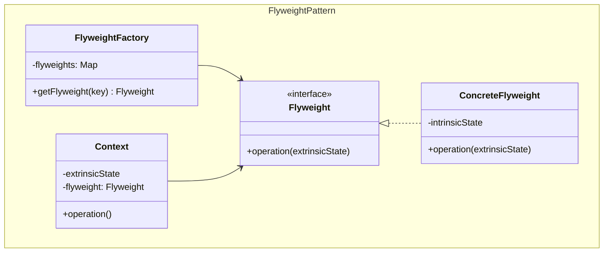
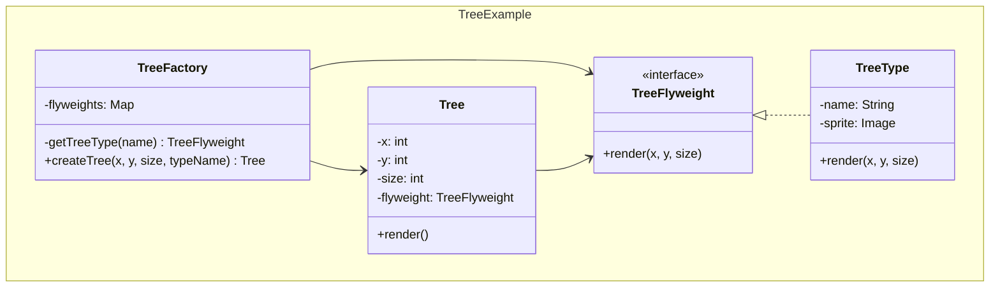
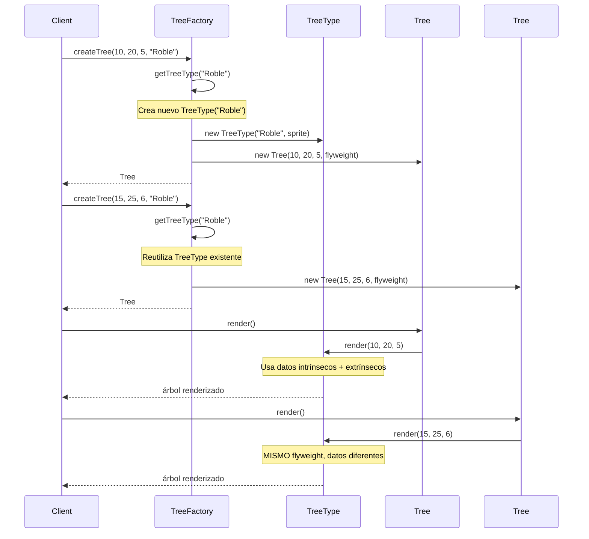
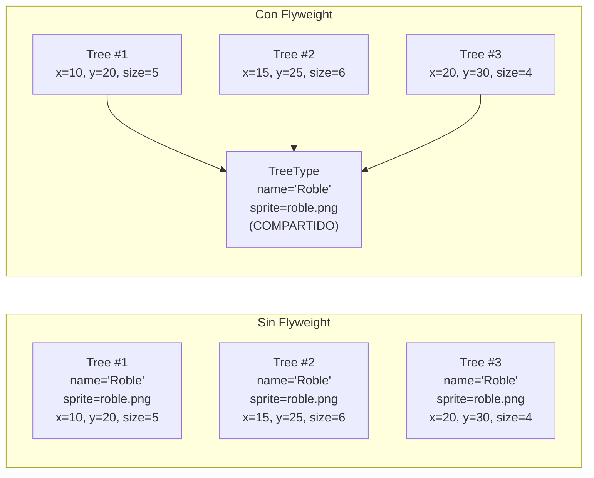

## Problema
Minimizar el uso de memoria cuando se necesita crear gran cantidad de objetos similares que comparten características comunes.

## Propósito
Compartir objetos para ahorrar memoria. En lugar de crear 1000 objetos idénticos, crea 1 objeto y compártelo 1000 veces.

## Concepto clave
**Compartir lo común, separar lo único**: Los datos que no cambian (intrínsecos) se guardan en el flyweight compartido. Los datos que sí cambian (extrínsecos) se pasan como parámetros.

## Casos de uso comunes
- **Juegos**: 1000 balas del mismo tipo, solo cambia posición
- **Texto**: Miles de letras 'A', solo cambia posición y color
- **Árboles**: Bosque con 500 robles, solo cambia posición y tamaño
- **Iconos**: Mismos iconos en diferentes lugares de la UI
- **Partículas**: Efectos de fuego, humo, lluvia

## Diagrama

## Ejemplo práctico

## Flujo de operación

## Ahorro de memoria

## Ventajas
- **Memoria**: Reduce significativamente el uso de memoria
- **Performance**: Menos objetos = menos presión en el Garbage Collector
- **Escalabilidad**: Permite manejar gran cantidad de objetos
- **Compartición**: Reutiliza objetos inmutables eficientemente

## Desventajas
- **Complejidad**: Separar estado intrínseco del extrínseco puede ser complejo
- **Cálculos**: Puede introducir overhead de cálculos para el estado extrínseco
- **Referencias circulares**: Problemas con objetos que se referencian mutuamente
- **Inmutabilidad**: Los flyweights deben ser inmutables

## Cuándo usar
- Necesitas crear gran cantidad de objetos similares
- El costo de almacenamiento es alto debido a la cantidad de objetos
- El estado extrínseco puede ser calculado o pasado como parámetro
- Los objetos pueden ser agrupados por características compartidas

## Cuándo NO usar
- Tienes pocos objetos
- Los objetos no comparten características significativas
- El estado extrínseco es difícil de separar o calcular
- La aplicación no tiene restricciones de memoria