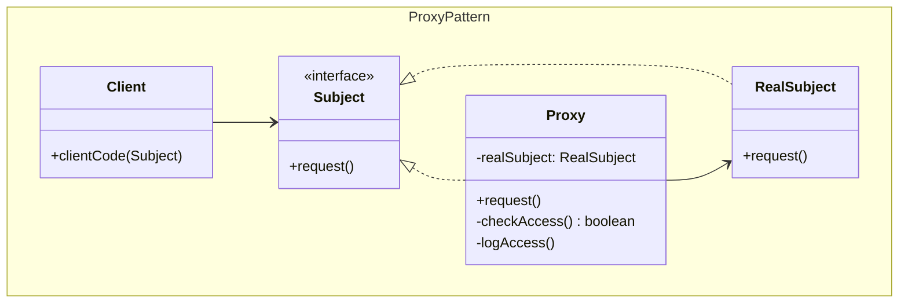
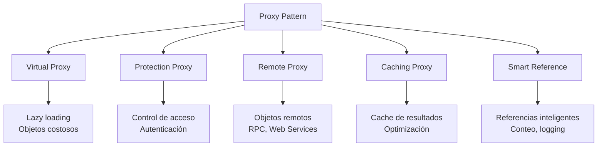
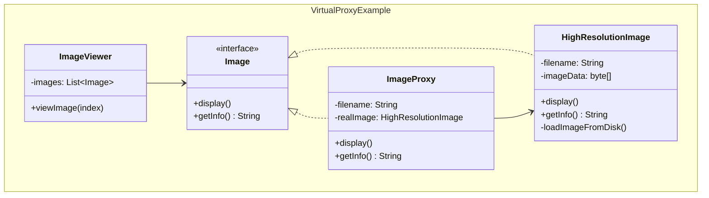
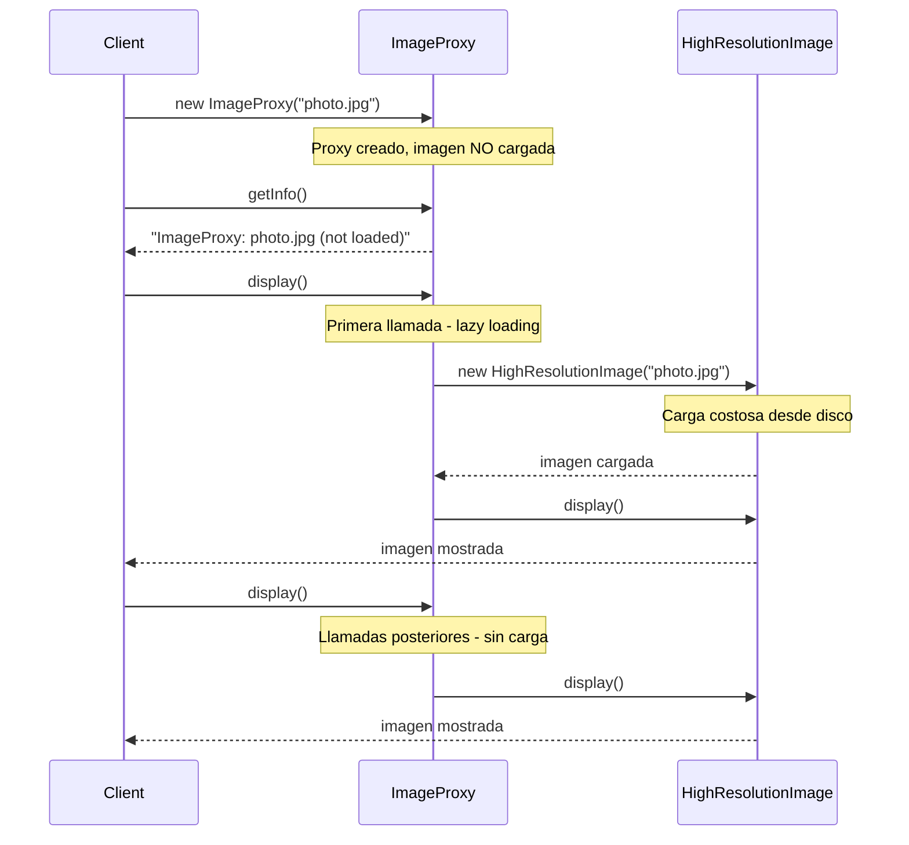
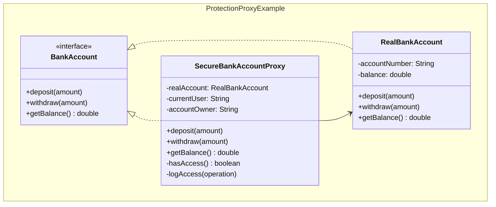

## Problema
Controlar el acceso a otro objeto proporcionando un sustituto o placeholder que puede agregar funcionalidad adicional.

## Propósito
Proporcionar un sustituto o placeholder para otro objeto para controlar el acceso a él. Permite agregar funcionalidad como lazy loading, caching, logging, control de acceso o validación sin modificar el objeto original.

## Casos de uso comunes
- Lazy loading de recursos costosos
- Control de acceso y seguridad
- Caching de resultados
- Logging y auditoría
- Validación antes de operaciones
- Conexiones remotas (Remote Proxy)

## ¿Quién es quién en Proxy?

| Actor | Lo que realmente es | Ejemplo | Analogía |
|-------|--------------------|---------|-----------|
| **Subject** | Interfaz común para Proxy y RealSubject | `Image` - operaciones que ambos implementan | "Reproductor de video" (interfaz) |
| **RealSubject** | Objeto real que hace el trabajo pesado | `HighResolutionImage` - carga y muestra imagen real | Archivo de video real (pesado, en disco) |
| **Proxy** | Sustituto que controla acceso y agrega funcionalidad | `ImageProxy` - lazy loading, caching, control | Thumbnail/preview (ligero, controla carga) |
| **Client** | Usa el servicio sin saber si es Proxy o Real | `ImageViewer` - no sabe si imagen está cargada | Persona que quiere ver película |

## Diagrama



## Tipos de Proxy



## Ejemplo práctico - Virtual Proxy



## Flujo de Virtual Proxy



## Ejemplo práctico - Protection Proxy



## Proxy vs Facade vs Adapter

```
Proxy:
• MISMA interfaz que el objeto real
• Controla ACCESO al objeto (cuándo, cómo)
• Relación 1:1 (un proxy por objeto)
• Ejemplo: ImageProxy controla cuándo cargar HighResolutionImage

Facade:
• NUEVA interfaz simplificada
• Coordina MÚTIPLES subsistemas
• Relación 1:N (una facade para muchos objetos)
• Ejemplo: HomeTheaterFacade coordina audio + video + luces

Adapter:
• CONVIERTE una interfaz en otra
• Hace compatibles interfaces incompatibles
• Relación 1:1 (adaptador por objeto incompatible)
• Ejemplo: XMLAdapter convierte XML a JSON
```

## ¿Por qué ambos implementan Subject?

```java
// Cliente solo conoce la interfaz
Subject image = getImage(); // Puede ser Proxy o RealSubject
image.display();            // Cliente no sabe cuál es

// Proxy controla el acceso
class ImageProxy implements Subject {
    public void display() {
        if (hasPermission()) {          // Control de acceso
            if (realImage == null) {    // Lazy loading
                realImage = new HighResolutionImage();
            }
            realImage.display();        // Delega al objeto real
        }
    }
}
```

## Ventajas
- **Control**: Controla acceso al objeto real
- **Optimización**: Lazy loading, caching, etc.
- **Transparencia**: Cliente no sabe que está usando un proxy
- **Funcionalidad adicional**: Logging, validación, seguridad sin modificar el objeto original

## Desventajas
- **Complejidad**: Introduce una capa adicional de abstracción
- **Latencia**: Puede introducir overhead mínimo
- **Mantenimiento**: Cambios en el subject pueden requerir cambios en el proxy
- **Memoria**: El proxy mantiene referencias adicionales

## Cuándo usar
- **Lazy loading**: Cuando la creación del objeto es costosa
- **Control de acceso**: Cuando necesitas verificar permisos
- **Caching**: Cuando quieres cachear resultados costosos
- **Logging**: Cuando necesitas registrar accesos
- **Validación**: Cuando necesitas validar antes de operaciones

## Cuándo NO usar
- El acceso directo al objeto es suficiente
- No necesitas funcionalidad adicional
- La complejidad adicional no se justifica
- El overhead del proxy es inaceptable