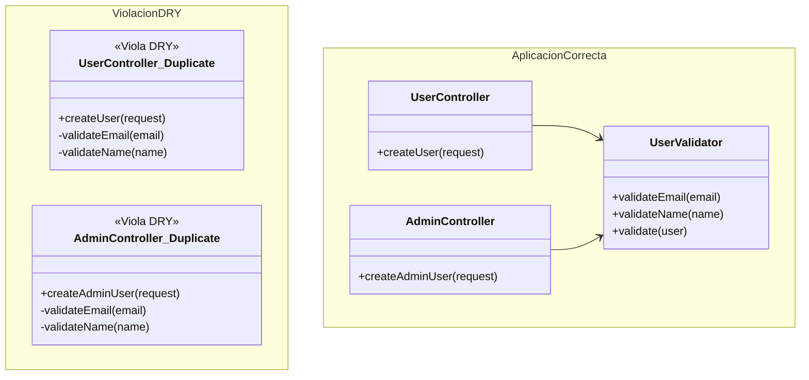
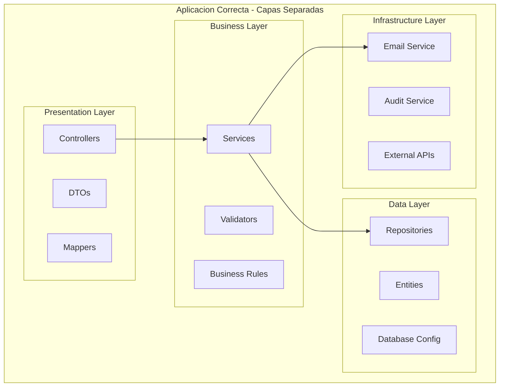
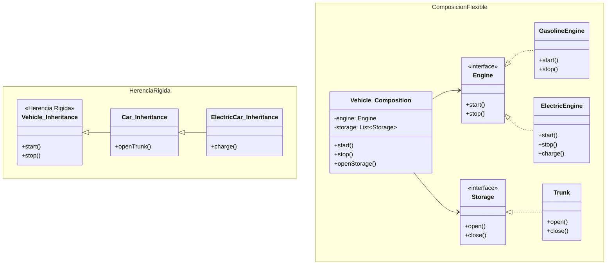
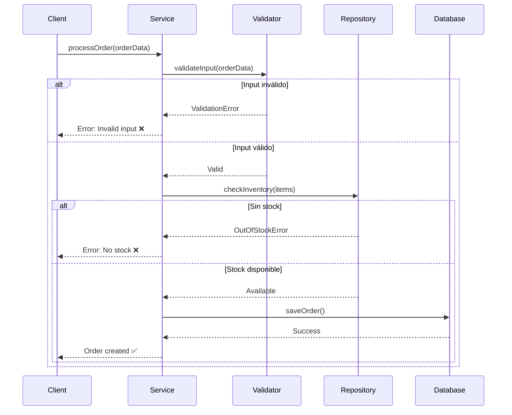

| Principio | Objetivo | Beneficio |
|-----------|----------|----------|
| **DRY** | Eliminar duplicación | Código más mantenible y consistente |
| **KISS** | Mantener simplicidad | Código más fácil de entender y mantener |
| **YAGNI** | No implementar hasta necesitar | Menos complejidad y desarrollo más eficiente |
| **Separation of Concerns** | Una responsabilidad por módulo | Mantenimiento independiente de cada capa |
| **Composition over Inheritance** | Flexibilidad sobre rigidez | Diseños más flexibles y modulares |
| **Fail Fast** | Detectar errores temprano | Debugging más fácil y rápido |
| **Law of Demeter** | Minimizar conocimiento entre objetos | Bajo acoplamiento y mayor robustez |

---

<a id="dry"></a>

# DRY - Don't Repeat Yourself

## Principio
> "Cada pieza de conocimiento debe tener una representación única, no ambigua y autoritativa dentro del sistema"

## Propósito
Evitar la duplicación de código y conocimiento, logrando:
- Una sola fuente de verdad para cada funcionalidad
- Mantenimiento más fácil y consistente
- Reducción de inconsistencias en el sistema

## Diagrama



---

<a id="kiss"></a>

# KISS - Keep It Simple, Stupid

## Principio
> "La simplicidad debe ser un objetivo clave en el diseño, y la complejidad innecesaria debe evitarse"

## Propósito
Mantener el código simple y comprensible, logrando:
- Soluciones directas sin over-engineering
- Código fácil de entender y mantener
- Menor probabilidad de bugs por complejidad

## Ejemplos

### ❌ Violación KISS - Over-engineering
```java
// Solución compleja para calcular descuento
public class DiscountCalculationEngine {
    private DiscountStrategyFactory factory;
    private DiscountContextBuilder contextBuilder;
    private DiscountValidationChain validationChain;
    
    public BigDecimal calculateDiscount(BigDecimal amount, double percentage) {
        DiscountContext context = contextBuilder
            .withAmount(amount)
            .withPercentage(percentage)
            .withValidationChain(validationChain)
            .build();
        
        AbstractDiscountStrategy strategy = factory
            .createStrategy(DiscountType.PERCENTAGE)
            .configure(context.getParameters());
            
        DiscountResult result = strategy.execute(context);
        return result.getFinalAmount();
    }
}
```

### ✅ Aplicación Correcta - Solución Simple
```java
// Solución simple y directa
public class DiscountService {
    public BigDecimal calculateDiscount(BigDecimal amount, double percentage) {
        return amount.multiply(BigDecimal.valueOf(percentage / 100));
    }
}
```

---

<a id="yagni"></a>

# YAGNI - You Aren't Gonna Need It

## Principio
> "No implementes algo hasta que realmente lo necesites"

## Propósito
Enfocarse en lo que realmente se necesita ahora, evitando:
- Desarrollar funcionalidades especulativas
- Complejidad prematura innecesaria
- Desperdicio de tiempo y esfuerzo

## Propósito Extendido
YAGNI va más allá de evitar funcionalidades "por si acaso". También significa:
- No implementar funcionalidades que sabes que vendrán, pero aún no son necesarias
- Dedicar tiempo solo a lo que se necesita ahora
- Cada funcionalidad tendrá su momento apropiado para ser desarrollada
- Evitar la tentación de "preparar el terreno" para futuras funcionalidades

---

<a id="soc"></a>

# Separation of Concerns

## Principio
> "Separar un programa en secciones distintas, cada una abordando una preocupación separada"

## Propósito
Organizar el código en responsabilidades bien definidas a **nivel arquitectónico**, logrando:
- Cada capa/módulo maneja un aspecto específico del sistema
- Separación clara entre presentación, lógica y datos
- Mantenimiento independiente de cada capa

## Diagrama



---

<a id="composition"></a>

# Composition over Inheritance

## Principio
> "Favorecer la composición de objetos sobre la herencia de clases"

## Propósito
Crear diseños flexibles y modulares, logrando:
- Relaciones más flexibles entre objetos
- Evitar jerarquías rígidas de herencia
- Mayor facilidad para cambios y extensiones

## Diagrama



---

<a id="fail-fast"></a>

# Fail Fast

## Principio
> "Detectar y reportar errores tan pronto como sea posible"

## Propósito
Detectar problemas en el momento que ocurren, logrando:
- Errores reportados inmediatamente
- Debugging más fácil y rápido
- Prevenir estados inconsistentes del sistema

## Diagrama



---

<a id="demeter"></a>

# Law of Demeter

## Principio
> "Un objeto debe hablar solo con sus amigos inmediatos, no con extraños"

## Propósito
Minimizar el conocimiento entre objetos, logrando:
- Bajo acoplamiento entre componentes
- Evitar cadenas largas de llamadas
- Mayor robustez ante cambios internos

## Ejemplos

### ❌ Violación Law of Demeter - Cadenas largas
```java
// Cliente conoce demasiado sobre la estructura interna
public class OrderService {
    public String getCustomerCity(Order order) {
        // Violación: cadena larga de llamadas
        return order.getCustomer().getAddress().getCity();
    }
    
    public void processOrder(Order order) {
        // Más violaciones
        String email = order.getCustomer().getContactInfo().getEmail();
        String phone = order.getCustomer().getContactInfo().getPhone();
        // Si cambia la estructura interna, este código se rompe
    }
}
```

### ✅ Aplicación Correcta - Métodos delegados
```java
// Cada objeto expone solo lo necesario
public class Order {
    private Customer customer;
    
    public String getCustomerCity() {
        return customer.getCity();
    }
    
    public String getCustomerEmail() {
        return customer.getEmail();
    }
}

public class OrderService {
    public String getCustomerCity(Order order) {
        // Simple y desacoplado
        return order.getCustomerCity();
    }
    
    public void processOrder(Order order) {
        String email = order.getCustomerEmail();
        // Cambios internos no afectan este código
    }
}
```