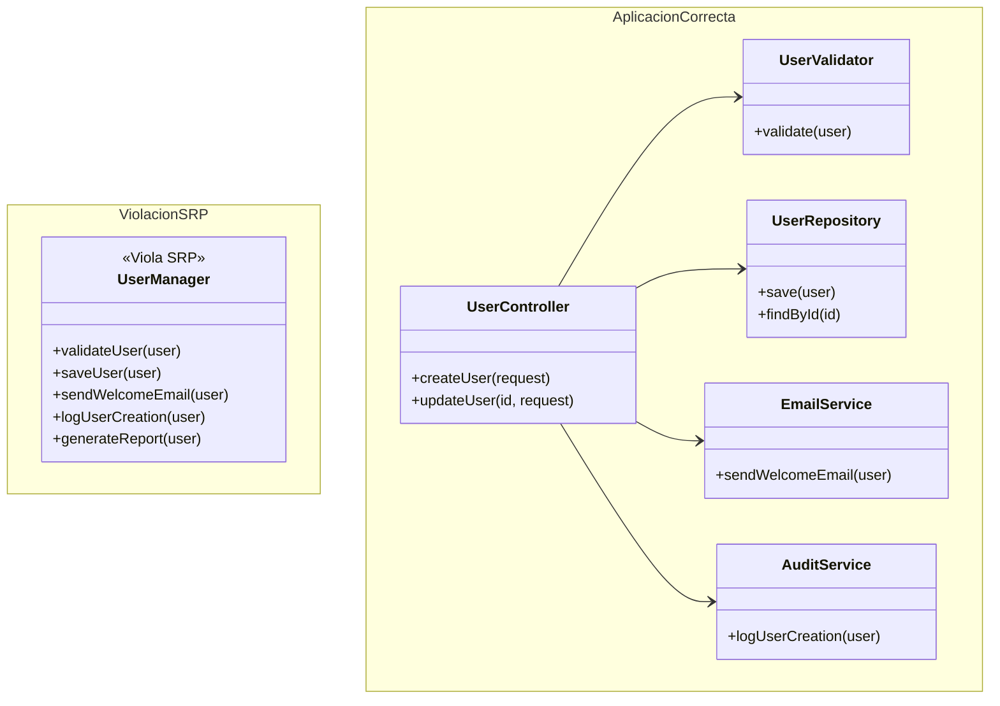
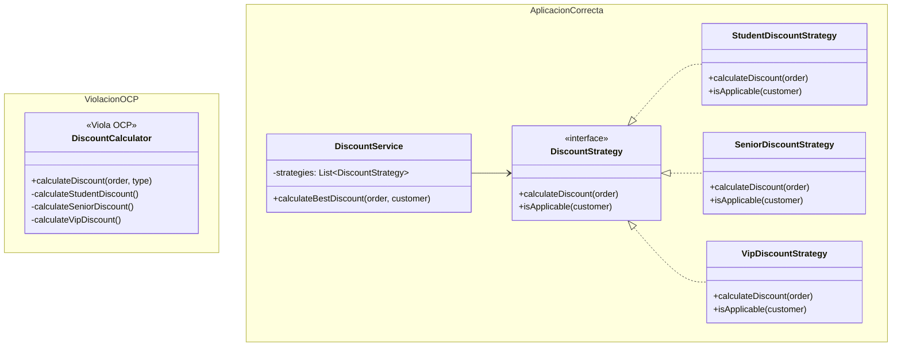
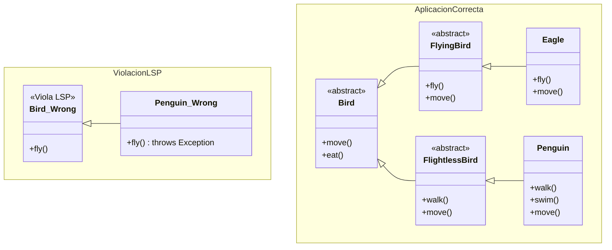
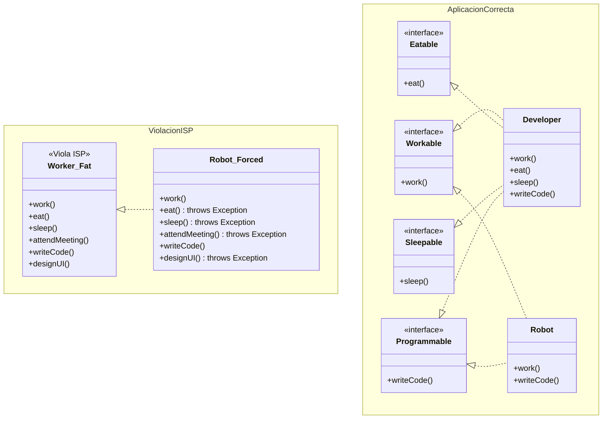
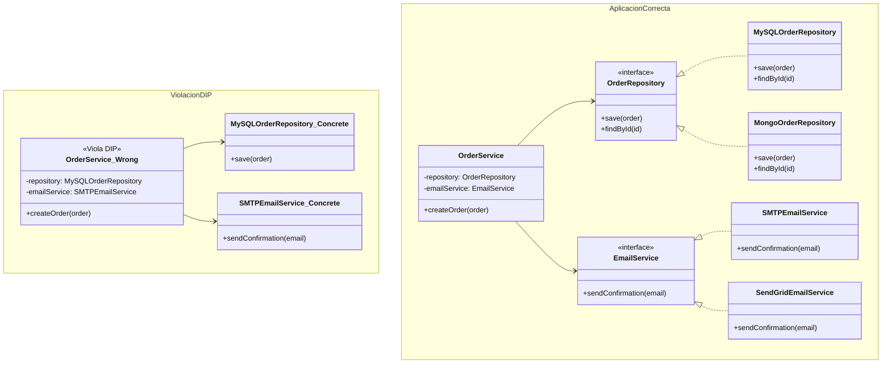

| Principio | Objetivo | Beneficio |
|-----------|----------|-----------|
| **SRP** | Una responsabilidad por clase | Código más cohesivo y mantenible |
| **OCP** | Abierto para extensión, cerrado para modificación | Menos riesgo al agregar funcionalidades |
| **LSP** | Subclases intercambiables con superclases | Polimorfismo seguro |
| **ISP** | Interfaces específicas y pequeñas | Menos dependencias innecesarias |
| **DIP** | Depender de abstracciones | Código más flexible y testeable |

# Single Responsibility Principle (SRP)

## Principio
> "Una clase debe tener una sola razón para cambiar"

## Propósito
Buscar que cada clase tenga una única responsabilidad bien definida, evitando:
- Clases que hacen demasiadas cosas
- Alto acoplamiento entre funcionalidades
- Dificultades para testing y mantenimiento

## Diagrama

---

# Open/Closed Principle (OCP)

## Principio
> "Las clases deben estar abiertas para extensión, cerradas para modificación"

## Propósito
Lograr que el código sea extensible sin modificar lo existente, evitando:
- Romper funcionalidad probada al agregar features
- Riesgo en despliegues por cambios en código estable
- Dificultad para agregar nuevas funcionalidades

## Diagrama

---

# Liskov Substitution Principle (LSP)

## Principio
> "Los objetos de una superclase deben ser reemplazables por objetos de sus subclases sin alterar el funcionamiento del programa"

## Propósito
Garantizar que el polimorfismo funcione correctamente, evitando:
- Subclases que rompen el contrato de la clase padre
- Comportamientos inesperados al usar herencia
- Violaciones de las expectativas de la interfaz

## Diagrama

---

# Interface Segregation Principle (ISP)

## Principio
> "Los clientes no deben depender de interfaces que no usan"

## Propósito
Crear interfaces específicas y cohesivas, evitando:
- Interfaces "gordas" con demasiados métodos
- Forzar clases a implementar métodos innecesarios
- Alto acoplamiento por interfaces demasiado amplias

## Diagrama

---

# Dependency Inversion Principle (DIP)

## Principio
> "Depende de abstracciones, no de concreciones"

## Propósito
Invertir las dependencias hacia abstracciones, evitando:
- Acoplamiento fuerte a implementaciones concretas
- Dificultades para testing (mocks/stubs)
- Poca flexibilidad para cambiar implementaciones

## Diagrama

